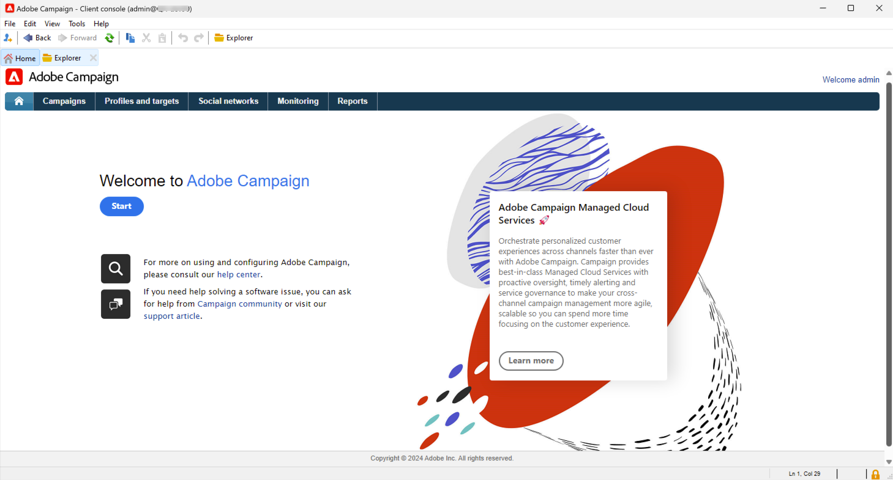

# Get started for admin & developers {#acs-gs-admin}

This page gives an overview of the key administrative and data management functionality of Campaign v8. It is for administrators and technical marketers transitioning from Campaign Standard to Campaign v8.

The major change for you is the introduction of the client console, the native application which communicates with the Adobe Campaign application server. 

The Campaign client console centralizes all capabilities and settings. It is stays synchronized with the Campaign Web user interface, ensuring consitency acrouss both environments.

{zoomable="yes"}

[Learn more about the client console user interface of Adobe Campaign v8](https://experienceleague.adobe.com/en/docs/campaign/campaign-v8/new/campaign-ui#ui-access){target="_blank"} .

## Campaign v8 architecture {#acs-gs-admi-archi}

Campaign architecture is detailed in Campaign v8 (console) documentation. Learn basics in [this page](https://experienceleague.adobe.com/en/docs/campaign/campaign-v8/config/architecture/general-architecture){target="_blank"}.

Useful link for you to start:

* Adobe Campaign components and global architecture are described in [this page](https://experienceleague.adobe.com/en/docs/campaign/campaign-v8/new/ac-components){target="_blank"}.

* Refer to [Get Started with Campaign architecture](https://experienceleague.adobe.com/en/docs/campaign/campaign-v8/config/architecture/architecture){target="_blank"} to understand the Campaign architecture before starting to structure your instance.

<!--Two deployment models are available: **Campaign FDA deployment** (P1-P3) and **Campaign Enterprise (FFDA)** deployment (P4). As a customer transitioning from Campaign Standard, your deployment model is **Campaign FDA**.-->

* Transactional messaging (Message Center) is the Campaign v8 module designed for managing triggered messages. It relies on a specific architecture model which is detailed in [this section](https://experienceleague.adobe.com/en/docs/campaign/campaign-v8/config/architecture/architecture#transac-msg-archi){target="_blank"}.

## Campaign client console {#acs-gs-console}

### Install the client console {#acs-gs-admin-console}

Administration and configuration tasks are performed in the client console. The first step is to set up your environment. 

Campaign client console is a native application, which communicates with the Adobe Campaign application server through standard internet protocols, such as SOAP and HTTP. Campaign client console centralizes all capabilities and settings, and requires minimal bandwidth as it relies on a local cache. Designed for easy deployment, Campaign client console can be deployed from an internet browser, updated automatically, and does not require any specific network configuration as it only generates HTTP(S) traffic.

The following video explains how to download and install the Adobe Campaign Client Console and manage your connection to your instance.

>[!VIDEO](https://video.tv.adobe.com/v/335375?quality=12&learn=on){transcript=true}

For more information, see [Connect to Campaign with the client console](https://experienceleague.adobe.com/en/docs/campaign/campaign-v8/new/connect){target="_blank"}.

Note that the client console must be installed in a supported environment. Learn more in [Campaign v8 (console) compatibility matrix](https://experienceleague.adobe.com/en/docs/campaign/campaign-v8/releases/compatibility-matrix#ClientConsoleoperatingsystems){target="_blank"}.

### Discover the client console interface  {#acs-gs-ui}

Learn about the Adobe Campaign V8 user interface and how to navigate the main features with this tutorial video.

>[!VIDEO](https://video.tv.adobe.com/v/334496?quality=12&learn=on){transcript=true}

See [Work with the client console](https://experienceleague.adobe.com/en/docs/campaign/campaign-v8/new/campaign-ui){target="_blank"} for more details.

## Administrate the environment {#acs-gs-admin-env}

Once the client console is installed, follow the steps in this documentation to create the connection to the application server: [Connection to the application server documentation](https://experienceleague.adobe.com/en/docs/campaign/campaign-v8/new/connect#create-your-connection){target="_blank"}. 

Security practices are deeply ingrained into our internal software development and operations processes and tools and are rigorously followed by our cross-functional teams to prevent, detect, and respond to incidents in an expedient manner. Learn more in [Campaign Security best practices](https://experienceleague.adobe.com/en/docs/campaign/campaign-v8/privacy/security){target="_blank"}.

### Access rights and permissions {#acs-gs-admin-rights}

Adobe Campaign lets you define and manage the rights assigned to users. These permissions are defined by combining operator group permissions, named rights and permissions on folders.

As a Campaign Standard user transitioning to Campaign v8, your permissions and access rights remain the same. Security groups have been moved by Adobe to the Campaign v8 operator groups, and your permissions per organizational units have been transitioned to folder permissions. Campaign users   use their Adobe ID to connect to Campaign v8, and then can use the same login and password as in Campaign Standard.

Campaign [folders](https://experienceleague.adobe.com/en/docs/campaign/campaign-v8/config/configuration/folders-and-views){target="_blank"} are nodes in the explorer tree of the client console. Based on their type, they contain certain types of data. Programs are materialized by folders in Campaign v8. You can create folders and manage permissions to them to restrict access. [Learn more](https://experienceleague.adobe.com/en/docs/campaign/campaign-v8/admin/permissions/folder-permissions){target="_blank"}.

Learn more in the [User permissions documentation](https://experienceleague.adobe.com/en/docs/campaign/campaign-v8/admin/permissions/gs-permissions){target="_blank"}.

### Campaign Control Panel {#acs-gs-admin-cp}

As for Campaign Standard, you can use the Control Panel to administrate your environment. Note that for v8, the Control Panel provides additional capabilities.

Campaign Control Panel helps you increase efficiency in your work as a product admin of Adobe Campaign, by allowing you to manage settings and track usages for each of your instances. Its intuitive interface lets you easily monitor usage of key assets, as well as perform administrative tasks such as IP addresses allow list addition, SFTP storage monitoring, key management, and more.

Learn more in the [Control panel tutorials](https://experienceleague.adobe.com/en/docs/control-panel-learn/tutorials/control-panel-overview){target="_blank"} and the [Control panel documentation](https://experienceleague.adobe.com/docs/control-panel/using/control-panel-home.html){target="_blank"}.

* **Add IP addresses** - Campaign Control Panel allows you to set up new connections to your instances by adding IP addresses ranges to the allow list. Learn more in the [IP allow listing documentation](https://experienceleague.adobe.com/en/docs/control-panel/using/instances-settings/ip-allow-listing-instance-access){target="_blank"}

* **Subdomain configuration** - You can configure a sub-section of your domain (technically a "DNS zone") for use with Adobe Campaign. 
Learn more in the [Subdomain delegation documentation](https://experienceleague.adobe.com/en/docs/control-panel/using/subdomains-and-certificates/subdomains-branding){target="_blank"}

* **Manage SFTP servers** - In the Control Panel, you can interact with all SFTP servers that are connected to Campaign instances that you have access to. Learn more in the [SFTP management documentation](https://experienceleague.adobe.com/en/docs/control-panel/using/sftp-management/about-sftp-management){target="_blank"}

### Audit trail {#acs-gs-admin-audit-trail}

As already available in Campaign Standard, the Audit trail can be used in Campaign v8 to access the complete history of changes made within your instance.

In Adobe Campaign Web User Interface, the Audit trail capability provides users with full visibility into all modifications made to important entities within your instance, typically those that significantly impact a smooth operation of the instance. Learn more in the [Audit trail documentation](../../v8/reporting/audit-trail.md)

### Data packages {#acs-gs-admin-audit-packages}

Similar to what can be achieved in Campaign Standard, administrators can define packages to exchange resources between different Adobe Campaign instances through structured XML files. These can be configuration parameters or data.

You can use data packages to export and import your platform custom settings and data. A package can contain different types of configurations and components, filtered or not. Learn how to work with data packages in Campaign v8 in [this documentation](https://experienceleague.adobe.com/en/docs/campaign/campaign-v8/developer/packages){target="_blank"}.

<!--
MISSING LINKS: 

- System options
- Data Encryption/Decryption-->

### Personalize the user interface {#acs-gs-admin-ui}

Several options are available to you to customize the user interface in the client console, such as:

* **List and data display** - Guidelines for managing user interface settings like lists, units, or data display are available in this document: [User interface settings documentation](https://experienceleague.adobe.com/en/docs/campaign/campaign-v8/config/configuration/ui-settings){target="_blank"}

* **Folder management** - Folders are objects in Adobe Campaign that allow you to organize your components and data. They are also used to manage permissions. Learn how to [work with folders](../../v8/get-started/work-with-folders.md).

* **Custom fields** - Custom fields are additional attributes added to the out-of-the-box schemas through the Adobe Campaign console. These custom fields are displayed in various screens, for example the details of a profile or a test profile. Learn more in the [custom fields configuration documentation](../../v8/administration/custom-fields.md).

## Configure the branding {#acs-gs-admin-branding}

Every company has brand guidelines that define both visual elements and technical details. As for Adobe Campaign Standard, Adobe Campaign v8 helps you manage these guidelines centrally, so you can present a consistent brand image to your customers in everything you do, from logos in emails to the URLs and domains used in your campaigns. As a technical administrator, you can create and manage multiple brands within Adobe Campaign.

Learn more in the [Branding documentation](https://experienceleague.adobe.com/en/docs/experience-cloud/campaign/branding/branding-gs){target="_blank"}

## Understand data model creation {#acs-gs-admin-data-model-creation}

Similar to Campaign Standard, Adobe Campaign v8 comes with its pre-defined data model. Adobe Campaign relies on a Cloud database containing tables that are linked together. Learn more in the [Data model documentation](https://experienceleague.adobe.com/en/docs/campaign/campaign-v8/developer/datamodel){target="_blank"}.

A schema is an XML document associated with a database table. It defines data structure and describes the SQL definition of the table. See the [Schemas creation documentation](https://experienceleague.adobe.com/en/docs/campaign/campaign-v8/developer/shemas-forms/schemas){target="_blank"}

Learn how to create a schema and how to extend an existing schema in Campaign v8 in this video:

>[!VIDEO](https://video.tv.adobe.com/v/337939?quality=12&learn=on){transcript=true}

Similar to the capabilities available in Campaign Standard, you can create custom resources. IN Campaign v8, custom resources are custom or extended **schemas**. 

* Learn how to work with schema in [this page](https://experienceleague.adobe.com/en/docs/campaign/campaign-v8/developer/shemas-forms/schemas){target="_blank"}.

* Learn how to extend an existing schema in [this page](https://experienceleague.adobe.com/en/docs/campaign/campaign-v8/developer/shemas-forms/extend-schema){target="_blank"}.

* Learn how to create an new schema in [this page](https://experienceleague.adobe.com/en/docs/campaign/campaign-v8/developer/shemas-forms/create-schema){target="_blank"}.

* When you create or extend a schema, you need to create or modify the associated input forms to make those changes visible to end-users. An input form lets you edit an instance associated with a data schema from the Adobe Campaign client console. The form is identified by its name and namespace. See the [Input forms creation documentation](https://experienceleague.adobe.com/en/docs/campaign/campaign-v8/developer/shemas-forms/forms){target="_blank"}.

## Workflows and data management {#acs-gs-admin-data-management}

Same as with Adobe Campaign Standard, Adobe Campaign v8 includes a workflow module that empowers you to orchestrate the full range of processes and tasks across the different modules of the application server. This comprehensive graphical environment lets you design processes including segmentation, campaign execution, file processing, human participation, etc. The workflow engine executes and tracks these processes. Learn how to start with workflows in Campaign v8 in [this documentation](https://experienceleague.adobe.com/en/docs/campaign/campaign-v8/data/workflows){target="_blank"}. 

See links to other useful resources below:

* Learn what targeting dimensions and working tables are, and how Adobe Campaign manages data across different data sources in this video:

    >[!VIDEO](https://video.tv.adobe.com/v/339992?quality=12&learn=on){transcript=true}

* Campaign helps you add contacts to the Cloud database. You can load a file, schedule and automate multiple contact updates, collect data on the Web, or enter profile information directly into the recipient table.  Learn more in the [Import data (console) documentation](https://experienceleague.adobe.com/en/docs/campaign/campaign-v8/data/import){target="_blank"}.

* You can easily export your different reports to PDF or CSV format, which enables you to share, manipulate, or print them. Learn more in the [Export data documentation](../../v8/reporting/export-reports.md).

## REST APIs {#acs-gs-admin-apis}

Campaign REST APIs are aimed at letting you create integrations for Adobe Campaign and build your own ecosystem by interfacing Adobe Campaign with the panel of technologies that you use.

As a Campaign Standard user transitioning to Campaign v8, REST APIs are available to you. 

Learn more in the [Rest API documentation](https://experienceleague.adobe.com/en/docs/experience-cloud/campaign/apis/get-started-apis){target="_blank"}.

Note that some recommendations and limitations apply to REST APIs when transitioning from Campaign Standard to Campaign v8. They are listed in [this page](https://experienceleague.adobe.com/en/docs/experience-cloud/campaign/apis/limitations){target="_blank"}. Specific restrictions also apply when transitioning to Campaign v8 as listed in the Availability note below:

>[!AVAILABILITY]
>
>* PKEYs values change between existing Campaign Standard instance and migrated Campaign v8 instance. In case PKEYs are being stored in external database then the implementation needs to change in a way that they need to call Adobe Campaign v8 main APIs which provides pkeys / hrefs links with PKEYs and sub sequent API calls need to be dynamically formed by consuming the pkeys /hrefs from previous API calls​
>
>* In Campaign v8, for the same body where vehicle linked to profile,​ we would get an error firstName property is not valid for `cusVehicle` but a request body with just the attributes without link works fine. `{ "vehicleNumber": "20009", "vehicleName": "Model E", "vehicleOwner":{   "firstName":"tester 11", "lastName":"Smith 11" } }​`
>
>* Timezone is shown to user as part of `profileAndServicesExt/profile` REST API call and not `profileAndServices/profile` REST API call since it is being added in an extended schema as part of data migration.​
>
>* The `ccpaOptOut` is only shown to user as part of `profileAndServicesExt/profile` REST API call and not `profileAndServices/profile` REST API call since it is being added in an extended schema as part of data migration. 
>

<!--
## Working with templates - TO REMOVE?

Workflow templates contain pre-configured settings and activities which can be reused for creating new workflows.
[Workflow template documentation](../../v8/workflows/create-workflow.md)

You can design your landing page content, and save it for future reuse. See the [landing page template documentation](../../v8/landing-pages/lp-templates.md).

Each event can trigger a personalized message. For this to happen, you need to create a message template to match each event type. Templates contain the necessary information for personalizing the transactional message. See the [Transactional messaging template documentation](https://experienceleague.adobe.com/en/docs/campaign/campaign-v8/send/real-time/transactional-template)

Using a workflow template is a best practice if you need to regularly import files with the same structure. See the [Import template documentation](https://experienceleague.adobe.com/en/docs/campaign/automation/workflows/use-cases/data-management/recurring-import-workflow){target="_blank"}
-->

## Subscription services {#acs-gs-admin-sub}

Like in Campaign Standard, as an administrator, you can create subscription services and marketers can send messages to their subscribers. Key concepts and implementations steps are aligned with Campaign Standard. You can find useful links and video below.

Learn how to setup and manage subscriptions and target subscribers.

>[!VIDEO](https://video.tv.adobe.com/v/334305?quality=12&learn=on){transcript=true}

* See the subscription services [Web user interface documentation](../../v8/audience/manage-subscribers.md).

* See also the documentation to set subscriptions services in the client console in [this section](https://experienceleague.adobe.com/en/docs/campaign/campaign-v8/audience/subscriptions){target="_blank"}.

## Messages and deliveries{#acs-gs-msg}

### Configure delivery channels {#acs-gs-admin-channels}

As Campaign Standard, Adobe Campaign v8 helps you send cross-channel campaigns including emails, SMS, Push notifications and direct mails, and measure their effectiveness using various dedicated reports. These messages are designed and sent though deliveries, and can be personalized for each recipient. Core functionalities include targeting, definition and personalization of messages, execution of communications, and the associated operational reports. The main functional access point is the delivery assistant. This access point leads to multiple capabilities covered by Adobe Campaign. 

As an administrator, you must define your channel configurations. Refer to the links below to learn more.

* **Email** - Email settings are all detailed in [this page](https://experienceleague.adobe.com/en/docs/campaign/campaign-v8/send/emails/email-parameters){target="_blank"}.
* **SMS** - Learn how to configure your SMS channel in [this documentation](https://experienceleague.adobe.com/en/docs/campaign/campaign-v8/send/sms/sms){target="_blank"}.
* **Push notifications** - Steps to configure the push notifications channel are detailed [in this section](https://experienceleague.adobe.com/en/docs/campaign/campaign-v8/send/push/push-data-collection){target="_blank"}.
* **Transactional messaging** - Steps to configure [Transactional messaging](https://experienceleague.adobe.com/en/docs/campaign/campaign-v8/send/real-time/transactional){target="_blank"} in Campaign v8 are detailed [in this section](https://experienceleague.adobe.com/en/docs/campaign/campaign-v8/config/configuration/transactional-msg-settings) 

### External accounts {#acs-gs-ext-accounts}

As an administrator, you are responsible for configuring and maintaining Campaign external accounts. As in Campaign Standard, external accounts are used by technical processes such as technical workflows or campaign workflows.

The transition process to Campaign v8 takes care of your existing Campaign Standard external accounts: they are now available in the client console.

Learn more about the [External account configuration](https://experienceleague.adobe.com/en/docs/campaign/campaign-v8/config/configuration/external-accounts){target="_blank"}.

<!--
**Email**

MISSING LINKS :
- general email channel parameters 
- email routing accounts 
- email processing rules 
- email properties
-->

<!--
MISSING LINKS: 
- Setting external account 
- Adding vender details etc. -->

<!--
**Mobile app**
MISSING LINKS: 
- Configuring a mobile application using AEP SDKs 
- Sync Mobile app AEPSDK  
- Setting up your application in Adobe Campaign 
- Channel-specific application configuration
-->

### Dynamic content {#acs-gs-dyn-content}

Use Campaign to create dynamic content and send personalized messages. Personalization capabilities can be combined to improve your messages and create a custom user experience.

With Campaign v8, as an administrator, you can define dynamic content blocks and how to use them to personalize the content of your email delivery in this video:

>[!VIDEO](https://video.tv.adobe.com/v/342088?quality=12&learn=on){transcript=true}

Useful links:

* [Get started with personalization](https://experienceleague.adobe.com/en/docs/campaign/campaign-v8/send/personalize/personalize){target="_blank"}
* [Use personalization blocks](https://experienceleague.adobe.com/en/docs/campaign/campaign-v8/send/personalize/personalization-blocks){target="_blank"}
* [Create conditional content](https://experienceleague.adobe.com/en/docs/campaign/campaign-v8/send/personalize/conditions){target="_blank"}
* [Personalization data sources](https://experienceleague.adobe.com/en/docs/campaign/campaign-v8/send/personalize/personalization-data){target="_blank"}

### Delivery templates {#acs-gs-templates}

Using delivery templates is a requirement in Campaign v8, like in Campaign Standard.

For an accelerated and improved design process, create delivery templates to easily reuse custom content and settings across your campaigns. This functionality enables you to standardize the creative look and feel, in order to be quicker in executing and launching campaigns. Learn how to create delivery templates in [Campaign web user interface](../../v8/msg/delivery-template.md). See also how to create delivery templates in the client console in [this section](https://experienceleague.adobe.com/en/docs/campaign/campaign-v8/send/create-templates){target="_blank"}.

### Typology rules {#acs-gs-admin-rules}

As an administrator, you are responsible for creating and maintaining typology rules for your deliveries. Same as in Adobe Campaign Standard, in Campaign v8, typology rules are business rules that allow you to perform checks and filtering on your message before sending it.

When transitioning to Campaign v8 from a Campaign Standard environment, your typoligy rules are moved to Campaign v8.

In Campaign v8, typology rules come with a specific Campaign Optimization ass-on. This module which lets you control, filter and monitor the sending of deliveries. To avoid conflicts between campaigns, Adobe Campaign can test various combinations by applying specific constraint rules. This guarantees that the messages sent meet the needs and expectations of customers and company communication policies. Learn more in the [Typology rules documentation](https://experienceleague.adobe.com/en/docs/campaign/automation/campaign-optimization/campaign-typologies){target="_blank"}.

### Quarantine management {#acs-gs-admin-quarantine}

All quarantined addresses and quarantine rules have been migrated from your Campaign Standard environment to Campaign v8. No specific action is needed for quarantine management.

As an administrator, get familiar with quarantine management in Campaign v8 starting from [this page](../../v8/audience/quarantine.md). See also the client console detailed documentation about quarantine management in [this section](https://experienceleague.adobe.com/en/docs/campaign/campaign-v8/send/failures/quarantines#access-quarantined-addresses){target="_blank"}.

## Manage Adobe Campaign integrations {#acs-gs-integrations}

You can connect your Campaign instance with Adobe Experience Cloud solutions to combine capabilities. Adobe Campaign comes with several connectors that allow you to communicate with external applications, connect to database engines, share and synchronize data. Learn how to combine your solutions in [this documentation](https://experienceleague.adobe.com/en/docs/campaign/campaign-v8/connect/integration){target="_blank"}.

As a Campaign Standard user migrating to Campaign v8, the following applies to you:

* If you were using these integrations with Campaign Standard, your **Adobe Analytics** and **Audience Manager** configurations and data have been migrated by Adobe.
* If your Campaign Standard environment was integrated with **Adobe Experience Manager**, Adobe recommends you to move to **Adobe Experience Manager as a Cloud Service** so that you can use this capability when designing emails in the Campaign Web user interface, and facilitate the streamlined management of email delivery content and forms directly within your Adobe Experience Manager environment. Learn more in [this page](../../v8/integrations/aem-content.md). 
    Note that Campaign can also be integrated with Adobe Experience Manager 6.5. To configure this integration, refer to [this documentation](https://experienceleague.adobe.com/en/docs/campaign/campaign-v8/connect/ac-aem){target="_blank"}.
* If your Campaign Standard environment was integrated with **Triggers**, you must set up and configure this integration in Campaign v8 as detailed in [this page](https://experienceleague.adobe.com/en/docs/campaign/campaign-v8/connect/ac-triggers){target="_blank"}.
* If your Campaign Standard environment was integrated with **Adobe Target**, you must set up and configure this integration in Campaign v8 as detailed in [this page](https://experienceleague.adobe.com/en/docs/campaign/campaign-v8/connect/ac-at){target="_blank"}.

