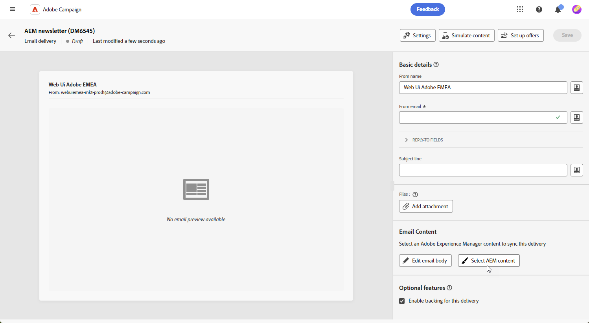

# From Campaign Standard to v8 {#ac-acs}

Welcome to Adobe Campaign v8!

As a user transitioning from Campaign Standard to Campaign v8, this reference guide is designed for you. It helps you familiarize yourself with your new Campaign environment and walk you through the steps required to get started for your role. 

1. Start by learning [what is new on Adobe Campaign v8](#new). 

1. Next understand [the experience differences between Adobe Campaign Standard and Adobe Campaign v8 according to your role](#experiences).

## What's new? {#new}

Get a glimpse of the newest enhancements in Adobe Campaign Web user interface in this page. For a comprehensive list of key capabilities and release updates features, check out [this section](../../v8/rn/whats-new.md).

### Enhancements with Campaign v8 {#ac-enhancements}

Key enhancements coming with Adobe Campaign v8 are listed below.

* **Web User Interface**

  Adobe Campaign v8 offers both a client console and a web user interface, catering to different user preferences and needs. The client console provides a powerful desktop application experience, while the web user interface is designed to be intuitive and accessible, making it an ideal choice for marketers familiar with Adobe Campaign Standard. 

  The web user interface shares many similarities with Adobe Campaign Standard, although some terminologies may differ. 

  You can [learn more about Adobe Campaign Web User Interface here](../../v8/campaign-web-home.md).

  {zoomable="yes"}

  All new capabilities and improvements are listed in the [Release Notes](../../v8/rn/release-notes.md). Adobe Campaign Web user interface releases operate on a continuous delivery model which allows for a more scalable, phased approach to feature deployment. Accordingly, these release notes get updated several times a month. Please check them regularly.

* **Performance**

  Adobe Campaign v8 takes advantage of advanced cloud-scale database technologies, resulting in significantly improved performance and efficiency. This redesigned architecture offers several key benefits:

  * *Scale*: The system now supports a substantial increase in processing capabilities, with batch processing throughput reaching up to **20 million operations per hour**. With this new architecture, even higher profiles can be managed with predictable performance.
  * *Speed*: The system has been improved for any marketing activity: segmentation, delivery preparation, or throughput for transactional messages which is now **1 million per hour**. 

  The fully managed cloud services provides user with:

  * Real time data exploration: Instantly access and analyze data for quick insights and more informed decision-making.

  * Rapid audience building: Easily create targeted audiences within minutes for more efficient campaign segmentation.

  Overall, Adobe Campaign v8's robust architecture provides a powerful foundation for managing extensive and complex marketing campaigns with enhanced speed and efficiency.

### New features on Adobe Campaign v8 {#ac-new-features}

As a Campaign Standard user transitioning to Adobe Campaign v8, the following features are now available to you:

* **Rich push**

  Adobe Campaign v8 offers the capability to send rich push notifications, which can capture users' attention and encourage them to take action. These notifications can include a variety of elements such as text, images, buttons, countdown timers, sounds, etc.

  {zoomable="yes"}

  To facilitate the creation of these rich notifications, Adobe Campaign v8 provides various templates that enable you to design and customize the content of complex notifications, such as carousels or timers.

  You can tailor your notifications based on the customer's system :

  * For [Android](../../v8/push/rich-push.md) templates

  * For [iOs](../../v8/push/rich-push.md) templates

  Push notifications are a crucial tool for engaging mobile app users, allowing you to reach them even when they are not actively using your app.

* **Adobe Experience Manager as a Cloud Service**

  Adobe Campaign v8 is seamlessly integrated with Adobe Experience Manager as a Cloud Service, enhancing your ability to deliver personalized and content-rich experiences to your customers. This native integration streamlines content management and leverages Adobe Experience Manager's robust capabilities to optimize your marketing efforts.

  Here are the key features enabled by this integration: 

  * *Asset management*: Within Adobe Campaign v8, the email designer provides a picker to access and manage assets. This feature simplifies the integration of elements from Adobe Experience Manager into your delivery, making content management more efficient. [Learn more about Asset management](../../v8/integrations/aem-assets.md)
    
    {zoomable="yes"}

  * *Email template import*: Adobe Campaign v8 enables you to browse and import email templates from Adobe Experience Manager directly into Campaign. [Learn more about Email template import](../../v8/integrations/aem-content.md)
    
    {zoomable="yes"}

  Adobe Experience Manager as a Cloud Service offers cloud-native agility, allowing you to accelerate your time to value and adapt to evolving business needs. This integration not only enhances your content management capabilities but also enables you to delivery more personalized and engaging experiences to your customers across all touchpoints.

* **AI Assistant - Content Accelerator**

  Campaign AI Assistant makes the creation and execution of marketing campaigns across channels like Email, SMS and Push intuitive, simple and hassle-free while saving time, improving efficiency, and driving better results.

  {zoomable="yes"}

  AI Assistant revolutionizes the way you create professional and brand-consistent content across channels. With advanced GenAI models and deep understanding of your brand guidelines, AI Assistant auto-generates personalized, engaging, and effective content based on the marketing objective with content optimized for brand outlined styles, layouts, tone, and more.

  AI Assistant makes the creation and execution of marketing campaigns intuitive, simple and hassle-free while saving time, improving efficiency, and driving better results.

  {zoomable="yes"}

  It provides variant of email templates and generates and re-generates images. Learn more about the AI Assistant - Content Accelerator in [this section](../../v8/email/generative-content.md). Adobe Campaign v8 has AI assistant available for [Email](../../v8/email/generative-content.md), [SMS](../../v8/email/generative-sms.md), and [Push](../../v8/email/generative-push.md).

* **Upgraded SMS infrastructure - SMS v2.0**

  The simplicity and ease of use of SMS make it a very valuable communication channel in addition to its robustness and unrivaled compatibility over billions of terminals. 

  Adobe Campaign v8 comes with a new infrastructure improving the sending of SMS. [Learn more about new SMS settings](https://experienceleague.adobe.com/en/docs/campaign/campaign-v8/send/sms/sms){target="_blank"}.

* **Upgraded Push infrastructure**

  Adobe Campaign v8 is introducing our latest Push notification service, powered by a robust framework built on a modern cutting-edge technology. This service is designed to unlock new levels of scalability, ensuring that your notifications can reach a larger audience with seamless efficiency. With our enhanced infrastructure and optimized processes, you can expect higher scale and reliability, empowering you to engage and connect with your Mobile App users like never before.

  [Learn more about Upgraded Push infrastructure](https://experienceleague.adobe.com/en/docs/campaign/campaign-v8/send/push/push-data-collection){target="_blank"}.

## Managed Services {#ac-managed-services}

Adobe Campaign v8 is available as a Managed Cloud Service, providing proactive oversight, timely alerting, and service governance. Adobe Managed Cloud Service provides marketers with a more agile, secure and scalable cross-channel campaign management solution with a low total cost of ownership. The new offering combines services with proactive oversight and timely alerting.

## Campaign Standard capabilities added into v8 {#ac-v8-added}

For you to transition smoothly to Campaign v8, key Campaign Standard capabilities have been added to Campaign v8. They are detailed in [this documentation](https://experienceleague.adobe.com/docs/experience-cloud/campaign/campaign-standard-migration-home.html){target="_blank"}.

* **Dynamic Reporting**: Dynamic Reporting provides fully customizable and real-time reports to measure the impact of your marketing activities. It adds access to profile data, enabling demographic analysis by profile dimensions such as gender, city and age in addition to functional email campaign data like opens and clicks. [Learn more](https://experienceleague.adobe.com/docs/experience-cloud/campaign/reporting/get-started-reporting.html){target="_blank"}.

* **Centralized branding**: Every company has brand visual and technical guidelines. With Adobe Campaign, you can define a set of specification to present a consistent brand to your customers, from logos to technical aspects, such as email sender, URL or domains. [Learn more](https://experienceleague.adobe.com/docs/experience-cloud/campaign/branding/branding-gs.html)

* **Rest APIs** - As a Campaign Stardard migrated user, you can use Rest APIs to create integrations for Adobe Campaign and build your own ecosystem by interfacing Adobe Campaign with the panel of technologies that you use. [Learn more](https://experienceleague.adobe.com/docs/experience-cloud/campaign/apis/get-started-apis.html){target="_blank"}.

* **Landing pages** - Some improvements have been brought to Campaign v8 landing pages to ensure feature parity with Campaign Standard. Learn more in the [release notes](../../v8/rn/release-notes.md#new-24-4) and the landing page [documentation](../landing-pages/get-started-lp.md).

* **Visual fragments** - Visual fragments are reusable visual components that can be referenced in one or more email deliveries or in content templates. When modifying a fragment, every content using it is updated. This functionality allows to prebuild multiple custom content blocks that can be used by marketing users to quickly assemble message contents in an improved design process. [Learn more](../../v8//content/use-visual-fragments.md)

## Key differences between Campaign Standard and Campaign v8 {#experiences}

Most concepts are similar between Adobe Campaign v8 and Adobe Campaign Standard. However, there are a few differences as described below. 

### Terminology changes {#terminology-changes}

Below are some terminology differences between Campaign Standard and the Campaign v8. 

* Custom resources are **Schemas**
* Messages are referred as **Deliveries**
* Product users are **Operators**
* Roles are configured with **Named Rights**
* Security Groups are **Operator Groups**
* Organizational units are managed through **Folder Permissions**

Also, as an existing Campaign user, note that some concepts have been renamed to align with the latest terminology standards. These changes only apply to Campaign Web user interface and are not reflected in the client console. They are summarized below.

* Recipients are now **Profiles**. [Learn more](../../v8/audience/gs-audiences-recipients.md).    
* Seed addresses are now **Test profiles**. [Learn more](../../v8/preview-test/test-deliveries.md).
* Delivery analysis is now the **delivery preparation**. When you need to launch the message preparation, click the **Prepare** button. [Learn more](../../v8/monitor/prepare-send.md).
* Email Preview is now available throught the **Simulate content** button. [Learn more](../../v8/preview-test/preview-test.md)
* Lists are now **Audiences**. [Learn more](../../v8/audience/gs-audiences-recipients.md).

## New user experience

Access to the relevant reference guide for your role to discover the new user experience with Adobe Campaign v8.

<table>
<tr>
  <td>
    
    

  </td>
  <td>
  
    

  </td>
  </tr>
  <tr>
    <td>
    <a href="marketers.md">
    <strong>Marketer</strong>
    </a>
    </td>
    <td>
      <a href="admin-developers.md">
      <strong>Administrator or Developer</strong>
      </a>
    </td>
  </tr>
    <td>
    <em>Campaign Manager, Media Marketing Specialist</em>
    </td>
    <td>
      <em> System Administrator, Technical Marketing Specialist</em>
    </td>
  <tr>
    <td>
    <b>Key tasks/responsibilities include:</b>
    </td>
      <td>
    <b>Key tasks/responsibilities include:</b>
    </td>
  </tr>
  <tr>
    <td>
      <li>Create marketing campaigns
      <li>Design workflows
      <li>Test and execute campaigns
      <li>Deploy multichannel campaigns
      <li>Optimize campaigns
      <li>Optimize automated campaigns
    </td>
    <td>
        <li>Access management
        <li>System configuration
        <li>System customization
    </td>
</tr>
</table>

<!--
## Deprecated items

Adobe constantly evaluates product capabilities to identify older features that should be replaced with more modern alternatives to improve overall customer value, always under careful consideration of backward compatibility.

Please refer to [this documentation for information on deprecated items](https://experienceleague.adobe.com/en/docs/campaign-standard/using/release-notes/deprecated-features).-->

