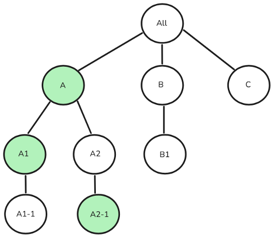

# User access management from Campaign Standard to Campaign v8 {#user-management-acs}

Both Adobe Campaign Standard and Adobe Campaign v8 enable users to define and manage permissions for different users/operators. These permissions consist of specific rights that grant users access to various features of the product. However, the two products use distinct approaches and implementations for managing user access.

The following concepts are used in Adobe Campaign Standard and Campaign v8 to achieve user access management:

|Campaign Standard| Campaign v8 |
|---------|----------|
| User | Operator |
| Role | Named Right |
| Security Group | Operator Group |
| Organizational unit | Folder Permission |

## Migration approach from Security group to Operator group

>[!IMPORTANT]
>
>The capabilities of these Roles/Named rights may vary in implementation, potentially causing authorization issues (e.g., privilege elevation or functionality disruptions). We recommend users to review these mappings after the transition to ensure proper access control. [Learn more about permissions](https://experienceleague.adobe.com/en/docs/campaign/campaign-v8/admin/permissions/manage-permissions)

The table below outlines the migration approach for user role groups when transitioning from Adobe Campaign Standard to Campaign v8. In Campaign Standard, a **Security group**, referred to as an **Operator group** in Campaign v8, is used to assign a set of roles to a user. While some security groups/operator groups are available out-of-the-box, users can create new groups or modify existing ones if needed.

| | **Campaign Standard**| **Campaign v8** |
|---------|----------|---------|
| **Terminology** | Security Group | Operator Group |

In both Adobe Campaign Standard and Campaign v8, **Security groups** and **Operator groups** are mapped to Product profiles in the Admin console. If you want to assign a **Security group** or **Operator group** to a user, you can link the corresponding **Product profile** in the Admin console. This association is synchronized when the user logs in. [Learn more about Product profile](https://experienceleague.adobe.com/en/docs/campaign/campaign-v8/admin/permissions/manage-permissions)

| **Campaign Standard Security group** | **Campaign v8 Operator group** |
|----------|---------|
| Administrators | Administrators |
| Delivery supervisors | Administrators |
| Workflow supervisors | Workflow supervisors |

## Migration approach from User roles to Named rights

>[!IMPORTANT]
>
>During migration from Adobe Campaign Standard to Campaign v8, users with the **Data Model** role but not **Administration** will automatically gain **Administration** access, as schema creation in Campaign v8 requires administration rights. To prevent this, remove their **Data Model** role before migration.

In Adobe Campaign Standard, the term **User role** is referred to as **Named right** in Campaign v8. The table below outlines the terminology used for **Named rights** in Campaign v8 corresponding to **User roles** in Campaign Standard.

| **Campaign Standard User role** | **Campaign v8 Named right** | **Description** |
|----------|---------|---------|
| Administration | Administration | User with the Administration right has full access to the instance.|
| Data Model  | Administration | Right to run publications and create custom resources. Schema creation related functionality available to Admin in Campaign v8. |
| Deliverability | Administration | Right to approve previously analyzed deliveries. |
| Export | Export | Right to export data. |
| File Access | Files Access | Right to approve previously analyzed deliveries. |
| Generic import  | Import | Right for generic data import |
| Prepare deliveries | Prepare deliveries | Right to create, modify, prepare and delete deliveries. |
| SQL Script Execution | SQL Script Execution | Right to execute any SQL command directly on the database. |
| Start deliveries | Start deliveries | Right to approve previously analyzed deliveries. |
| System Command Execution | Program Execution | Right to execute system commands on the server.|
| Workflow | Workflow | Right to manage the execution of workflows start, stop, pause etc. |

## Migration approach from Organizational unit

>[!IMPORTANT]
>
>Organizational units in Adobe Campaign Standard without **All (all)** as a direct or indirect parent will not be migrated to Campaign v8.
> 
>Users in multiple security groups are assigned the organizational unit of the highest-ranking security group. If multiple groups have parallel top-level units, the system selects the organizational unit for the user in Campaign Standard and the user would only have access to the system selected organizational unit and its children. In Campaign v8 after migration, the user would have access to **all the assigned organizational units and their children**, potentially escalating privileges. To prevent this, avoid assigning users to security groups with parallel organizational units. Learn more about [parallel organizational unit assignment](#parallel-assignments).

In Adobe Campaign Standard, the **Organization unit** is mapped to the existing **Folder** hierarchy model in Campaign v8 to maintain similar access control. [Learn more about folder management](https://experienceleague.adobe.com/en/docs/campaign/campaign-v8/admin/permissions/folder-permissions)

| | **Campaign Standard**| **Campaign v8** |
|---------|----------|---------|
| **Terminology** | Organizational unit | Folder |

### About parallel organizational unit assignment {#parallel-assignments}

A parallel organizational unit assignment occurs when a user has access to multiple units (assigned via security groups) that exist in separate branches of the hierarchy without having access to a common parent org unit. This creates a security risk during migration.

For example, consider the following organizational unit hierarchy:

{width="50%" zoomable="yes"}

An assignment without parallel organizational units would look like:

{width="50%" zoomable="yes"}

Here, the user has access to organizational units A, A1, and A2-1, all connected under the parent org unit A. The user can access everything under A.

The following assignment contains parallel organizational units:

{width="50%" zoomable="yes"}

The user has access to A1-1, A2 and A2-1, which exist in separate branches with no common assigned parent.

**Security implications**

* In Campaign Standard, the system selects one top level organizational unit (either A1-1 or A2) for the user, limiting access to just that unit and its children.
* After migration to Campaign V8, the user gains access to resources in all the assigned organizational units and their children.

**Resolution**

Parallel organizational unit assignment can be resolved by ensuring all organizational units assigned to a user fall under a single, common parent unit that is also assigned to the user. 

Some ways to achieve this are mentioned below:

1. Remove access to multiple branches: Revoke access to multiple parallel branches and ensure all access is under a single parent.
1. Assign a common parent: Grant access to an appropriate common parent org unit that includes all needed access points.
1. Restructure the hierarchy: Modify the org unit structure to place all needed access under a single branch.

For the example above where a user has access to A1-1, A2, and A2-1, specific resolutions steps are:

1. Remove access to multiple branches:

    1. Revoke access to A1-1, leaving only access to A2 (which includes A2-1), or
    1. Revoke access to A2 and A2-1, leaving only access to A1-1

1. Assign a common parent:

    1. Grant access to org unit A, which is the common parent of both A1-1 and A2, or
    1. Grant access to All, which covers the entire hierarchy
    
1. Restructure the hierarchy:

    1. Move A1-1 under A2, or
    1. Move A2 and A2-1 under A1-1

## Migration approach from Program 

In Campaign v8, **Programs** are represented as **Folders**. Campaign v8 enables the creation of folders and allows restricting access to them.

By using **Groups** and **Named rights**, **Operators** can be granted access to specific **Folders** within the navigation hierarchy, with the ability to assign read, write, and delete permissions. [Learn more about folder management](https://experienceleague.adobe.com/en/docs/campaign/campaign-v8/admin/permissions/folder-permissions)

Since a **Program** is treated as a **Folder** in Campaign v8, its access can be managed in the same way as any other folder. After migration, Campaign Standard administrators can follow these steps:

1. From the explorer, right-click on any folder and select **[!UICONTROL Properties...]**.

1. Navigate to the **[!UICONTROL Security]** tab.

1. Modify the operator group permissions as per the desired access model.  

## Product profile mapping to access REST APIs  

To access transactional APIs from the execution instance in Campaign v8, a new **Product profile** is required, in addition to the **Administrator** and **Message Center** product profiles. This new **Product profile** will be added to existing or pre-created technical accounts in Campaign Standard.

After migration, Campaign Standard users should review their **Product Profile mappings** and assign the appropriate **Product Profile** if they do not wish to link their **Technical accounts** to the **Administrator** Product Profile. For future integrations, we recommend using the Campaign v8 **Tenant ID** in the **REST URL** instead of the previous Campaign Standard **Tenant ID**.

## Migration of access to built-in Campaign resources for Campaign Standard operators

Operators migrated from Campaign Standard will have read access to specific built-in resources in Campaign v8.

## Non-migrated security groups and roles {#non-migrated-groups-roles}

Below is a list of Campaign Standard roles that have not been transitioned:

* Default Relay Account  

* Message Center Push  
 
Below is a list of Campaign Standard security group mappings that have not been transitioned.
 
* Message Center Agents

* Message Center Push Agents

* Adobe Experience Manager application managers   

* Relay Account

>[!NOTE]
>
>Custom roles created and assigned to users in Adobe Campaign Standard will not be migrated to Adobe Campaign v8.
