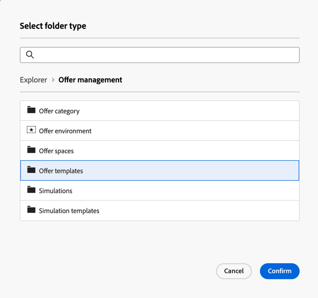

# Create and Manage a Folder

In Adobe Campaign, you can create new folders to manage your navigation tree. In **[!UICONTROL Explorer]**, go to the folder where you want to create your new folder.

Under the **[!UICONTROL ...]** button, select **[!UICONTROL Create new folder]**.

  {zoomable="yes"}

When you create a new folder, the folder type defaults to the type of the parent folder.  
In this example, a folder is created in the **[!UICONTROL Deliveries]** folder.

  {zoomable="yes"}

You can change the folder type by clicking on the Folder type icon and selecting a type from the list presented.

  {zoomable="yes"}

Set up the folder type by clicking the **[!UICONTROL Confirm]** button.

To create a folder with no specific type, select the **[!UICONTROL Generic Folder]** type.

In the Adobe Campaign console, the process for creating and managing folders is explained [here](https://experienceleague.adobe.com/en/docs/campaign/campaign-v8/config/configuration/folders-and-views). You can also set up permissions for folders. [Learn more](https://experienceleague.adobe.com/en/docs/campaign/campaign-v8/admin/permissions/folder-permissions).