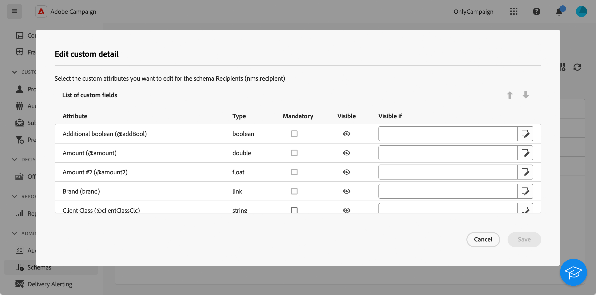

# Configure custom fields {#custom-fields}

Custom fields are additional attributes added to the out-of-the-box schemas through the Adobe Campaign console. Learn more in the [Adobe Campaign v8 documentation](https://experienceleague.adobe.com/docs/campaign/campaign-v8/developer/shemas-forms/extend-schema.html){target="_blank"}

These custom fields are displayed in various screens, for example the details of a profile or a test profile.

In the web user interface, you cannot create custom fields, but you can modify the way they display. Modifications apply to all Campaign users.

>[!NOTE]
>
>You need to have administrator rights to modify custom fields.

Custom fields are available in the following schemas:

* Recipients (nms)
* Campaigns (nms)
* Deliveries (nms)
* Seed addresses (nms)

To configure custom fields, follow these steps:

1. Under **Administration**, click **Schemas**.

    {zoomable="yes"}

1. Locate the desired schema, for example the **Recipients (nms)** schema.

    {zoomable="yes"}

1. Click the **More actions** button and select **Edit custom detail**. 

    {zoomable="yes"}

    The **Edit custom detail** screen displays all custom fields and their type. 

    {zoomable="yes"}

    This screen allows you to perform the following actions:

    * change the order of the different fields using the up and down arrows.
    * make the field mandatory: check the **Mandatory** box. 
    * make the field visible or hide it: click the **Visible** button.
    * add a visibility condition: click the **Visible if** button and write your xtk expression using the available xtk functions.

1. Navigate to the screen which display the custom field. In our example, it's the profile details screen.

    {zoomable="yes"}
