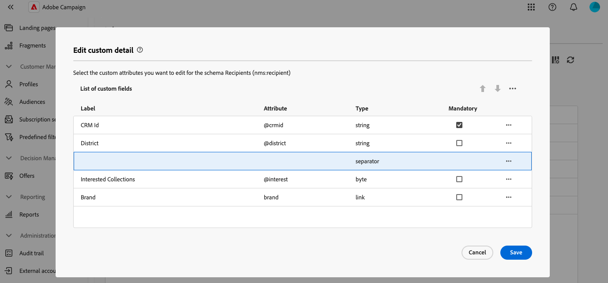
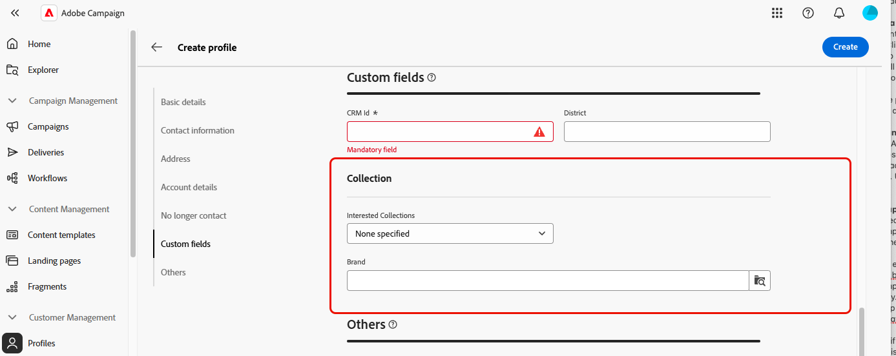

# Configure custom fields {#custom-fields}

>[!CONTEXTUALHELP]
>id="acw_schema_editcustomfields"
>title="Screen edition"
>abstract="All custom fields displayed in the interface for the selected schema display. You can change the order in which they display in the interface, using the up and down arrows, and group fields into sub-sections by adding separators. To delete a custom field or edit settings such as visibility conditions, click the ellipsis button."

>[!CONTEXTUALHELP]
>id="acw_schema_editcustomfields_settings_general"
>title="General"
>abstract="Define the custom field's general settings. If no label is provided, the label defined in the schema will display. Use the **Visible if** field to define a condition using an xtk expression that controls when the field is displayed. You can also mark the field as mandatory or read-only in the interface."

>[!CONTEXTUALHELP]
>id="acw_schema_editcustomfields_settings_link"
>title="Link properties"
>abstract="Use the query modeler to specify rules for displaying a link-type custom field. For example, restrict list values based on another field's input."

>[!CONTEXTUALHELP]
>id="acw_schema_editcustomfields_settings_layout"
>title="Layout"
>abstract="By default, custom fields display in the interface in two columns. Toggle on this option to display the custom field across the full width of the screen instead of two columns."

>[!CONTEXTUALHELP]
>id="acw_schema_editcustomfields_separatorproperties"
>title="Separator properties"
>abstract="Specify the name to display in the interface for the sub-section."

<!-- NOT USED IN THE UI?-->

>[!CONTEXTUALHELP]
>id="acw_schema_editcustomfields_settings"
>title="Attribute settings"
>abstract="Attribute settings"

Custom fields are additional attributes added to out-of-the-box schemas through the Adobe Campaign console. They allow you to customize schemas by including new attributes to suit your organization's needs. Learn how to extend a schema in the [Adobe Campaign v8 documentation](https://experienceleague.adobe.com/docs/campaign/campaign-v8/developer/shemas-forms/extend-schema.html){target="_blank"}.

Custom fields can be displayed in various screens, such as profile details in the Campaign Web interface. Administrators can control which fields are visible and how they appear. These changes apply to all Campaign users.

>[!NOTE]
>
>You need to have administrator rights to manage custom fields.

Custom fields are available for the following schemas:

* Campaigns (nms)
* Plans (nms)
* Programs (nms)
* Recipients (nms)
* Seed addresses (nms)
* Deliveries (nms)

## Add custom fields to the interface {#add}

To display custom fields in the interface, follow these steps:

1. Browse to the **[!UICONTROL Schemas]** menu in the left navigation pane, and locate the desired schema.

    Use the **[!UICONTROL Editable]** filter in the filters pane to quickly identify schemas with custom fields.

    

1. Select the schema name in the list to open it. A detailed schema view displays. [Learn more about schema details](../administration/schemas.md). Click the **[!UICONTROL Screen edition]** button to access custom fields. In this example, fields are added for the **[!UICONTROL Recipients]** schema.

    

    The list of custom fields displayed in the interface for the schema appears. 

1. Click the **[!UICONTROL Preview]** button to display the custom fields in a sample screen. 

    

    Here, the "Amount" field has been marked as mandatory.

    

1. To add a custom field to the interface, click the ellipsis button and choose one of the following options:

    * **[!UICONTROL Select custom fields]**: Select one or multiple custom fields to display in the interface.
    * **[!UICONTROL Fill automatically the list of custom fields]**: Add all custom fields defined for the schema to the interface.

    

1. Once custom fields are added, you can:

    * **Reorder fields**: Use the up and down arrows, or move fields using drag and drop.
    * **Make fields mandatory**: Select the **Mandatory** checkbox. 
    * **Edit field settings**: Click the ellipsis button and choose **[!UICONTROL Edit]**. [Learn more](#settings)
    * **Delete fields**: Click the ellipsis button and choose **[!UICONTROL Delete]**.
    * **Organize fields into sub-sections in the interface**: Click the ellipsis button next to the up and down arrows and choose **[!UICONTROL Add separator]**. [Learn more](#separator)

## Configure custom fields settings {#settings}

To configure specific settings for each custom field, click the ellipsis button next to the desired field and select **[!UICONTROL Edit]**.

Available settings are:

* **[!UICONTROL Attribute]**: The name of the custom field. 
* **[!UICONTROL Label (custom)]**: The label to display in the interface. If no label is provided, the label defined in the schema will display.
* **[!UICONTROL Visible if]**: Define a condition using an xtk expression that controls when the field is displayed. For example, hide this field if another field is empty.
* **[!UICONTROL Mandatory]**: Make the field mandatory in the interface.
* **[!UICONTROL Read-only]**: Make the field read-only in the interface. Users will not be able to edit the field's value.
* **[!UICONTROL Filter settings]** (for link-type fields): Use the query modeler to specify rules for displaying a link-type custom field. For example, restrict list values based on another field's input.

   You can also reference the value entered into other fields in your conditions using the syntax `$(<field-name>)`. This allows you to reference the current value of a field as entered in the form, even if it has not yet been saved to the database. 
   
   In the example below, the condition checks if the value of the @ref field matches the value entered in the @refCom field. In contrast, using `@refCom` instead of `$(@refCom)` would reference the value of the @ref field as it exists in the database. 

    +++View example

    

    +++

* **[!UICONTROL Span two columns]**: By default, custom fields display in the interface in two columns. Toggle on this option to display the custom field across the full width of the screen instead of two columns.

## Organize custom fields in sub-sections {#separator}

The Campaign Web user interface allows you to add separators to group custom fields in the interface for better readability. To do so, follow these steps:

1. Click the ellipsis button next to the up and down arrows, and select **[!UICONTROL Add separator]**.

1. A new line representing the separator is added to the list. Click the ellipsis button and choose **[!UICONTROL Edit]** to name the sub-section.

1. Use the up and down arrows to move the separator to the desired location. Fields listed below the separator will be grouped under it.

    In this example, the "Interested Collections" and "Brand" fields are grouped into a "Collection" sub-section.

    |Custom fields configuration|Rendering in the interface|
    |  ---  |  ---  |
    |{zoomable="yes"}|{zoomable="yes"}|