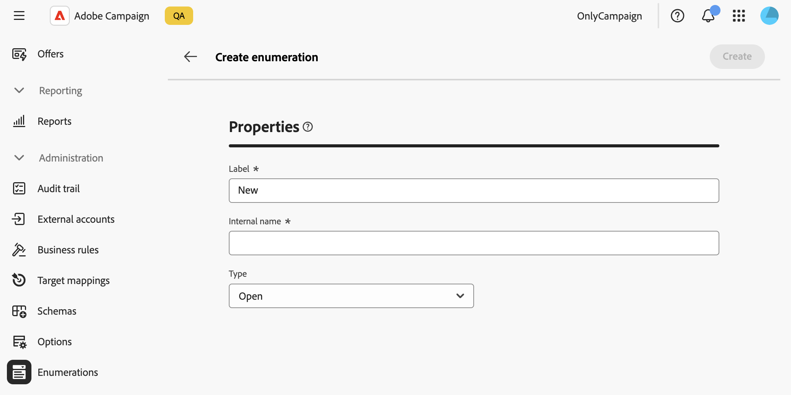
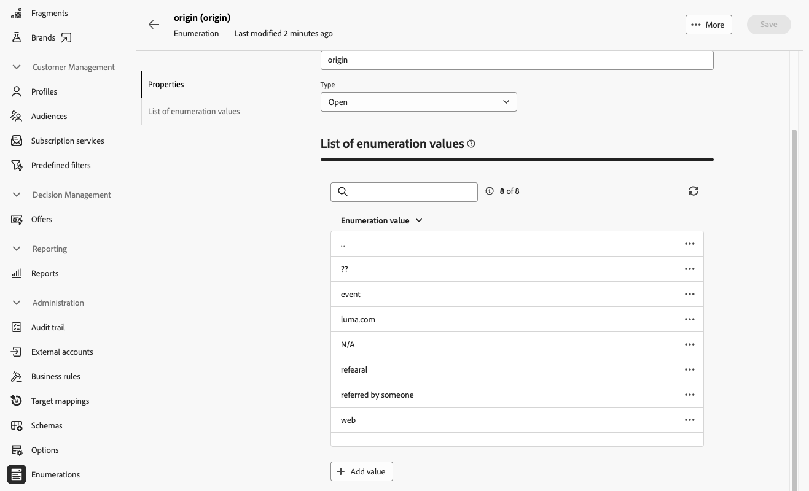

# Manage enumerations {#enumerations}

>[!CONTEXTUALHELP]
>id="acw_enumerations_list"
>title="Enumerations"
>abstract="An enumeration is a list of values suggested by the system to populate fields. Use enumerations to standardize the values of these fields, help with data input or use within queries."

>[!CONTEXTUALHELP]
>id="acw_enumerations_properties"
>title="Properties"
>abstract="Define the enumeration's properties such as its name, internal name, and type. **[!UICONTROL Closed]** enumerations have a fixed list of values which can only be modified from the **[!UICONTROL Enumerations]** menu. **[!UICONTROL Open]** enumerations allow users to add new values directly in the fields based on this enumeration. **[!UICONTROL System]** enumerations are associated to system fields. **[!UICONTROL Emoticon]** enumerations are used to update the emoticon list."

>[!CONTEXTUALHELP]
>id="acw_enumerations_values"
>title="List of enumeration values"
>abstract="To add a value to the enumeration, click the **[!UICONTROL Add value]** button then configure it as needed."

## What are enumerations? {#about}

An enumeration is a list of values suggested by the system to populate fields. Use enumerations to standardize the values of these fields, help with data input, or use within queries. The list of values appears as a drop-down list from which you can select the value to be entered in the field. The drop-down list also enables predictive input: enter the first letters, and the application fills in the rest.

The values for this type of field are defined via the **[!UICONTROL Administration]** / **[!UICONTROL Enumerations]** menu in the left navigation pane.

## Create an enumeration {#create}

To create an enumeration, follow these steps:

1. Navigate to the **[!UICONTROL Enumerations]** menu, then click the **[!UICONTROL Create enumeration]** button.

1. Enter a **[!UICONTROL Label]** and an **[!UICONTROL Internal name]** for the enumeration.

    

1. Select the enumeration **[!UICONTROL Type]**:

    * **[!UICONTROL Closed]** enumerations have a fixed list of values, which can only be modified from the **[!UICONTROL Enumerations]** menu. 
    * **[!UICONTROL Open]** enumerations allow users to add new values directly in the fields based on this enumeration.
    * **[!UICONTROL System]** enumerations are associated with system fields.
    * **[!UICONTROL Emoticon]** enumerations are used to update the emoticon list.

1. Click **[!UICONTROL Create]**. The enumeration details display, allowing you to add values to the list.

    

1. To add a value, click the **[!UICONTROL Add value]** button, then configure it as needed:

    * **[!UICONTROL Label]**: The label to display in the enumeration.
    * **[!UICONTROL Internal name]**: The value's internal name (for system enumerations).
    * **[!UICONTROL U+ (internal name)]** (emoticon enumerations): The unicode code for the emoticon (for emoticon enumerations).

    

1. Save your changes. The enumeration updates in the screens where it is used.

## Use case: Add predefined values to an enumeration {#uc}

By default, the "Origin" field in the profile details screen allows users to enter any value freely.

Each time a user enters a value for the field, the value is automatically added to the "Origin" enumeration. This can lead to redundant, inconsistent, or erroneous values over time in the values list.

To ensure data consistency and guide users when filling out the field, define a set of predefined values. Follow these steps:

1. Go to the **[!UICONTROL Enumerations]** menu and open the "Origin" enumeration.

2. Review the list of user-entered values and clean it up. Click the ellipsis button next to a value to delete it. If the list contains too many inconsistencies, delete the entire enumeration and re-create it from scratch.

    

3. Add predefined values. To do so, click the **[!UICONTROL Add value]** button and enter the predefined values users should select from.

    

4. To enforce consistency, switch the enumeration type to **[!UICONTROL Closed]**, which restricts users to predefined values. If flexibility is needed, keep it **[!UICONTROL Open]** to allow new user entries.

5. Return to the profile details screen. The "Origin" field now displays the predefined values for selection.

    