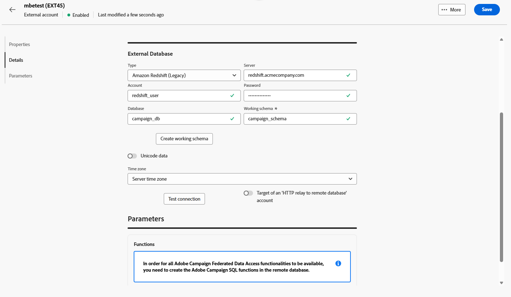
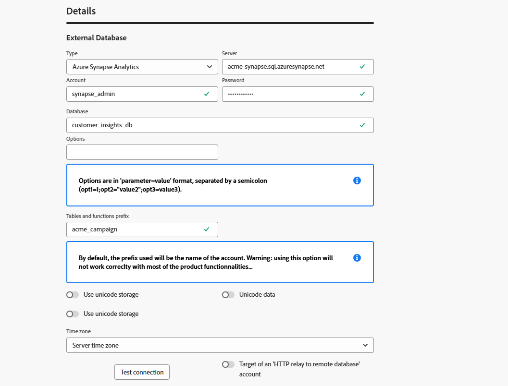

# External database accounts {#external-accounts}

Use an External database type external account to connect Adobe Campaign to a third-party database.

The configuration settings for the external account vary depending on the database engine you are connecting to. Detailed instructions for each supported database can be found in the sections below.

## Amazon Redshift

The Amazon Redshift external account allows you to connect your Campaign instance to your Amazon Redshift external database.

In Adobe Campaign Web User Interface, configure your Amazon Redshift external account.

1. [Create your external account](external-account.md) and select **[!UICONTROL External database]** as your external account's **[!UICONTROL Type]** and Amazon Redshift as **[!UICONTROL Provider type]**.

1. Click **[!UICONTROL Create]**. 

1. To configure the **[!UICONTROL Amazon Redshift]** external account, fill in the following fields:

    * **[!UICONTROL Type]**: Amazon Redshift

    * **[!UICONTROL Server]**: Enter the DNS name of your Redshift server.

    * **[!UICONTROL Account]**: Provide the Redshift username that will be used for authentication.

    * **[!UICONTROL Password]**: Enter the password associated with the user account.

    * **[!UICONTROL Database]**: Specify the database name if it is not already defined in the DSN. Leave this field empty if the DSN includes the database.

    * **[!UICONTROL Working schema]**: Input the schema name where Adobe Campaign will operate.

    * **[!UICONTROL Options]**: Add any advanced configuration options that may be required by your environment.

    * **[!UICONTROL Time zone]**: Select or enter the server's time zone to ensure accurate time-based operations.

    

1. After setting up the connection, create the Adobe Campaign SQL functions in your remote Redshift database. Once these functions are available, click **[!UICONTROL Deploy functions]** to activate them.

1. Link your **[!UICONTROL Storage account]** to optimize performance and enable faster data-loading processes between Adobe Campaign and Amazon Redshift.

1. Enter your **[!UICONTROL Account role]** which determines the permissions Adobe Campaign will use when interacting with your Redshift environment.

## Amazon Redshift (legacy)

The Amazon Redshift (legacy) external account allows you to connect your Campaign instance to your Amazon Redshift external database.

In Adobe Campaign Web User Interface, configure your Amazon Redshift (legacy) external account.

1. [Create your external account](external-account.md) and select **[!UICONTROL External database]** as your external account's **[!UICONTROL Type]** and Amazon Redshift (legacy) as **[!UICONTROL Provider type]**.

1. Click **[!UICONTROL Create]**. 

1. To configure the **[!UICONTROL Amazon Redshift (legacy)]** external account, fill in the following fields:

    * **[!UICONTROL Type]**: Amazon Redshift (legacy) 

    * **[!UICONTROL Server]**: Enter the DNS name of your Redshift server.

    * **[!UICONTROL Account]**: Provide the Redshift username that will be used for authentication.

    * **[!UICONTROL Password]**: Enter the password associated with the user account.

    * **[!UICONTROL Database]**: Specify the database name if it is not already defined in the DSN. Leave this field empty if the DSN includes the database.

    * **[!UICONTROL Working schema]**: Input the schema name where Adobe Campaign will operate.

    * **[!UICONTROL Time zone]**: Select or enter the server's time zone to ensure accurate time-based operations.

    

1. After setting up the connection, create the Adobe Campaign SQL functions in your remote Redshift database. Once these functions are available, click **[!UICONTROL Deploy functions]** to activate them.

## Azure Synapse Analytics

The Azure Synapse Analytics external account allows you to connect your Campaign instance to your Azure Synapse external database.

In Adobe Campaign Web User Interface, configure your Azure Synapse Analytics external account.

1. [Create your external account](external-account.md) and select **[!UICONTROL External database]** as your external account's **[!UICONTROL Type]** and Amazon Redshift as **[!UICONTROL Provider type]**.

1. Click **[!UICONTROL Create]**. 

1. To configure the **[!UICONTROL Azure Synapse Analytics]** external account, fill in the following fields:

    * **[!UICONTROL Type]**: Azure Synapse Analytics

    * **[!UICONTROL Server]**: Enter the URL of the Azure Synapse server.

    * **[!UICONTROL Account]**: Provide the username that will authenticate with the Synapse database.

    * **[!UICONTROL Password]**: Enter the password associated with the account.
  
    * **[!UICONTROL Database]**: Specify the target database you want Adobe Campaign to connect to.

    * **[!UICONTROL Tables and functions prefix]**: By default, this is set to the account name. You may adjust it if you prefer to use a different prefix for identifying Campaign-related objects.

    * **[!UICONTROL Options]**: Add any advanced configuration options that may be required by your environment.

    * **[!UICONTROL Time zone]**: Select or enter the server's time zone to ensure accurate time-based operations.

    

1. You can choose to enable the **[!UICONTROL Use a work tablespace for tables]** option, then specify the **[!UICONTROL Tablespace of tables]** where your working tables will be stored.

1. If needed, enable the **[!UICONTROL Use a work tablespace for indexes]** option, then provide the **[!UICONTROL Indexes tablespace]**.

    

1. After setting up the connection, create the Adobe Campaign SQL functions in your remote Azure Synapse Analytics database. Once these functions are available, click **[!UICONTROL Deploy functions]** to activate them.

## Databricks

The Databricks external account allows you to connect your Campaign instance to your Databricks external database.

In Adobe Campaign Web User Interface, configure your Databricks external account.

1. [Create your external account](external-account.md) and select **[!UICONTROL External database]** as your external account's **[!UICONTROL Type]** and Databricks as **[!UICONTROL Provider type]**.

1. Click **[!UICONTROL Create]**. 

1. To configure the **[!UICONTROL Databricks]** external account, fill in the following fields:

    * **[!UICONTROL Type]**: Databricks

    * **[!UICONTROL Server]**: Enter the DNS name of your Databricks server.

    * **[!UICONTROL Account]**: Provide the Databricks username that will be used for authentication.

    * **[!UICONTROL Password]**: Enter the password associated with the user account.

    * **[!UICONTROL Catalog]**: Specify the catalog you want to use.

    * **[!UICONTROL Working schema]**: Enter the name of the schema where Adobe Campaign will create and manage its working objects.

    * **[!UICONTROL Options]**: Add any advanced configuration options that may be required by your environment.

    

1. After setting up the connection, create the Adobe Campaign SQL functions in your remote Databricks database. Once these functions are available, click **[!UICONTROL Deploy functions]** to activate them.

1. Link your **[!UICONTROL Storage account]** to optimize performance and enable faster data-loading processes between Adobe Campaign and Databricks.

## Google BigQuery

The Google BigQuery external account allows you to connect your Campaign instance to your Google BigQuery external database.

In Adobe Campaign Web User Interface, configure your Google BigQuery external account.

1. [Create your external account](external-account.md) and select **[!UICONTROL External database]** as your external account's **[!UICONTROL Type]** and Google BigQuery as **[!UICONTROL Provider type]**.

1. Click **[!UICONTROL Create]**. 

1. To configure the **[!UICONTROL Google BigQuery]** external account, fill in the following fields:

    * **[!UICONTROL Type]**: Google BigQuery

    * **[!UICONTROL Account]**: Enter the username or service account that Adobe Campaign will use to connect to BigQuery.

    * **[!UICONTROL Login file upload method]**: Choose how to provide the service account keym either by entering the key file path manually or by uploading the key file directly to the server.
     
    * **[!UICONTROL Server]**: If you select the manual entry option, provide the server URL.

    * **[!UICONTROL Project]**: Specify the Google Cloud project ID associated with your BigQuery instance.

    * **[!UICONTROL Dataset]**: Enter the name of the dataset where Adobe Campaign will store and query data.

    * **[!UICONTROL Options]**: Add any advanced configuration options that may be required by your environment.

    

1. Under **[!UICONTROL Parameters]**, paste the contents of the service account key JSON file to authenticate Adobe Campaign with Google BigQuery.

1. After setting up the connection, create the Adobe Campaign SQL functions in your remote Google BigQuery database. Once these functions are available, click **[!UICONTROL Deploy functions]** to activate them.

1. If your environment requires proxy access to connect to the BigQuery server, configure the proxy settings. 

    Start by selecting your proxy type: http, http_no_tunnel, socks4, or socks5.

1. Fill in the following proxy configuration fields to establish secure access:

    * **[!UICONTROL Proxy Host]**: The address of the proxy server.
    * **[!UICONTROL Proxy Port]**: The port used by the proxy server.
    * **[!UICONTROL Proxy UID]**: The user ID for authenticating with the proxy server, if required.
    * **[!UICONTROL Proxy Host]**: The password corresponding to the Proxy UID (if applicable).

    

## Microsoft SQL Server

The Microsoft SQL Server external account allows you to connect your Campaign instance to your Microsoft SQL Server external database.

In Adobe Campaign Web User Interface, configure your Microsoft SQL Server external account.

1. [Create your external account](external-account.md) and select **[!UICONTROL External database]** as your external account's **[!UICONTROL Type]** and Microsoft SQL Server as **[!UICONTROL Provider type]**.

1. Click **[!UICONTROL Create]**. 

1. To configure the **[!UICONTROL Microsoft SQL Server]** external account, fill in the following fields:

    * **[!UICONTROL Type]**: Microsoft SQL Server

    * **[!UICONTROL Server]**: Enter the DNS name of your Microsoft SQL Server.

    * **[!UICONTROL Account]**: Provide the Microsoft SQL Server username that will be used for authentication.

    * **[!UICONTROL Password]**: Enter the password associated with the user account.

    * **[!UICONTROL Database]**: Specify the database name if it is not already defined in the DSN. Leave this field empty if the DSN includes the database.

    * **[!UICONTROL Options]**: Add any advanced configuration options that may be required by your environment.

    * **[!UICONTROL Tables and functions prefix]**: By default, this is set to the account name. You may adjust it if you prefer to use a different prefix for identifying Campaign-related objects.

    * **[!UICONTROL Time zone]**: Select or enter the server's time zone to ensure accurate time-based operations.

    

1. You can choose to enable the **[!UICONTROL Use a work tablespace for tables]** option, then specify the **[!UICONTROL Tablespace of tables]** where your working tables will be stored.

1. If needed, enable the **[!UICONTROL Use a work tablespace for indexes]** option, then provide the **[!UICONTROL Indexes tablespace]**.

1. After setting up the connection, create the Adobe Campaign SQL functions in your remote Microsoft SQL Server database. Once these functions are available, click **[!UICONTROL Deploy functions]** to activate them.

## MySQL

The MySQL external account allows you to connect your Campaign instance to your MySQL external database.
In Adobe Campaign Web User Interface, configure your MySQL external account.

1. [Create your external account](external-account.md) and select **[!UICONTROL External database]** as your external account's **[!UICONTROL Type]** and MySQL as **[!UICONTROL Provider type]**.

1. Click **[!UICONTROL Create]**. 

1. To configure the **[!UICONTROL MySQL]** external account, fill in the following fields:

    * **[!UICONTROL Type]**: MySQL

    * **[!UICONTROL Server]**: Enter the DNS name of your MySQL server.

    * **[!UICONTROL Account]**: Provide the MySQL username that will be used for authentication.

    * **[!UICONTROL Password]**: Enter the password associated with the user account.

    * **[!UICONTROL Database]**: Specify the database name if it is not already defined in the DSN. Leave this field empty if the DSN includes the database.

    * **[!UICONTROL Time zone]**: Select or enter the server's time zone to ensure accurate time-based operations.

    

1. You can choose to enable the **[!UICONTROL Use a work tablespace for tables]** option, then specify the **[!UICONTROL Tablespace of tables]** where your working tables will be stored.

1. If needed, enable the **[!UICONTROL Use a work tablespace for indexes]** option, then provide the **[!UICONTROL Indexes tablespace]**.

1. After setting up the connection, create the Adobe Campaign SQL functions in your remote  MySQL database. Once these functions are available, click **[!UICONTROL Deploy functions]** to activate them.

## Netezza

The Netezza external account allows you to connect your Campaign instance to your Netezza external database.

In Adobe Campaign Web User Interface, configure your Netezza external account.

1. [Create your external account](external-account.md) and select **[!UICONTROL External database]** as your external account's **[!UICONTROL Type]** and Netezza as **[!UICONTROL Provider type]**.

1. Click **[!UICONTROL Create]**. 

1. To configure the **[!UICONTROL Netezza]** external account, fill in the following fields:

    * **[!UICONTROL Type]**: Netezza

    * **[!UICONTROL Server]**: Enter the DNS name of your Netezza server.

    * **[!UICONTROL Account]**: Provide the Netezza username that will be used for authentication.

    * **[!UICONTROL Password]**: Enter the password associated with the user account.

    * **[!UICONTROL Database]**: Specify the database name if it is not already defined in the DSN. Leave this field empty if the DSN includes the database.

    * **[!UICONTROL Time zone]**: Select or enter the server's time zone to ensure accurate time-based operations.

    

1. You can choose to enable the **[!UICONTROL Use a work tablespace for tables]** option, then specify the **[!UICONTROL Tablespace of tables]** where your working tables will be stored.

1. If needed, enable the **[!UICONTROL Use a work tablespace for indexes]** option, then provide the **[!UICONTROL Indexes tablespace]**.

1. After setting up the connection, create the Adobe Campaign SQL functions in your remote  Netezza database. Once these functions are available, click **[!UICONTROL Deploy functions]** to activate them.

## ODBC (Sybase ASE, Sybase IQ)

The ODBC (Sybase ASE, Sybase IQ) external account allows you to connect your Campaign instance to your ODBC (Sybase ASE, Sybase IQ) external database.
In Adobe Campaign Web User Interface, configure your ODBC (Sybase ASE, Sybase IQ) external account.

1. [Create your external account](external-account.md) and select **[!UICONTROL External database]** as your external account's **[!UICONTROL Type]** and ODBC (Sybase ASE, Sybase IQ) as **[!UICONTROL Provider type]**.

1. Click **[!UICONTROL Create]**. 

1. To configure the **[!UICONTROL ODBC (Sybase ASE, Sybase IQ)]** external account, fill in the following fields:

    * **[!UICONTROL Type]**: ODBC (Sybase ASE, Sybase IQ)

    * **[!UICONTROL Server]**: Enter the DNS name of your ODBC (Sybase ASE, Sybase IQ) server.

    * **[!UICONTROL Account]**: Provide the ODBC (Sybase ASE, Sybase IQ) Server username that will be used for authentication.

    * **[!UICONTROL Password]**: Enter the password associated with the user account.

    * **[!UICONTROL Database]**: Specify the database name if it is not already defined in the DSN. Leave this field empty if the DSN includes the database.

    * **[!UICONTROL Options]**: Add any advanced configuration options that may be required by your environment.

    * **[!UICONTROL Mass insert tool]**: Specify the full path to the mass insertion tool executable.

    * **[!UICONTROL Time zone]**: Select or enter the server's time zone to ensure accurate time-based operations.

    

1. You can choose to enable the **[!UICONTROL Use a work tablespace for tables]** option, then specify the **[!UICONTROL Tablespace of tables]** where your working tables will be stored.

1. If needed, enable the **[!UICONTROL Use a work tablespace for indexes]** option, then provide the **[!UICONTROL Indexes tablespace]**.

1. After setting up the connection, create the Adobe Campaign SQL functions in your remote ODBC database. Once these functions are available, click **[!UICONTROL Deploy functions]** to activate them.

## HTTP relay to remote database

The HTTP relay to remote database external account allows you to connect your Campaign instance to your HTTP relay to remote database external database.

In Adobe Campaign Web User Interface, configure your HTTP relay to remote database external account.

1. [Create your external account](external-account.md) and select **[!UICONTROL External database]** as your external account's **[!UICONTROL Type]** and Amazon Redshift as **[!UICONTROL Provider type]**.

1. Click **[!UICONTROL Create]**. 

1. To configure the **[!UICONTROL HTTP relay to remote database]** external account, fill in the following fields:

    * **[!UICONTROL Type]**: HTTP relay to remote database

    * **[!UICONTROL Server]**: Enter the full URL of the HTTP relay server that connects to your remote database.

    * **[!UICONTROL Account]**: Provide the username used to authenticate with the HTTP relay server.

    * **[!UICONTROL Password]**: Enter the password associated with this account.
  
    * **[!UICONTROL Datasource]**: Specify the target database to which Adobe Campaign should connect through the relay.

    * **[!UICONTROL Options]**: Add any advanced configuration options that may be required by your environment.

    

1. You can choose to enable the **[!UICONTROL Use a work tablespace for tables]** option, then specify the **[!UICONTROL Tablespace of tables]** where your working tables will be stored.

1. If needed, enable the **[!UICONTROL Use a work tablespace for indexes]** option, then provide the **[!UICONTROL Indexes tablespace]**.

1. After setting up the connection, create the Adobe Campaign SQL functions in your remote HTTP relay to remote database database. Once these functions are available, click **[!UICONTROL Deploy functions]** to activate them.

## Oracle

The Oracle external account allows you to connect your Campaign instance to your Oracle external database.
In Adobe Campaign Web User Interface, configure your Oracle external account.

1. [Create your external account](external-account.md) and select **[!UICONTROL External database]** as your external account's **[!UICONTROL Type]** and Oracle as **[!UICONTROL Provider type]**.

1. Click **[!UICONTROL Create]**. 

1. To configure the **[!UICONTROL Oracle]** external account, fill in the following fields:

    * **[!UICONTROL Type]**: Oracle

    * **[!UICONTROL Server]**: Enter the DNS name of your Oracle server.

    * **[!UICONTROL Account]**: Provide the Oracle username that will be used for authentication.

    * **[!UICONTROL Password]**: Enter the password associated with the user account.

    * **[!UICONTROL Time zone]**: Select or enter the server's time zone to ensure accurate time-based operations.

    

1. You can choose to enable the **[!UICONTROL Use a work tablespace for tables]** option, then specify the **[!UICONTROL Tablespace of tables]** where your working tables will be stored.

1. If needed, enable the **[!UICONTROL Use a work tablespace for indexes]** option, then provide the **[!UICONTROL Indexes tablespace]**.

1. After setting up the connection, create the Adobe Campaign SQL functions in your remote  Oracle database. Once these functions are available, click **[!UICONTROL Deploy functions]** to activate them.

## PostgreSQL

The PostgreSQL external account allows you to connect your Campaign instance to your PostgreSQL external database.
In Adobe Campaign Web User Interface, configure your PostgreSQL external account.

1. [Create your external account](external-account.md) and select **[!UICONTROL External database]** as your external account's **[!UICONTROL Type]** and PostgreSQL as **[!UICONTROL Provider type]**.

1. Click **[!UICONTROL Create]**. 

1. To configure the **[!UICONTROL PostgreSQL]** external account, fill in the following fields:

    * **[!UICONTROL Type]**: PostgreSQL

    * **[!UICONTROL Server]**: Enter the DNS name of your PostgreSQL server.

    * **[!UICONTROL Account]**: Provide the PostgreSQL username that will be used for authentication.

    * **[!UICONTROL Password]**: Enter the password associated with the user account.

    * **[!UICONTROL Database]**: Specify the database name if it is not already defined in the DSN. Leave this field empty if the DSN includes the database.

    * **[!UICONTROL Working schema]**: Enter the name of the schema where Adobe Campaign will create and manage its working objects.

    * **[!UICONTROL Time zone]**: Select or enter the server's time zone to ensure accurate time-based operations.

    

1. You can choose to enable the **[!UICONTROL Use a work tablespace for tables]** option, then specify the **[!UICONTROL Tablespace of tables]** where your working tables will be stored.

1. If needed, enable the **[!UICONTROL Use a work tablespace for indexes]** option, then provide the **[!UICONTROL Indexes tablespace]**.

1. After setting up the connection, create the Adobe Campaign SQL functions in your remote  PostgreSQL database. Once these functions are available, click **[!UICONTROL Deploy functions]** to activate them.

## SAP HANA

The SAP HANA external account allows you to connect your Campaign instance to your SAP HANA external database.

In Adobe Campaign Web User Interface, configure your SAP HANA external account.

1. [Create your external account](external-account.md) and select **[!UICONTROL External database]** as your external account's **[!UICONTROL Type]** and SAP HANA as **[!UICONTROL Provider type]**.

1. Click **[!UICONTROL Create]**. 

1. To configure the **[!UICONTROL SAP HANA]** external account, fill in the following fields:

    * **[!UICONTROL Type]**: SAP HANA

    * **[!UICONTROL Server]**: Enter the DNS name of your SAP HANA server.

    * **[!UICONTROL Account]**: Provide the SAP HANA username that will be used for authentication.

    * **[!UICONTROL Password]**: Enter the password associated with the user account.

    * **[!UICONTROL Options]**: Add any advanced configuration options that may be required by your environment.

    * **[!UICONTROL Working schema]**: Enter the name of the schema where Adobe Campaign will create and manage its working objects.

    * **[!UICONTROL Time zone]**: Select or enter the server's time zone to ensure accurate time-based operations.

    

1. You can choose to enable the **[!UICONTROL Use a work tablespace for tables]** option, then specify the **[!UICONTROL Tablespace of tables]** where your working tables will be stored.

1. If needed, enable the **[!UICONTROL Use a work tablespace for indexes]** option, then provide the **[!UICONTROL Indexes tablespace]**.

1. After setting up the connection, create the Adobe Campaign SQL functions in your remote  SAP HANA database. Once these functions are available, click **[!UICONTROL Deploy functions]** to activate them.

## Snowflake

The Snowflake external account allows you to connect your Campaign instance to your Snowflake external database.

In Adobe Campaign Web User Interface, configure your Snowflake external account.

1. [Create your external account](external-account.md) and select **[!UICONTROL External database]** as your external account's **[!UICONTROL Type]** and Snowflake as **[!UICONTROL Provider type]**.

1. Click **[!UICONTROL Create]**. 

1. To configure the **[!UICONTROL Snowflake]** external account, fill in the following fields:

    * **[!UICONTROL Type]**: Snowflake

    * **[!UICONTROL Server]**: Enter the DNS name of your Snowflake server.

    * **[!UICONTROL Account]**: Provide the Snowflake username that will be used for authentication.

    * **[!UICONTROL Password]**: Enter the password associated with the user account.

    * **[!UICONTROL Database]**: Specify the database name if it is not already defined in the DSN. Leave this field empty if the DSN includes the database.

    * **[!UICONTROL Working schema]**: Enter the name of the schema where Adobe Campaign will create and manage its working objects.

    * **[!UICONTROL Options]**: Add any advanced configuration options that may be required by your environment.

    * **[!UICONTROL Time zone]**: Select or enter the server's time zone to ensure accurate time-based operations.

    

1. After setting up the connection, create the Adobe Campaign SQL functions in your remote  Snowflake database. Once these functions are available, click **[!UICONTROL Deploy functions]** to activate them.

1. If you are using key pair authentication, from the **[!UICONTROL keypair.auth]** menu, enter the required values for:

    * **[!UICONTROL Password]**: The passphrase protecting the private key, if applicable.

    * **[!UICONTROL Private key]**: The private key used to authenticate the Snowflake account.

## Teradata

The Teradata external account allows you to connect your Campaign instance to your Teradata external database.

In Adobe Campaign Web User Interface, configure your Teradata external account.

1. [Create your external account](external-account.md) and select **[!UICONTROL External database]** as your external account's **[!UICONTROL Type]** and Teradata as **[!UICONTROL Provider type]**.

1. Click **[!UICONTROL Create]**. 

1. To configure the **[!UICONTROL Teradata]** external account, fill in the following fields:

    * **[!UICONTROL Type]**: Teradata

    * **[!UICONTROL Server]**: Enter the DNS name of your Teradata server.

    * **[!UICONTROL Account]**: Provide the Teradata username that will be used for authentication.

    * **[!UICONTROL Password]**: Enter the password associated with the user account.

    * **[!UICONTROL Database]**: Specify the database name if it is not already defined in the DSN. Leave this field empty if the DSN includes the database.

    * **[!UICONTROL Options]**: Add any advanced configuration options that may be required by your environment.

    * **[!UICONTROL Time zone]**: Select or enter the server's time zone to ensure accurate time-based operations.

    

1. You can choose to enable the **[!UICONTROL Use a work tablespace for tables]** option, then specify the **[!UICONTROL Tablespace of tables]** where your working tables will be stored.

1. If needed, enable the **[!UICONTROL Use a work tablespace for indexes]** option, then provide the **[!UICONTROL Indexes tablespace]**.

1. After setting up the connection, create the Adobe Campaign SQL functions in your remote  Teradata database. Once these functions are available, click **[!UICONTROL Deploy functions]** to activate them.

1. If needed, enter your **[!UICONTROL PostConnect Script]** if you want a script to execute automatically after each connection is established. If you want the script to run every time, enable the **[!UICONTROL Run every time]** option.

## Vertica Analytics

In Adobe Campaign Web User Interface, configure your Vertica Analytics external account.

1. [Create your external account](external-account.md) and select **[!UICONTROL External database]** as your external account's **[!UICONTROL Type]** and Vertica Analytics as **[!UICONTROL Provider type]**.

1. Click **[!UICONTROL Create]**. 

1. To configure the **[!UICONTROL Vertica Analytics]** external account, fill in the following fields:

    * **[!UICONTROL Type]**: Vertica Analytics

    * **[!UICONTROL Server]**: Enter the DNS name of your Vertica Analytics server.

    * **[!UICONTROL Account]**: Provide the Vertica Analytics username that will be used for authentication.

    * **[!UICONTROL Password]**: Enter the password associated with the user account.

    * **[!UICONTROL Database]**: Specify the database name if it is not already defined in the DSN. Leave this field empty if the DSN includes the database.

    * **[!UICONTROL Working schema]**: Enter the name of the schema where Adobe Campaign will create and manage its working objects.

    * **[!UICONTROL Options]**: Add any advanced configuration options that may be required by your environment.

    * **[!UICONTROL Time zone]**: Select or enter the server's time zone to ensure accurate time-based operations.

    

1. After setting up the connection, create the Adobe Campaign SQL functions in your remote  Vertica Analytics database. Once these functions are available, click **[!UICONTROL Deploy functions]** to activate them.

## Microsoft Fabric {#fabric}

The Microsoft Fabric external account allows you to connect your Campaign instance to your Microsoft Fabric external database.

In Adobe Campaign Web User Interface, configure your Microsoft Fabric external account.

1. [Create your external account](external-account.md) and select **[!UICONTROL External database]** as your external account's **[!UICONTROL Type]** and Microsoft Fabric as **[!UICONTROL Provider type]**.

1. Click **[!UICONTROL Create]**. 

1. To configure the **[!UICONTROL Microsoft Fabric]** external account, fill in the following fields:

    * **[!UICONTROL Type]**: Microsoft Fabric

    * **[!UICONTROL Server]**: Enter the DNS name of your Microsoft Fabric server.

    * **[!UICONTROL Account]**: Provide the Microsoft Fabric username (or service principal) that will be used for authentication.

    * **[!UICONTROL Password]**: Enter the password or secret associated with the account.

    * **[!UICONTROL Options]**: Add any advanced configuration options that may be required by your environment.

    

1. After setting up the connection, create the Adobe Campaign SQL functions in your remote Redshift database. Once these functions are available, click **[!UICONTROL Deploy functions]** to activate them.

1. Link your **[!UICONTROL Storage account]** to optimize performance and enable faster data-loading processes between Adobe Campaign and Microsoft Fabric.

1. Enter your **[!UICONTROL Account role]** which determines the permissions Adobe Campaign will use when interacting with your Redshift environment.
