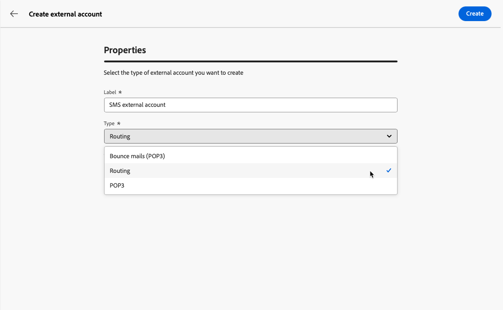
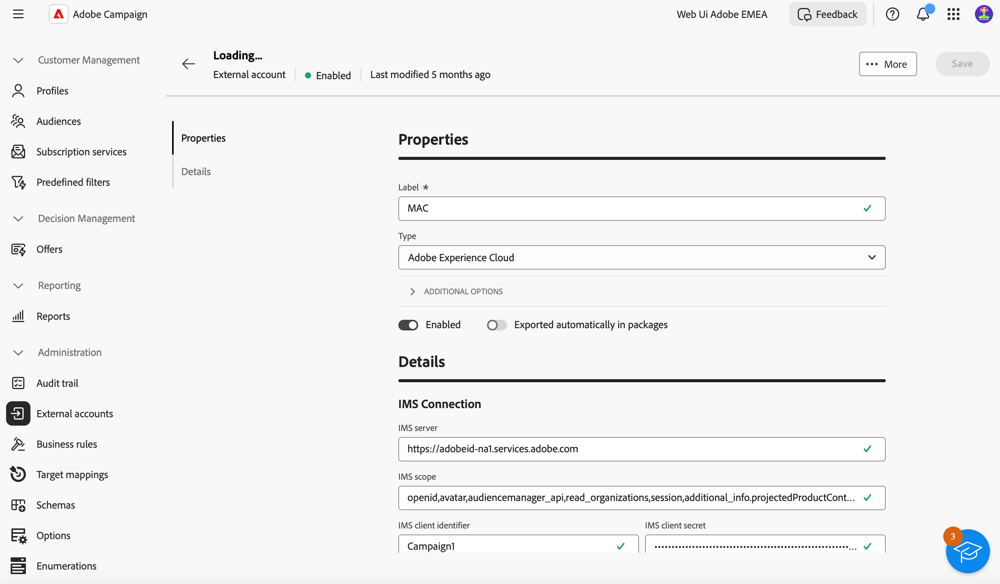

# Manage external accounts {#external-accounts}

>[!CONTEXTUALHELP]
>id="acw_homepage_welcome_rn3"
>title="External Account Authoring"
>abstract="As a Campaign administrator, you can now set up new connections with external systems from Campaign Web user interface. You can also view, update and manage existing external accounts."
>additional-url="https://experienceleague.adobe.com/docs/campaign-web/v8/release-notes/release-notes.html" text="See release notes"

Adobe Campaign includes pre-configured external accounts for easy integration with various systems. To connect to additional platforms or customize connections to fit your workflow, create new external accounts using the Web User Interface. This ensures seamless data transfers.

## Create an external account {#create-ext-account}

To create a new external account, follow the steps below. Detailed settings depend on the type of external account. [Learn more](#campaign-specific)

1. From the left-pane menu, select **[!UICONTROL External accounts]** under **[!UICONTROL Administration]**.

1. Click **[!UICONTROL Create external account]**.

    

1. Enter your **[!UICONTROL Label]** and select the external account **[!UICONTROL Type]**.

    >[!NOTE]
    >
    >The settings for Campaign-specific types are detailed in [this section](#campaign-specific).

    

1. Click **[!UICONTROL Create]**. 

1. From the **[!UICONTROL Additional options]** drop-down, change the **[!UICONTROL Internal name]** or **[!UICONTROL Folder]** path if needed. 

    

1. Enable the **[!UICONTROL Exported automatically in packages]** option to automatically export data managed by this external account. <!--Exported where??-->

    

1. In the **[!UICONTROL Details]** section, configure access to the account by specifying credentials based on the chosen external account type. [Learn more](#bounce)

1. Click **[!UICONTROL Test connection]** to verify that your configuration is correct. 

1. From the **[!UICONTROL More...]** menu, duplicate or delete your external account.

    

1. Once configuration is complete, click **[!UICONTROL Save]**.

## Campaign-specific external accounts {#campaign-specific}

Depending on the external account type you selected, follow the steps below to configure the account settings.

### Bounce mails (POP3) {#bounce}

The Bounce mails external account specifies the external POP3 account used to connect to the email service. All servers configured for POP3 access can receive return mail.

To configure the **[!UICONTROL Bounce mails (POP3)]** external account, fill in the following fields:

* **[!UICONTROL Server]** - URL of the POP3 server.

* **[!UICONTROL Port]** - POP3 connection port number (default port is 110).

* **[!UICONTROL Account]** - Name of the user.

* **[!UICONTROL Password]** - User account password.

* **[!UICONTROL Encryption]** - Type of chosen encryption, including:
    * By default (POP3 if port 110, POP3S if port 995).
    * POP3 that switches to SSL after sending a STARTTLS.
    * POP3 non-secure (port 110 by default).
    * POP3 secure above SSL (port 995 by default).

* **[!UICONTROL Function]** - Select **[!UICONTROL Inbound email]** to configure the account for receiving incoming emails or **[!UICONTROL SOAP router]** to handle SOAP requests.

>[!IMPORTANT]
>
>Before configuring your POP3 external account using Microsoft OAuth 2.0, you first need to register your application in the Azure portal. For more on this, refer to [this page](https://learn.microsoft.com/en-us/entra/identity-platform/quickstart-register-app){target=_blank}.

To configure a POP3 external using Microsoft OAuth 2.0, check the Microsoft OAuth 2.0 option and fill in the following fields:

* **[!UICONTROL Azure Tenant]**

    Azure ID (or Directory (tenant) ID) can be found in the Essentials drop-down of your application overview in the Azure portal.

* **[!UICONTROL Azure Client ID]**

    Client ID (or Application (client) ID) can be found in the Essentials drop-down of your application overview in the Azure portal.

* **[!UICONTROL Azure Client Secret]**

    Client secret ID can be found in the Client secrets column from the Certificates & secrets menu of your application in the Azure portal.

* **[!UICONTROL Azure Redirect URL]**

    Redirect URL can be found in the Authentication menu of your application in the Azure portal. It should end with the following syntax nl/jsp/oauth.jsp, e.g. `https://redirect.adobe.net/nl/jsp/oauth.jsp`.

Internet access is needed for setup and to use the Test Connection button in the client console. After setup, the inMail process can communicate with Microsoft servers without internet.

After entering your different credentials, you can click Setup the connection to finish your external account configuration.

### Routing {#routing}

To configure a specific external account for external deliveries, follow the steps below.

1. Create an external account. [Learn more](../administration/external-account.md#create-ext-account)

1. Select the **[!UICONTROL Routing]** type.

    {zoomable="yes"}

1. Select the desired channel and click **[!UICONTROL Create]**.

1. In the external account **[!UICONTROL Details]** section, **[!UICONTROL External]** is selected by default as the **[!UICONTROL Delivery mode]**.

    {zoomable="yes"}

    >[!NOTE]
    >
    >Currently, **[!UICONTROL External]** is the only available mode.

1. To handle the process after delivery execution, externalize this to a post-processing workflow. Create a workflow with an [External signal](../workflows/activities/external-signal.md) activity and select it from the **[!UICONTROL Post-processing]** field.

    {zoomable="yes"}

1. In the **[!UICONTROL Activity]** field, edit the name of the post-processing workflow activity displayed in the logs. <!--you can edit the name of the activity that will be created if you add an external or bulk delivery to a workflow-->

### Execution instance {#instance-exec}

If you have a segmented architecture, identify the execution instances associated with the control instance and establish connections between them. Transactional message templates are deployed on the execution instance.

To configure the **[!UICONTROL Execution instance]** external account:

* **[!UICONTROL URL]** - URL of the server where the execution instance is installed.

* **[!UICONTROL Account]** - Name of the account, matching the Message Center Agent as defined in the operator folder.

* **[!UICONTROL Password]** - Password of the account as defined in the operator folder.

* **[!UICONTROL Method]** - Choose between Web service or Federated Data Access (FDA). 
    
    For FDA, select your FDA account. Note that Campaign connection to external systems is restricted to advanced users and only available from the client console. [Learn more](https://experienceleague.adobe.com/en/docs/campaign/campaign-v8/connect/fda#_blank)

* **[!UICONTROL Create archiving workflow]** - For each execution instance registered in the Message Center, regardless of whether you have one or multiple instances, create a separate archiving workflow for each external account associated with the execution instance.

## Adobe Solution Integration External Accounts

### Adobe Experience Cloud

To connect to the Adobe Campaign console using an Adobe ID, you must configure the Adobe Experience Cloud (MAC) external account.

* **[!UICONTROL IMS server]**

  URL of your IMS server. Make sure both stage and production instances point to the same IMS production end point.

* **[!UICONTROL IMS scope]**

  Scopes defined here must be a subset of those provisioned by IMS.

* **[!UICONTROL IMS client identifier]**

  ID of your IMS client.

* **[!UICONTROL IMS client secret]**

  Credential of your IMS client secret.

* **[!UICONTROL Callback server]**

  Access URL of your Adobe Campaign instance.

* **[!UICONTROL IMS organization ID]**

  ID of your organization. To find your organization ID, refer to [this page](https://experienceleague.adobe.com/docs/core-services/interface/administration/organizations.html){target=_blank}.

* **[!UICONTROL Association mask]**

  Syntax which will allow configuration names in Enterprise Dashboard to be synced with the groups in Adobe Campaign.

* **[!UICONTROL Server]**

  URL of your Adobe Experience Cloud instance.

* **[!UICONTROL Tenant]**

  Name of your Adobe Experience Cloud Tenant.

## Transfer Data External Accounts

### Amazon Simple Storage Service (S3) {#amazon-simple-storage-service--s3--external-account}

The Amazon Simple Storage Service (S3) connector can be used to import or export data to Adobe Campaign. It can be set up in a workflow activity. For more on this, refer to [this page](https://experienceleague.adobe.com/en/docs/campaign-web/v8/wf/design-workflows/transfer-file){target=_blank}.

As you are setting up this new external account, you need to provide the following details:

* **[!UICONTROL AWS S3 Account Server]**

  URL of your server, it should be filled as follows:

    `  <S3bucket name>.s3.amazonaws.com/<s3object path>`

* **[!UICONTROL AWS access key ID]**

  To know where to find your AWS access key ID, refer to this [page](https://docs.aws.amazon.com/general/latest/gr/aws-sec-cred-types.html#access-keys-and-secret-access-keys).

* **[!UICONTROL Secret access key to AWS]**

  To know where to find your secret access key to AWS, refer to this [page](https://aws.amazon.com/fr/blogs/security/wheres-my-secret-access-key/).

* **[!UICONTROL AWS Region]**

  To learn more on AWS region, refer to this [page](https://aws.amazon.com/about-aws/global-infrastructure/regions_az/).

* The **[!UICONTROL Use server side encryption]** checkbox allows you to store your file in S3 encrypted mode.

To learn where to find the access key ID and secret access key, refer to Amazon Web services [documentation](https://docs.aws.amazon.com/general/latest/gr/aws-sec-cred-types.html#access-keys-and-secret-access-keys).

### Azure Blob Storage {#azure-blob-external-account}

The **[!UICONTROL Azure Blob Storage]** external account can be used to import or export data to Adobe Campaign using a **[!UICONTROL Transfer file]** workflow activity. For more on this, refer to [this section](https://experienceleague.adobe.com/en/docs/campaign-web/v8/wf/design-workflows/transfer-file){target=_blank}.

To configure the **[!UICONTROL Azure external account]** to work with Adobe Campaign, you need to provide the following details:

* **[!UICONTROL Server]**

  URL of your Azure Blob storage server.

* **[!UICONTROL Encryption]**

  Type of chosen encryption between **[!UICONTROL None]** or **[!UICONTROL SSL]**.

* **[!UICONTROL Access key]**

  To know where to find your **[!UICONTROL Access key]**, refer to this [page](https://docs.microsoft.com/en-us/azure/storage/common/storage-account-keys-manage?tabs=azure-portal).

## Hadoop

The Hadoop external account allows you to connect your Campaign instance to your Hadoop external database. You can learn more about Hadoop in [Campaign V7 console documentation](https://experienceleague.adobe.com/en/docs/campaign-classic/using/installing-campaign-classic/accessing-external-database/configure-fda/config-databases/configure-fda-hadoop){target=_blank}.

* **[!UICONTROL Server]**

  URL of your Hadoop storage server.

* **[!UICONTROL Account]**

  Name of your Hadoop server account.
