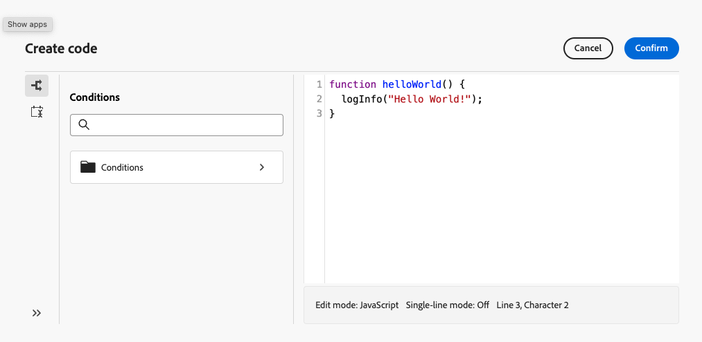
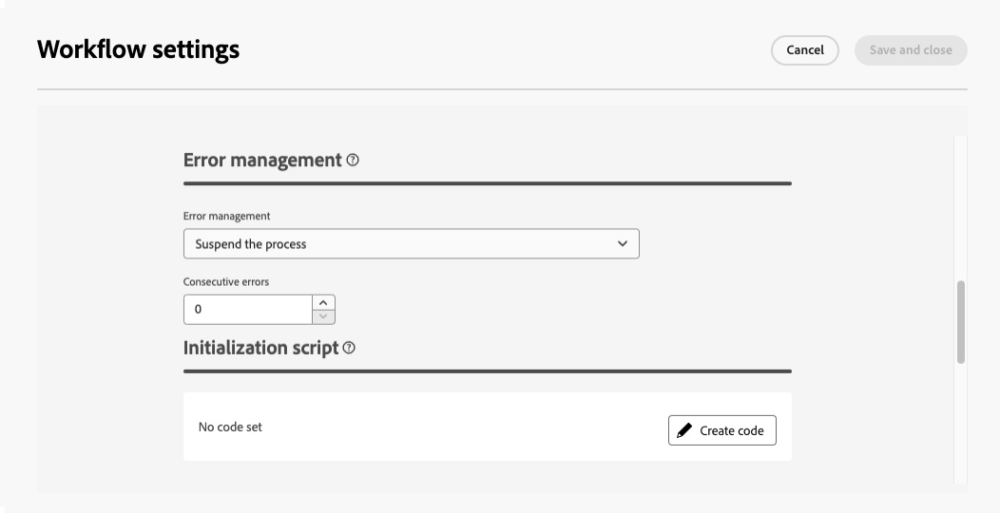

# Work with JavaScript codes {#javascript-codes}

<!-- JavaScript codes -->

>[!CONTEXTUALHELP]
>id="acw_javascript_codes_list"
>title="JavaScript codes"
>abstract="JavaScript codes"

>[!CONTEXTUALHELP]
>id="acw_javascript_codes_create"
>title="Create JavaScript code"
>abstract="Create JavaScript code"

## About JavaScript codes {#about}

JavaScript codes allow you to create reusable functions that can be utilized across workflows, similar to a library. These functions are stored in the **[!UICONTROL Administration]** > **[!UICONTROL JavaScript codes]** menu in the left navigation pane.


From the JavaScript codes list, you can:

* **Duplicate or delete a code**: Click the ellipsis button and select the desired action.
* **Modify a code**: Click a code's name to open its properties. Make your changes and save.
* **Create a new JavaScript code**: Click the **[!UICONTROL Create JavaScript code]** button.

>[!NOTE]
>
>Although the JavaScript codes menu location differs between the Adobe Campaign console and Web user interface, the list is identical and operates like a mirror.

## Create a JavaScript code {#create}

To create a JavaScript code, follow these steps:

1. Navigate to the **[!UICONTROL JavaScript codes]** menu and click the **[!UICONTROL Create JavaScript code]** button.

1. Define the code's properties:

    * **[!UICONTROL Namespace]**: Specify the namespace relevant to your custom resources. By default, the namespace is "cus" but it may vary depending on your implementation.
    * **[!UICONTROL Name]**: The unique identifier to use to reference the code.
    * **[!UICONTROL Label]**: The descriptive label to display in the JavaScript codes list.

    

    >[!NOTE]
    >
    >Once created, the **[!UICONTROL Namespace]** and **[!UICONTROL Name]** fields cannot be modified. To make changes, duplicate the code and update as needed.
    >
    >In the Campaign console, the JavaScript code name appears as a concatenation of these two fields.

1. Click the **[!UICONTROL Create code]** button to define the JavaScript code. The left pane provides two menus that allow you to use predefined functions related to conditions and date formatting.

    

1. Click **[!UICONTROL Confirm]** to save your code.

1. When your JavaScript code is ready, click **[!UICONTROL Create]**.  The JavaScript code is now available for use across workflows.

## Use a JavaScript code from a workflow {#workflow}

### Load JavaScript code libraries {#library}

You can reference JavaScript codes in workflows to avoid rewriting code for repetitive tasks. To use these codes, you first need to load the corresponding library in the workflow’s initialization script. This allows you to load all the libraries containing the functions you want to use in your workflow once.

To load a library, follow these steps:

1. Open a workflow and click the **[!UICONTROL Settings]** button.
1. Navigate to the **[!UICONTROL Initialization script]** section and click **[!UICONTROL Create code]**.
    
    
    
1. Use the syntax below in the code to load a library:

    ```
    loadLibrary("/<namespace>/<name>")
    ```

    * Replace `<namespace>` with the namespace specified during the JavaScript code creation.
    * Replace `<name>` with the name of the JavaScript code.

1. Click **[!UICONTROL Confirm]** and save the settings. 

### Reference functions in workflows {#reference}

Once the JavaScript library is loaded, you can reference the functions defined in the JavaScript code directly within the workflow, typically using a **[!UICONTROL JavaScript code]** activity.


