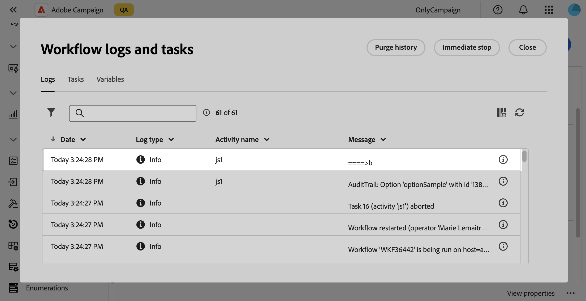
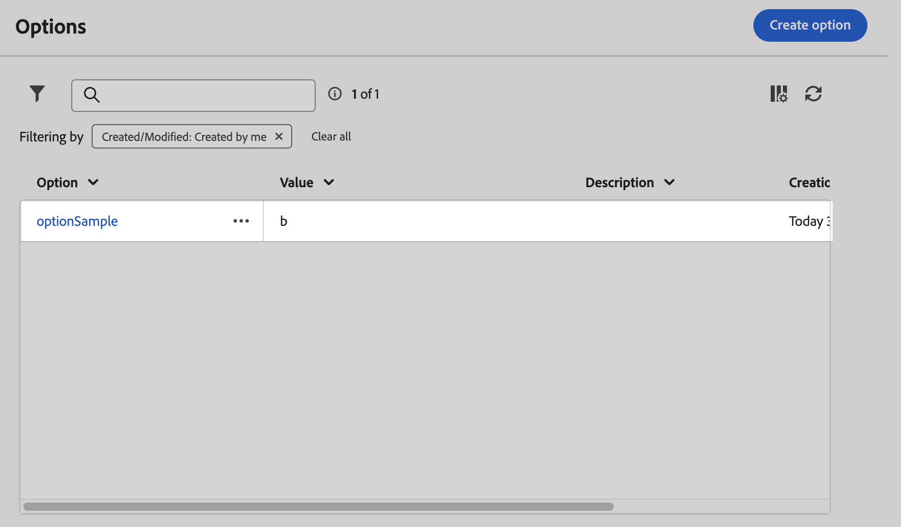

# Configure [!DNL Campaign] options {#options}

>[!CONTEXTUALHELP]
>id="acw_options_list"
>title="Options"
>abstract="Options"

>[!CONTEXTUALHELP]
>id="acw_options_create"
>title="Create option"
>abstract="Create option"

Adobe Campaign Web comes with technical options that allow you to configure the application more specifically. Some of these options are built-in, while others can be added manually as required.

>[!IMPORTANT]
>
>Built-in options are pre-configured and should only be modified by advanced users. If you have any question or request, reach out to your Adobe representative.

## Access Campaign options {#access}

Options are available from the **[!UICONTROL Administration]** / **[!UICONTROL Options]** menu. Use the filter pane to narrow down the list and quickly find the option you need.

>[!NOTE]
>
>Although the options menu location differs between the Adobe Campaign console and Web user interface, the list is identical and operates like a mirror. For more information on the available options, refer to the list of options in [Campaign v7 documentation](https://experienceleague.adobe.com/en/docs/campaign-classic/using/installing-campaign-classic/appendices/configuring-campaign-options){target="_blank"}

From the options list, you can:

* **Duplicate or delete an option**: Click the ellipsis button and select the desired action.
* **Modify an option**: Click the option's name to open its properties. Make your changes and save.
* **Create a custom option**: Click the **[!UICONTROL Create option]** button.

## Create an option {#create}

The Adobe Campaign Web user interface allows you to create your own custom options to suit your needs. This is particularly useful when working with **[!UICONTROL JavaScript code]** workflow activities to store intermediate data.

To create an option:

1. Access the options list and click **[!UICONTROL Create option]**.
1. Enter a name for the option, select its type and set the desired value.
1. Click **[!UICONTROL Create]** to create the option.

    

Options can act as a temporary storage space for data, providing the following benefits:

* Typed Values: Options support specific data types, such as dates, integers, strings...
* Flexibility: Options allow users to store and retrieve data efficiently without the overhead of managing database tables.

In the example below, we create a custom option named `sampleOption` with the initial value "a". A **[!UICONTROL JavaScript code]** activity in a workflow modifies this option's value and stores it into a variable. The updated value is displayed in the workflow logs and reflected in the **[!UICONTROL Options]** menu.

1. Create the option.

    

1. Configure a **[!UICONTROL JavaScript code]** activity and start the workflow.

    

1. Run the workflow to see the updated value in the workflow logs.

    

1. The updated value is now visible in the **[!UICONTROL Options]** menu.

    
