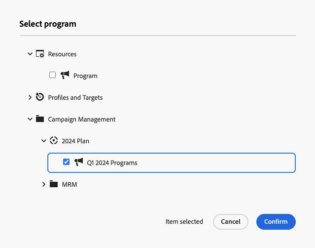

# Plans and programs {#plan-and-programs}

Adobe Campaign allows you to configure your folder hierarchy for marketing plans and programs.

To better organize these components, Adobe recommends the following hierarchy: Plan `>` Programs `>` Campaigns.

* A **plan** may contain multiple programs. It defines strategic objectives for a specific period.
* A **program** may contain other programs as well as campaigns, workflows, and landing pages.
* A **campaign** may contain deliveries, workflows, and landing pages.

## Create and configure a plan {#create-plan}

To create a plan, create a folder with the folder type **[!UICONTROL Plan]**. [Learn more about creating a folder](../get-started/work-with-folders.md).

{zoomable="yes"}

Go to the **[!UICONTROL Folder settings]** of your plan to manage it.

{zoomable="yes"}

Define **[!UICONTROL Custom options]**, and set the scheduling date of your plan.

{zoomable="yes"}

To manage the **[!UICONTROL Custom options]**:

1. Browse to the **[!UICONTROL Schemas]**.
1. Choose the **[!UICONTROL Editable]** schemas in the filters.
1. Click on the icon for **[!UICONTROL Edit custom details]**.

{zoomable="yes"}

Configure the custom options:

{zoomable="yes"}

## Create and configure a program

To create a program in your plan ([Learn more about creating a plan](#create-plan)), navigate to your plan and create a folder with the folder type **[!UICONTROL Program]**. [Learn more about creating a folder](../get-started/work-with-folders.md).

{zoomable="yes"}

Go to the **[!UICONTROL Folder settings]** of your program to manage it.

{zoomable="yes"}

Define **[!UICONTROL Custom options]**, and set the scheduling date of your program.

{zoomable="yes"}

To manage the **[!UICONTROL Custom options]**:

1. Browse to the **[!UICONTROL Schemas]**.
1. Choose the **[!UICONTROL Editable]** schemas in the filters.
1. Click on the icon for **[!UICONTROL Edit custom details]**.

{zoomable="yes"}

Configure the custom options:

{zoomable="yes"}

## How to link a campaign to a program

You have two ways to link a campaign to a program:

### Way #1: You already have a program and want to create a campaign linked to it

To link a new campaign to your program, create the campaign directly within the program.

{zoomable="yes"}

The **[!UICONTROL Folder]** settings will automatically populate with the path to your program.

{zoomable="yes"}

### Way #2: You already have an existing campaign and want to link it to an existing program

Go to the **[!UICONTROL Settings]** button of the campaign you want to link to your program.

{zoomable="yes"}

In its **[!UICONTROL Properties]**, click the **[!UICONTROL Folder]** icon in the **[!UICONTROL Folder]** settings to choose your **[!UICONTROL Program]** folder.

{zoomable="yes"}

Select your **[!UICONTROL Program]** folder, click the **[!UICONTROL Confirm]** button, and then click the **[!UICONTROL Save and Close]** button.

{zoomable="yes"}

Your campaign is now listed in your program.

{zoomable="yes"}