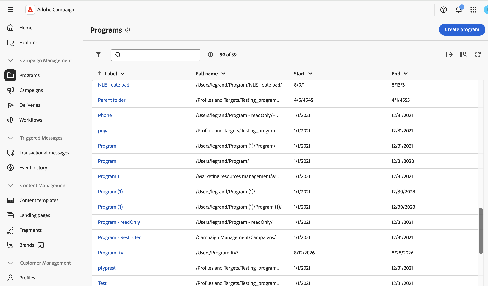
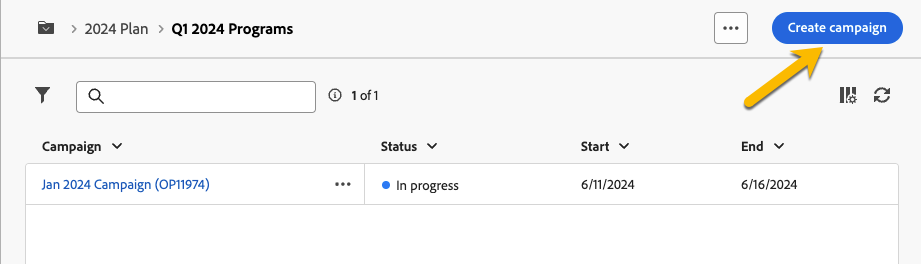
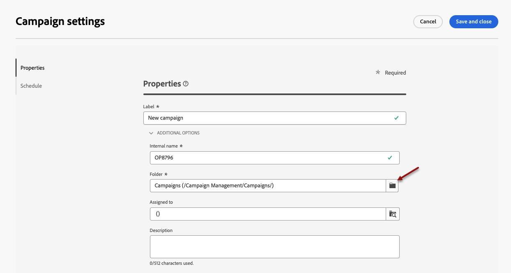
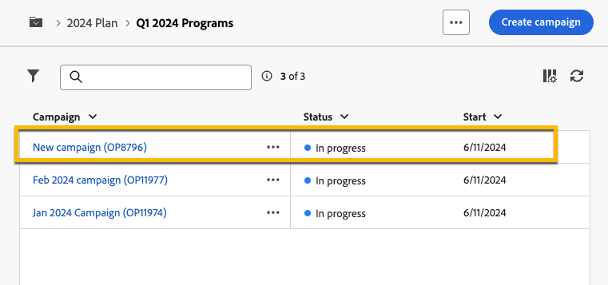

# Plans and programs {#plan-and-programs}

Adobe Campaign allows you to configure your folder hierarchy for marketing plans and programs.

To better organize these components, Adobe recommends the following hierarchy: Plan `>` Programs `>` Campaigns.

* A **plan** may contain multiple programs. It defines strategic objectives for a specific period.
* A **program** may contain other programs as well as campaigns, workflows, and landing pages.
* A **campaign** may contain deliveries, workflows, and landing pages.

## Create and configure a plan {#create-plan}

To create a plan, create a folder with the folder type **[!UICONTROL Plan]**. [Learn more about creating a folder](../get-started/work-with-folders.md)

{zoomable="yes"}

Go to the **[!UICONTROL Folder settings]** of your plan to manage it.

{zoomable="yes"}

Define **[!UICONTROL Custom options]**, and set the scheduling date of your plan.

{zoomable="yes"}

To manage the **[!UICONTROL Custom options]**:

1. Browse to the **[!UICONTROL Schemas]**.
1. Choose the **[!UICONTROL Editable]** schemas in the filters.
1. Click the schema.

{zoomable="yes"}

1. Click the **[!UICONTROL Screen edition]** button.

    {zoomable="yes"}

Configure the custom options:

{zoomable="yes"}

## Create and configure a program {#create-program}

Programs are available from the left navigation menu, similar to the list views for campaigns, deliveries, and workflows. The **[!UICONTROL Programs]** entry lets you create a program within an existing program, not under a plan. 

To create your first, top-level program in a plan, navigate to your plan in the Explorer (see this [section](#create-plan)), and create a folder with the folder type **[!UICONTROL Program]**. [Learn more about creating a folder](../get-started/work-with-folders.md).

To create a program within an existing program, follow the steps below:

1. Browse to the **[!UICONTROL Programs]** entry in the left navigation menu. This view lists all your programs and lets you search and filter. Clicking a program opens it in the Explorer view.

   {zoomable="yes"}

1. Click **[!UICONTROL Create program]** and configure the following options:

   {zoomable="yes"}

   * Enter a **[!UICONTROL Label]**.
   * Select the existing program to use as the **[!UICONTROL Parent folder]**.
   * Optionally, set a **[!UICONTROL Date range]** in the **[!UICONTROL Schedule]** section.

   >[!TIP]
   >
   >If you create a program from the Explorer view, the parent folder is automatically set to the current program.

1. Click **[!UICONTROL Create program]** again to save changes and create the program. The program is then displayed in the Explorer view. You can rename it, delete it, and access its settings, like any other folder. You can also create sub-programs within this program.

   {zoomable="yes"}

Custom options for a program are configured the same way as for a plan. See [Create and configure a plan](#create-plan).

## How to link a campaign to a program

You have two ways to link a campaign to a program:

### Way #1: You already have a program and want to create a campaign linked to it

To link a new campaign to your program, create the campaign directly within the program.

{zoomable="yes"}

The **[!UICONTROL Folder]** settings will automatically populate with the path to your program.

{zoomable="yes"}

### Way #2: You already have an existing campaign and want to link it to an existing program

Go to the **[!UICONTROL Settings]** button of the campaign you want to link to your program.

{zoomable="yes"}

In its **[!UICONTROL Properties]**, click the **[!UICONTROL Folder]** icon in the **[!UICONTROL Folder]** settings to choose your **[!UICONTROL Program]** folder.

{zoomable="yes"}

Select your **[!UICONTROL Program]** folder, click the **[!UICONTROL Confirm]** button, and then click the **[!UICONTROL Save and Close]** button.

{zoomable="yes"}

Your campaign is now listed in your program.

{zoomable="yes"}