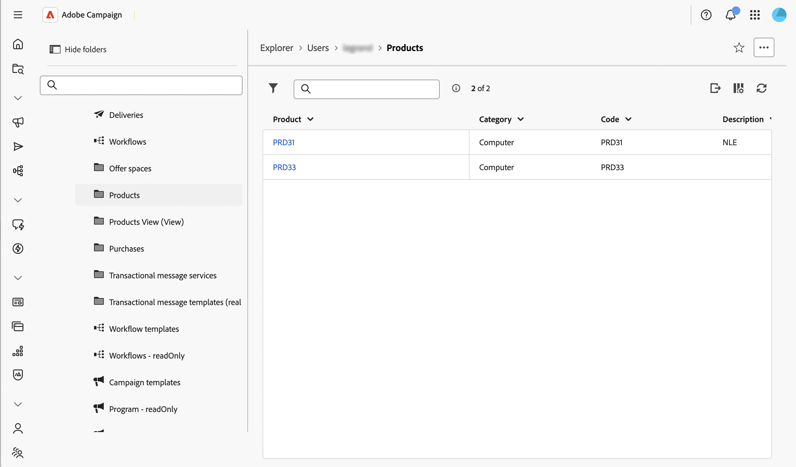

# Control actions on data {#action-data}

>[!CONTEXTUALHELP]
>id="acw_schema_action_data"
>title="Actions data"
>abstract="Configure actions available for the schema's detail and list screens. Enable **[!UICONTROL Read-only]** to set the detail screen as read-only and remove actions from the list. Enable **[!UICONTROL Do not allow deletion]** to remove the delete action from the detail and list screens."

The **[!UICONTROL Action data]** section allows you to restrict the actions available on a custom schema's records, regardless of the [security rules](../get-started/work-with-folders.md) configured on individual folders. This restriction applies at the schema level, in every folder, for every user, including administrators.

>[!NOTE]
>
>This section is only available for custom schemas.

For more information on the screen definition screen and how to access it, refer to the [Access the screen definition](schemas-browse-access.md#screen-def) section.

To configure action data, follow the steps below:

1. Browse to the **[!UICONTROL Schemas]** menu, and locate editable schemas using the filters. 

1. Select the schema name in the list to open it and click the **[!UICONTROL Screen edition]** button in the schema details view to access the screen definition. 

1. Scroll down to the **[!UICONTROL Action data]** section, at the bottom of the screen definition.

   

1. Select one or more of the available options:

   * **[!UICONTROL Read-only]**: The detail screen becomes read-only for all users. No create, duplicate, update, or delete action is available from the list, and the delete and duplicate actions are hidden from the detail screen. Selecting this option is similar to configuring a view: users can still open records and reuse them, for example when targeting a delivery, but cannot modify them.

   * **[!UICONTROL Do not allow deletion]**: The delete action is removed from the detail screen and from the list, in every folder. Other actions, such as create, duplicate, and update, remain available.

   * **[!UICONTROL Do not allow duplicate]**: The duplicate action is removed from the detail screen and from the list, in every folder. Other actions, such as create, delete, and update, remain available.

      >[!NOTE]
      >
      >Enabling **[!UICONTROL Read-only]** automatically covers deletion and duplication as well, so the **[!UICONTROL Do not allow deletion]** and **[!UICONTROL Do not allow duplicate]** options are disabled while **[!UICONTROL Read-only]** is selected.

1. Click **[!UICONTROL Save]**.

1. Browse to the list of records for this schema to check the result. 

   In this example, **[!UICONTROL Read-only]** is enabled: the list no longer displays the duplicate and delete actions.

   

1. Open a record to check the detail screen. Its fields are displayed without allowing any edition.

   
