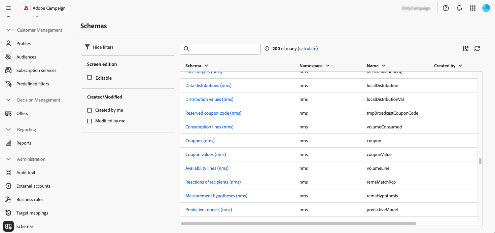

# Access and configure schemas {#access}

Schemas are accessible from the **[!UICONTROL Administration]** > **[!UICONTROL Schemas]** menu.

From this screen, you can view all existing schemas. Filters are available to help refine the list, such as displaying only editable schemas.

To open a schema, select its name. A detailed schema view displays.

## Schema overview {#overview}

The **[!UICONTROL Overview]** tab provides a general view of the schema:

* The **[!UICONTROL Properties]** section displays key information, such as the schema name, namespace, and associated table name.

* The **[!UICONTROL Schema definition]** section shows details about the schema definition, including the primary key used for data reconciliation and its links with other tables. 

    Click the **[!UICONTROL Schema preview]** button to view the different fields and links composing the schema. This allows you to check the complete structure of a schema. If the schema has been extended with custom fields, you can visualize all its extensions.

* The **[!UICONTROL Content]** section displays the XML content of the schema, allowing you to switch between the source and the generated syntax.

## Schema data {#data}

The **[!UICONTROL Data]** tab provides information on the schema data.

## Customize screen display {#screen-def}

The screen definition allows you to configure how schema fields are displayed and edited in the interface. You can configure default columns for list views, customize which custom fields are displayed in detail screens, add collection lists to show related data, and organize fields into sections with separators and visibility criteria.

To access the screen definition:

1. Browse to the **[!UICONTROL Schemas]** menu, and locate editable schemas using the filters. 

   

1. Select the schema name in the list to open it and click the **[!UICONTROL Screen edition]** button in the schema details view to access the screen definition. 

      

   The different lists allow you to reorder elements by using the up and down arrow icons or drag and dropping them. To remove items, click the trash icon on a specific row or select **[!UICONTROL Delete all]** from the ellipsis icon.

   

From the screen definition, you can:

* [Configure default list columns](schemas-list-columns.md) - Configure which columns are displayed by default in list views.
* [Edit custom fields](schemas-custom-fields.md) - Configure which custom fields are displayed in detail screens and organize them into sections.
* [Add collection lists](schemas-collection-lists.md) - Add collection lists to show related data in profile screens.
