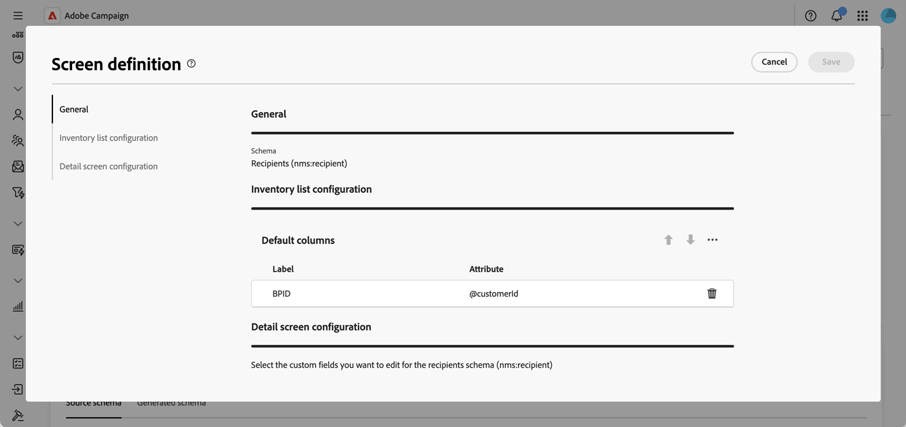

# Customize screen display {#screen-definition}

The screen definition allows you to configure how schema fields are displayed and edited in the interface. You can configure default columns for list views, customize which custom fields are displayed in detail screens, add collection lists to show related data, and organize fields into sections with separators and visibility criteria. 

Click the **[!UICONTROL Screen edition]** button in the schema details view to access the screen definition. The different lists allow you to reorder elements by using the up and down arrow icons or drag and dropping them. To remove items, click the trash icon on a specific row or select **[!UICONTROL Delete all]** from the to ellipsis icon.

## Configure default list columns {#list-columns}

The **[!UICONTROL Inventory list configuration]** section allows you to configure which columns are displayed by default in list views. Each column shows its label and the corresponding attribute.

To add new columns to the default list:

1. Click the ellipsis icon (three dots).
1. Choose **[!UICONTROL Select columns]**.
1. Select the attributes you want to display in list views and confirm.

   

## Edit custom fields {#fields}

Custom fields are additional attributes added to out-of-the-box schemas through the Adobe Campaign console. They allow you to customize schemas by including new attributes to suit your organization's needs. 

Custom fields can be displayed in various screens, such as profile details in the interface. You can control which fields are visible and how they appear in the interface.

To add new custom fields to the list:

1. Click the ellipsis icon above the **[!UICONTROL List of custom fields]** table and choose **[!UICONTROL Select attributes]**.
1. Select the custom fields you want to add and confirm.

   

To add a separator:

1. Click the ellipsis icon above the **[!UICONTROL List of custom fields]** table.
1. Click the ellipsis icon on the separator row in the list, and select **[!UICONTROL Edit]**.
1. Enter a **[!UICONTROL Label]** for the separator and (optional) set a **[!UICONTROL Visible if]** condition to control when the separator is displayed.

   

To automatically populate the list with available custom fields:

1. Click the ellipsis icon above the **[!UICONTROL List of custom fields]** table.
1. Choose **[!UICONTROL Fill automatically the list of custom fields]**.

To configure individual field properties:

1. Click the ellipsis icon on a field row in the list and select **[!UICONTROL Edit]**.
1. Enter a custom **[!UICONTROL Label]** if you want to override the default field label.
1. Set a **[!UICONTROL Visible if]** condition to control when the field is displayed.
1. Check **[!UICONTROL Mandatory]** to make the field required.
1. Check **[!UICONTROL Read-only]** to prevent users from editing the field value.
1. Check **[!UICONTROL Span two columns]** to make the field span the full width of the form.

   

Click **[!UICONTROL Preview]** to display the custom fields in a sample screen.

For detailed information on how to edit custom fields in a schema, refer to this section: [Configure custom fields](custom-fields.md).

## Add collection lists {#collection-lists}

The **List of custom lists** section allows you to define collection links, such as purchases. The related data is then displayed in profile screens through a dedicated tab.

>[!NOTE]
>
>Currently, this capability is only available for the Recipients schema. 

To add collections lists:

1. Click the ellipsis button and choose **Select custom lists**.

   

1. Select one of the available custom lists, for example purchases, then click **Confirm**.

   

1. Browse to the **Profiles** menu and filter profiles that have made purchases. 

   

1. Click on a profile. You notice that the new tab is displayed. You can add more columns if needed. 

   
