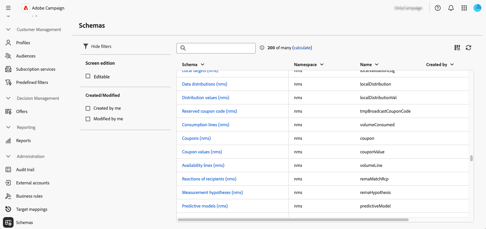

# Work with schemas {#schemas}

>[!CONTEXTUALHELP]
>id="acw_homepage_welcome_rn3"
>title="Work with Schemas"
>abstract="You can now access the details of a schema by selecting its name in the list. Custom fields edition is also accessible from the **Edit custom detail** button."
>additional-url="https://experienceleague.adobe.com/docs/campaign-web/v8/release-notes/release-notes.html" text="See release notes"

>[!CONTEXTUALHELP]
>id="acw_schema"
>title="Schemas"
>abstract="**[!DNL Adobe Campaign]** uses XML-based schemas to define the physical and logical structure of data within the application. From this screen, you can view all existing schemas and access the details of a schema by selecting its name in the list. Filters are available to help refine the list, such as displaying only editable schemas."

## About schemas {#about}

**[!DNL Adobe Campaign]** uses XML-based schemas to define the physical and logical structure of data within the application. A schema is an XML document linked to a database table that defines:

* The SQL table structure, including table name, fields, and relationships.
* The XML data structure, including elements, attributes, hierarchy, types, default values, and labels.

Schemas play a key role in:

* Mapping application data to database tables.
* Defining relationships between data objects.
* Specifying the structure and properties of each field.

Each entity in Adobe Campaign has a dedicated schema, ensuring data consistency and organization.

Detailed information on schemas is available in the [Campaign console documentation](https://experienceleague.adobe.com/en/docs/campaign/campaign-v8/developer/shemas-forms/schemas){target="_blank"}.

## Access schemas in the Web User Interface {#access}

Schemas are accessible from the **[!UICONTROL Administration]** > **[!UICONTROL Schemas]** menu.

From this screen, you can view all existing schemas. Filters are available to help refine the list, such as displaying only editable schemas.

To open a schema, select its name. A detailed schema view displays.

### Schema overview {#overview}

The **[!UICONTROL Overview]** tab provides a general view of the schema:

* The **[!UICONTROL Properties]** section displays key information, such as the schema name, namespace, and associated table name.

* The **[!UICONTROL Schema definition]** section shows details about the schema definition, including the primary key used for data reconciliation and its links with other tables. 

    Click the **[!UICONTROL Schema preview]** button to view the different fields and links composing the schema. This allows you to check the complete structure of a schema. If the schema has been extended with custom fields, you can visualize all its extensions.

* The **[!UICONTROL Content]** section displays the XML content of the schema, allowing you to switch between the source and the generated syntax.

### Schema data {#data}

The **[!UICONTROL Data]** tab provides information on the schema data.

## Edit custom fields {#fields}

Custom fields are additional attributes added to out-of-the-box schemas through the Adobe Campaign console. They allow you to customize schemas by including new attributes to suit your organization's needs. 

Custom fields can be displayed in various screens, such as profile details in the Campaign Web interface. You can control which fields are visible and how they appear in the interface. To do this, click the **[!UICONTROL Edit custom detail]** button in the **[!UICONTROL Schemas]** menu.

For detailed information on how to edit custom fields in a schema, refer to this section: [Configure custom fields](../administration/custom-fields.md).