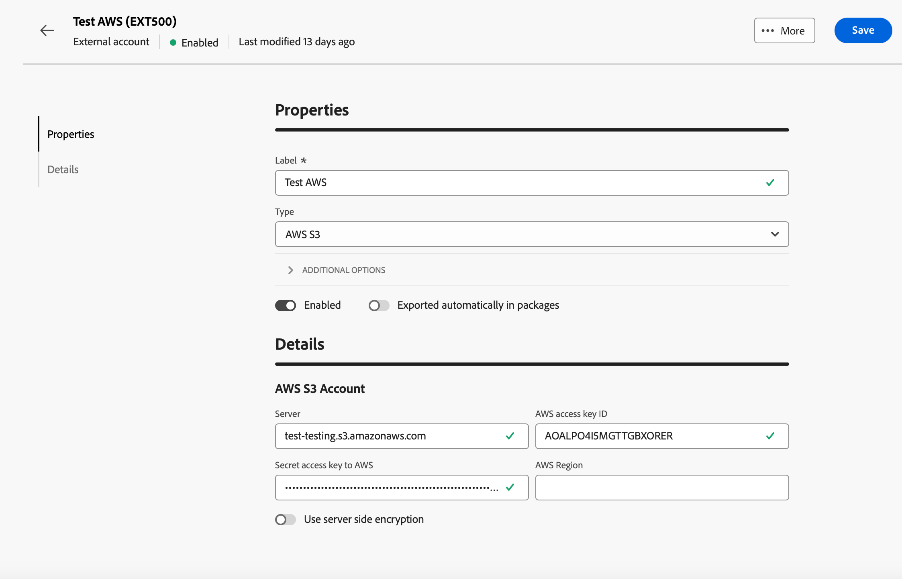
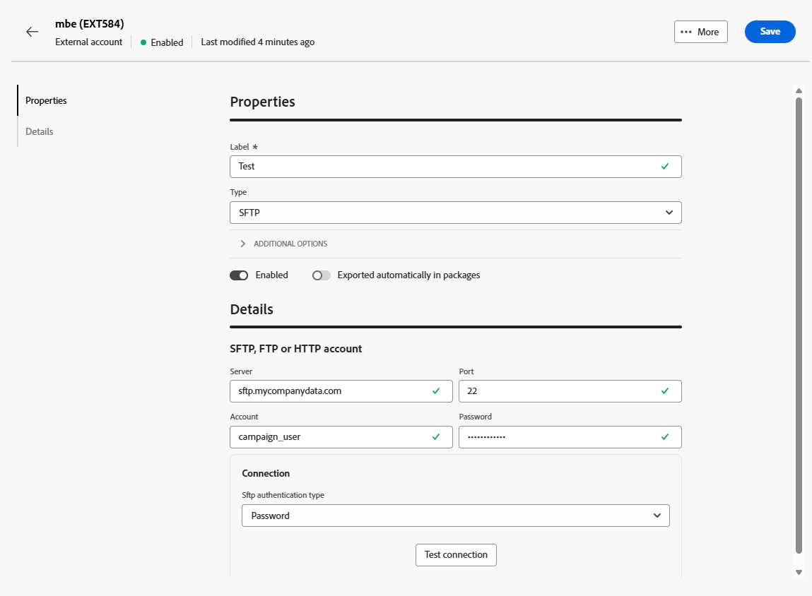

# Transfer Data external accounts {#transfer-external-account}

## Amazon Simple Storage Service (S3) {#amazon-simple-storage-service--s3--external-account}

The Amazon Simple Storage Service (S3) connector can be used to import or export data to Adobe Campaign. It can be set up in a workflow activity. For more on this, refer to [this page](https://experienceleague.adobe.com/en/docs/campaign-web/v8/wf/design-workflows/transfer-file){target=_blank}.

As you are setting up this new external account, you need to provide the following details:

* **[!UICONTROL AWS S3 Account Server]**

  URL of your server, it should be filled as follows:

    `  <S3bucket name>.s3.amazonaws.com/<s3object path>`

* **[!UICONTROL AWS access key ID]**

  To know where to find your AWS access key ID, refer to this [page](https://docs.aws.amazon.com/general/latest/gr/aws-sec-cred-types.html#access-keys-and-secret-access-keys).

* **[!UICONTROL Secret access key to AWS]**

  To know where to find your secret access key to AWS, refer to this [page](https://aws.amazon.com/fr/blogs/security/wheres-my-secret-access-key/).

* **[!UICONTROL AWS Region]**

  To learn more on AWS region, refer to this [page](https://aws.amazon.com/about-aws/global-infrastructure/regions_az/).

* The **[!UICONTROL Use server side encryption]** checkbox allows you to store your file in S3 encrypted mode.

To learn where to find the access key ID and secret access key, refer to Amazon Web services [documentation](https://docs.aws.amazon.com/general/latest/gr/aws-sec-cred-types.html#access-keys-and-secret-access-keys).

## Azure Blob Storage {#azure-blob-external-account}

The **[!UICONTROL Azure Blob Storage]** external account can be used to import or export data to Adobe Campaign using a **[!UICONTROL Transfer file]** workflow activity. For more on this, refer to [this section](https://experienceleague.adobe.com/en/docs/campaign-web/v8/wf/design-workflows/transfer-file){target=_blank}.

To configure the **[!UICONTROL Azure external account]** to work with Adobe Campaign, you need to provide the following details:

* **[!UICONTROL Server]**

  URL of your Azure Blob storage server.

* **[!UICONTROL Encryption]**

  Type of chosen encryption between **[!UICONTROL None]** or **[!UICONTROL SSL]**.

* **[!UICONTROL Access key]**

  To know where to find your **[!UICONTROL Access key]**, refer to this [page](https://docs.microsoft.com/en-us/azure/storage/common/storage-account-keys-manage?tabs=azure-portal).

## SFTP

The SFTP external account lets you configure and test access to a server outside of Adobe Campaign. 

To configure the **[!UICONTROL SFTP]** external account, fill in the following fields:

* **[!UICONTROL Server]**

  Enter the name or address of the SFTP server.

* **[!UICONTROL Port]**

  Specify the SFTP connection port number. The default port is 22.

* **[!UICONTROL Account]**

  Enter the username used to connect to the SFTP server.

* **[!UICONTROL Password]**
  
  Enter the password for the SFTP account.

* **[!UICONTROL SFTP authentication type]**

  Choose the method to authenticate with the SFTP server. Options include:

    * **[!UICONTROL Password]**: authenticate using the account's password.

    * **[!UICONTROL Public key]**: authenticate using an SSH key pair (private and public key).

If **[!UICONTROL Public key]** authentication is selected, following fields need to be filled:

* **[!UICONTROL Private key file]**

  Specify the private SSH key file used for authentication.

* **[!UICONTROL Public key file]**

  Specify the corresponding public SSH key registered on the SFTP server.

* **[!UICONTROL SSH Key passphrase]**

  Enter the passphrase to decrypt the private key if it is protected.

## HTTP

The HTTP external account lets you configure and test access to a server outside of Adobe Campaign.

To configure the **[!UICONTROL HTTP]** external account, fill in the following fields:

* **[!UICONTROL Server]**

  Enter the name or address of the HTTP server.

* **[!UICONTROL Port]**

  Specify the HTTP connection port number. The default port is 80.

* **[!UICONTROL Account]**

  Enter the username for authentication.

* **[!UICONTROL Password]**
  
  Enter the password associated with the user account.

* **[!UICONTROL SFTP authentication type]**

  Select the type of authentication type for the connection. Options include:

    * Password
    * Public key

If you are using **[!UICONTROL Public key]** authentication, from the **[!UICONTROL PublicKey Auth]** menu, enter the required values for:

* **[!UICONTROL Password]**: The passphrase protecting the private key, if applicable.

* **[!UICONTROL Private key]**: The private key used to authenticate the Snowflake account.

## FTP 

The FTP external account lets you configure and test access to a server outside of Adobe Campaign. 

To configure the **[!UICONTROL FTP]** external account, fill in the following fields:

* **[!UICONTROL Server]**
    
    Enter the name or address of the FTP server.

* **[!UICONTROL Port]**

    Specify the FTP connection port number. The default port is 21.

* **[!UICONTROL Account]**

    Enter the username for authentication.

* **[!UICONTROL Password]**

    Enter the password associated with the user account.

* **[!UICONTROL Encryption]**

    Select the type of encryption for the connection. Options include:

    * By default
    * POP3 + STARTTLS
    * POP3 non-secure
    * POP3 secure