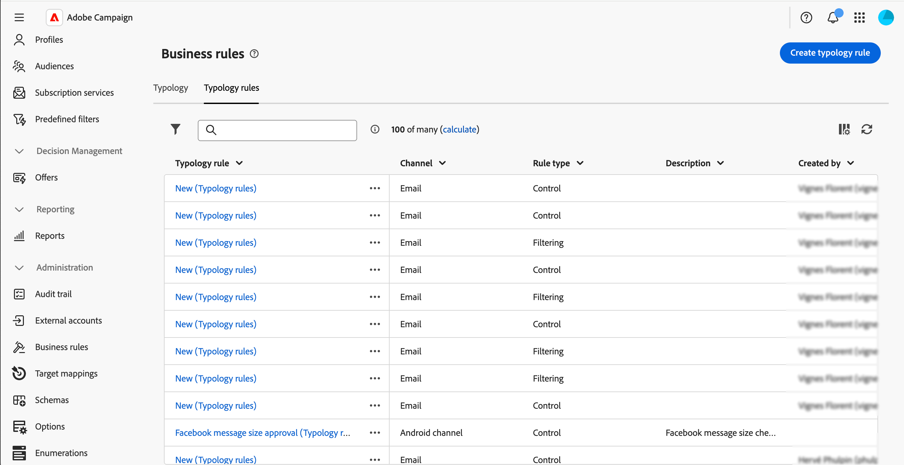

# Work with business rules (typologies) {#typologies}

>[!CONTEXTUALHELP]
>id="acw_business_rules"
>title="Typologies & typology rules"
>abstract="Typologies allow you to standardize business practices across all deliveries. A typology is a collection of typology rules that lets you control, filter, and prioritize the sending of deliveries. Profiles matching criteria within a typology rule are excluded from the delivery audiences during the preparation phase."

>[!CONTEXTUALHELP]
>id="acw_business_rules_typology_rules_type"
>title="Filtering"
>abstract=" Two types of typology rules are available:   **Control** rules which ensure message quality and validity pre-send, such as character display, SMS length, address format, or URL shortening.   **Filtering** rules which exclude segments of the target audience based on specific criteria, such as age, location, country, or phone numbers."

## About typologies

Typologies allow you to standardize business practices across all deliveries. A **typology** is a collection of **typology rules** that lets you control, filter, and prioritize the sending of deliveries. Profiles matching criteria within a typology rule are excluded from the delivery audiences during the preparation phase.

Typologies ensure your deliveries always contain certain elements, such as an unsubscription link or a subject line, or filtering rules to exclude groups from your intended target, like unsubscribers, competitors, or non-loyalty customers.

Typologies are accessible via the **[!UICONTROL Administration]** > **[!UICONTROL Business rules]** menu. From this screen, access all existing typologies and typology rules, or create new ones based on your needs.

>[!NOTE]
>
>The **[!UICONTROL Typology rules]** list displays all existing rules created so far in the Web User Interface or the Client Console. However, only **Control** and **Filtering** rules can be created in the Web User Interface. To create other types of typology rules, such as Pressure or Capacity rules, use the Campaign v8 client console. [Learn how to create typology rules in the client console](https://experienceleague.adobe.com/en/docs/campaign/automation/campaign-optimization/campaign-typologies){target="_blank"}

The main steps to apply typologies to your messages are as follows:

1. [Create a typology](#typology).
1. [Create typology rules](#typology-rule).
1. [Reference typology rules in the typology](#add-rules).
1. [Apply the typology to a message](#message).

## Create a typology {#typology}

>[!CONTEXTUALHELP]
>id="acw_business_rules_typology_properties"
>title="Typology properties"
>abstract="Define the typology's properties and expand the **[!UICONTROL Additional options]** section to access advanced settings. Use the **[!UICONTROL IP affinity]** field to associate IP affinities with typologies. This allows you to better control the outbound SMTP traffic by defining which specific IP addresses can be used for each affinity."

>[!CONTEXTUALHELP]
>id="acw_business_rules_typology_ip_affinity"
>title="IP affinity"
>abstract="Managing affinities with IP addresses enables better control of outgoing SMTP traffic by associating different IP addresses with each type of traffic depending on the typology of its delivery action."

To create a typology, follow these steps:

1. Navigate to the **[!UICONTROL Business rules]** menu, then select the **[!UICONTROL Typology]** tab.

1. Click the **[!UICONTROL Create typology]** button and enter a **[!UICONTROL Label]** for the typology.

1. Expand the **[!UICONTROL Additional options]** section to define advanced settings, such as the typology's internal name, storage folder, and description.

    

    >[!NOTE]
    >
    >The **[!UICONTROL IP affinity]** field allows you to associate IP affinities with typologies. This enables better control of outbound SMTP traffic by defining which specific IP addresses can be used for each affinity. For example, you can use one affinity per country or sub-domain. You can then create one typology per country and link each affinity to the corresponding typology.

1. Click **[!UICONTROL Create]** to confirm the typology creation.

The typology details open. From this screen, directly reference existing typology rules or create new typology rules to reference later:
* [Learn how to create a typology rule](#add-rules) 
* [Learn how to reference rules in a typology](#add-rules)

## Create a typology rule {#typology-rule}

>[!CONTEXTUALHELP]
>id="acw_business_rules_typology_rules_properties"
>title="Typology rule properties"
>abstract="Define the typology rule's properties. **Control** rules verify message quality and validity pre-send, while **Filtering** rules exclude segments of the target audience based on specific criteria.  You can also change the rule's execution order to manage the sequence in which typology rules will be executed when several rules of the same type are executed during the same message processing phase."

Two types of typology rules are available:

* **Control**: Ensures message quality and validity pre-send, such as character display, SMS length, address format, or URL shortening. These rules are created using a scripting interface to define complex logic for content checks and modifications.

* **Filtering**: Excludes segments of the target audience based on specific criteria, such as age, location, country, or phone numbers. These rules are linked to a targeting dimension.

>[!NOTE]
>
>Currently, only **Control** and **Filtering** typology rules can be created from the Web User Interface. To create other types of rules, use the Client Console. [Learn how to create typology rules in the client console](https://experienceleague.adobe.com/en/docs/campaign/automation/campaign-optimization/campaign-typologies){target="_blank"}

To create a typology rule, follow these steps:

1. Navigate to the **[!UICONTROL Business rules]** menu, then select the **[!UICONTROL Typology rules]** tab.

1. Click the **[!UICONTROL Create typology rule]** button, then follow the steps detailed below.

   

### Define the rule's main properties {#properties}

>[!CONTEXTUALHELP]
>id="acw_business_rules_typology_rules_filtering"
>title="Filtering"
>abstract="**Filtering** rules exclude segments of the target audience based on specific criteria, such as age, location, country, or phone numbers. Select the typology rule's targeting dimension and click the **[!UICONTROL Add rules]** button to access the query modeler and build the rule."

>[!CONTEXTUALHELP]
>id="acw_business_rules_typology_rules_code"
>title="Code"
>abstract="**Control** rules verify message quality and validity pre-send, such as character display, SMS length, address format, or URL shortening. These rules are created using JavaScript code."

These are the main properties to define when creating a new typology rule:

>[!BEGINTABS]

>[!TAB Control rules] 

1. Enter a **[!UICONTROL Label]** for the rule.
   
   

1. The **[!UICONTROL Additional options]** section allows you to access advanced settings, such as the rule's internal name, folder storage, and description. You can also specify when the rule should apply and its alert level. Expand the sections below for more information.

    +++Phases

    Specify at which point of the delivery life cycle the rule will be applied. Select the value in the **[!UICONTROL Phase]** drop-down list:

    * **[!UICONTROL At the start of targeting]**: Prevent the personalization step from being executed in case of errors.

    * **[!UICONTROL After targeting]**: Select this phase if you need to know the volume of the target in order to apply the control rule. For example, the **[!UICONTROL Check proof size]** control rule applies after each targeting stage. This rule prevents message personalization if there are too many proof recipients.

    * **[!UICONTROL At the start of personalization]**: Select this phase if the control concerns the approval of message personalization. Message personalization is carried out during the analysis phase.

    * **[!UICONTROL At the end of the analysis]**: Apply checks requiring complete message personalization.

    +++

    +++Level

    Specify the alert level for the rule:

    * **[!UICONTROL Error]**: Stop the message preparation

    * **[!UICONTROL Warning]**: Display a warning in the preparation logs

    * **[!UICONTROL Info]**: Display information in the preparation logs

    * **[!UICONTROL Verbose]**: Display information in the server logs

    +++

1. To build the content of the rule, click the **Edit code** button and enter the logic for the rule using JavaScript. In the example below, a rule is created to display a warning in the logs if the target is empty.

   

1. Click **Create**.

>[!TAB Filtering rules]

1. Enter a **[!UICONTROL Label]** for the rule.

   

1. Expand the **[!UICONTROL Additional options]** section to access advanced settings, such as the rule's internal name, folder storage, and description.

1. To build the content of the rule, select the targeting dimension and click the **[!UICONTROL Add rules]** button to define filtering criteria using the [rule builder](../query/query-modeler-overview.md).

   

1. Click **Create**

>[!ENDTABS]

### Define the rule's additional properties {#add-properties}

Now, let's define the additional parameters. In this screen, you can still change the main properties previously defined. 

1. Toggle off the **[!UICONTROL Active]** option if you do not want the rule to be active immediately after its creation.

1. Define the rule's **[!UICONTROL Execution order]**.

    By default, typology rules order is set to 50. Adapt this value to manage the sequence in which typology rules will be executed when several rules of the same type are executed during the same message processing phase. For example, a filtering rule with an execution order of 20 is executed before a filtering rule with an execution order of 30.

1. Select a **[!UICONTROL Channel]** to associate with the rule.

Your rule is ready to be referenced in a typology to apply it to messages.

## Reference typology rules in a typology {#add-rules}

To reference one or multiple rules in a typology, follow these steps:

1. Navigate to the **[!UICONTROL Typology]** tab and open the typology where you want to reference the rule(s).

1. Select the **[!UICONTROL Typology rules]** tab and click the **[!UICONTROL Add rules)]** button.

    

1. Select one or multiple typology rules to associate with the typology and confirm.

    

1. Click **[!UICONTROL Save]**.

You can now apply the typology to messages. Once done, all the selected typology rules will be executed to perform the defined checks.

## Apply typologies to messages {#message}

To apply a typology to a message or message template, select the typology in the message settings. [Learn how to configure delivery settings](../advanced-settings/delivery-settings.md#typology)

Once applied, the typology rules included in the typology are executed to check the delivery validity during message preparation. Profiles matching criteria within a typology rule are excluded from the delivery audiences.