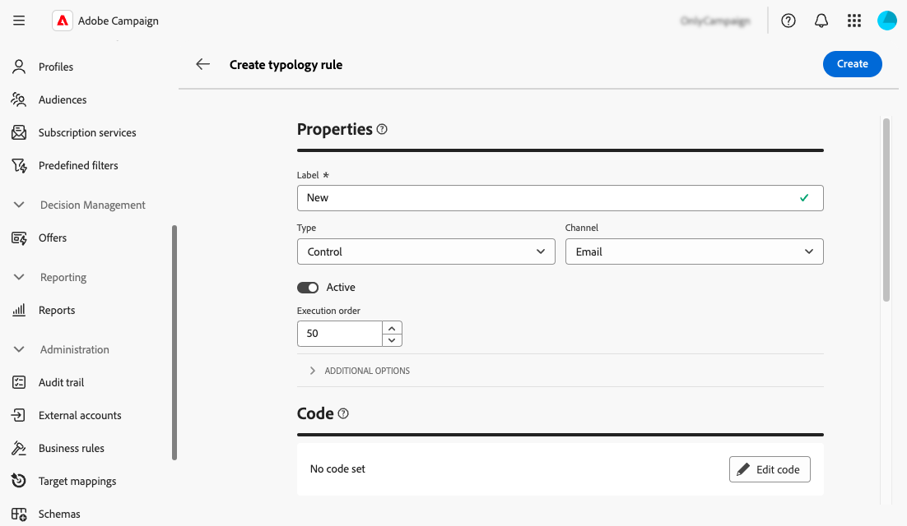

# Work with business rules (typologies) {#typologies}

>[!CONTEXTUALHELP]
>id="acw_business_rules"
>title="Typologies & typology rules"
>abstract="Typologies allow you to standardize business practices, across all deliveries. A typology is a collection of typology rules which lets you control, filter, and prioritize the sending of deliveries. Profiles which match criteria within a typology rule are excluded from the delivery audiences at the preparation phase."

## About typologies

Typologies allow you to standardize business practices, across all deliveries. A **typology** is a collection of **typology rules** which lets you control, filter, and prioritize the sending of deliveries. Profiles which match criteria within a typology rule are excluded from the delivery audiences at the preparation phase.

Typlogies make sure your deliveries always contain certain elements (such as an unsubscription link or a subject line) or filtering rules to exclude groups from your intended target (like unsubscribers, competitors, or non-loyalty customers).

Typologies are accessible via the **[!UICONTROL Administration]** > **[!UICONTROL Business rules]** menu. From this screen, you can access all existing typologies and typology rules, or create new ones based on your needs.

>[!NOTE]
>
>The **[!UICONTROL Typology rules]** list displays all existing rules created so far in the Web User Interface or the Client Console. However, only **Control** and **Filtering** rules can be created in the Web User Interface. To create other types of typology rules such as Pressure or Capacity rules, use  the Campaign v8 client console. [Learn how to create typology rules in the client console](https://experienceleague.adobe.com/en/docs/campaign/automation/campaign-optimization/campaign-typologies){target="_blank"}

The main steps to apply typologies to your messages are as follows:

1. [Create a typology](#typology).
1. [Create typology rules](#typology-rules).
1. [Reference typology rules in the typology](#add-rules).
1. [Apply the typology to a message](#message).

## Create a typology {#typology}

>[!CONTEXTUALHELP]
>id="acw_business_rules_typology_properties"
>title="Typology properties"
>abstract="Define the typology's properties and expand the **[!UICONTROL Additional options]** section to access advanced settings. Use the **[!UICONTROL IP affinity]** field to associate IP affinities with typologies. This allows you to better control the outbound SMTP traffic, by defining which specific IP addresses can be used for each affinity."

>[!CONTEXTUALHELP]
>id="acw_business_rules_typology_ip_affinity"
>title="IP affinity"
>abstract="Managing affinities with IP addresses enables better control of outgoing SMTP traffic by associating different IP addresses with each type of traffic depending on the typology of its delivery action."

To create a typology, follow these steps:

1. Navigate to the **[!UICONTROL Business rules]** menu then select the **[!UICONTROL Typology]** tab.

1. Click the **[!UICONTROL Create typology]** button and enter a **[!UICONTROL Label]** for the typology.

1. Expand the **[!UICONTROL Additional options]** section to define advanced settings such as the typology's internal name, storage folder, and description.

    

    >[!NOTE]
    >
    >The **[!UICONTROL IP affinity]** field allows you to associate IP affinities with typologies. This allows you to better control the outbound SMTP traffic, by defining which specific IP addresses can be used for each affinity.  For example, you can use one affinity per country or sub-domain. You can then create one typology per country and link each affinity to the corresponding typology.

1. Click **[!UICONTROL Create]** to confirm the typology creation.

The typology opens details open. From this screen, you can directly reference existing typology rules. You can also create new typology rules and reference them in the typology later on:
* [Learn how to create a typology rule](#add-rules) 
* [Learn how to reference rules in a typology](#add-rules)

## Create a typology rule {#typology-rule}
 
>[!CONTEXTUALHELP]
>id="acw_business_rules_typology_rules_properties"
>title="Typology rule properties"
>abstract="Define the typology rule's properties. **Control** rules verify message quality and validity pre-send, while **Filtering** rules exclude segments of the target audience based on specific criteria.  You can also change the rule's execution orderl to manage the sequence in which typology rules will be executed when several rules from the same type are executed during the same message processing phase."

To create a typology rule, navigate to the **[!UICONTROL Business rules]** menu then select the **[!UICONTROL Typology rules]** tab.

Click the **[!UICONTROL Create typology rule]** button then follow the steps detailed below.

### Define the typology rule's properties {#properties}

Define the typology rule's properties:

1. Enter a **[!UICONTROL Label]** for the rule.

    

1. Select the typology rule's **[!UICONTROL Type]**:

    * **Control**: Ensures message quality and validity pre-send (e.g., character display, SMS length, address format, URL shortening). They are created using a scripting interface to define complex logic for content checks and modifications.

    * **Filtering** rules exclude segments of the target audience based on specific criteria (e.g., age, location, country, phone numbers). These rules are linked to a targeting dimension.

    >[!NOTE]
    >
    >For now, only **Control** and **Filtering** typology rules can be created from the Web User Interface. To create other types of rules, use the Client console. [Learn how to create typology rules in the client console](https://experienceleague.adobe.com/en/docs/campaign/automation/campaign-optimization/campaign-typologies){target="_blank"}

1. Select a **[!UICONTROL Channel]** to associate to the rule.

1. Toggle off the **[!UICONTROL Active]** option if you do not want the rule to be active right after its creation.

1. Define the rule **[!UICONTROL Execution order]**.

    By default, typology rules order is set to 50. You can adapt this value to manage the sequence in which typology rules will be executed when several rules from the same type are executed during the same message processing phase. For example, a filtering rule with an execution order of 20 is executed before a filtering rule with an execution order of 30.

1. Expand the **[!UICONTROL Additional options]** section to access advanced settings such as the rule's internal name, folder storage, and description.

1. For control rules, two additional rules are available in the additional options. They allow you to specify when the rule should apply and its alert level:

    * **[!UICONTROL Phase]**: This field allows you to specify at which point of the delivery life cycle the rule will be applied. Select the value to apply in the **[!UICONTROL Phase]** drop-down list. Expand the section below for more details on the possible values.

    +++Control rules phases:

    **[!UICONTROL At the start of targeting]**: To prevent the personalization step from being executed in case of errors, you can apply the control rule here.

    **[!UICONTROL After targeting]**: If you need to know the volume of the target in order to apply the control rule, select this phase. For example, the Check proof size control rule applies after each targeting stage: this rule prevents message personalization if there are too many proof recipients.

    **[!UICONTROL At the start of personalization]**: This phase must be selected if the control concerns the approval of message personalization. Message personalization is carried out during the analysis phase.

    **[!UICONTROL At the end of the analysis]**:When a check requires message personalization to be complete, select this phase.

    +++

    * **[!UICONTROL Level]**: This options allows you to specify the alert level for the rule. Expand the section below for more information.

    +++Control rules levels:

    **[!UICONTROL Error]**: Stop the message preparation.

    **[!UICONTROL Warning]**: Display a warning in the preparation logs.

    **[!UICONTROL Info]**: Display information in the preparation logs.

    <!--**[!UICONTROL Status]**:-->

    **[!UICONTROL Verbose]**: Display information in the server logs.

    +++

### Build the rule content {#build}

>[!CONTEXTUALHELP]
>id="acw_business_rules_typology_rules_filtering"
>title="Filtering"
>abstract="**Filtering** rules exclude segments of the target audience based on specific criteria (e.g., age, location, country, phone numbers). Select the typology rule's targeting dimension and click the **[!UICONTROL Add rules]** button to access the query modeler and build the rule."

>[!CONTEXTUALHELP]
>id="acw_business_rules_typology_rules_code"
>title="Code"
>abstract="**Control** rules verify message quality and validity pre-send (e.g., character display, SMS length, address format, URL shortening). They are created using JavaScript code."

Once the typology rule's properties have been defined, you can build the content of the rule.

* For **Control rules**, click the **Edit code** button and enter the logic for the rule using JavaScript. In the example below, we are creating a rule to display a warning in the logs if the target is empty.

    

* For **Filtering rules**, select the targeting dimension and click the **[!UICONTROL Add rules]** button to define filtering criteria using the [query modeler](../query/query-modeler-overview.md).

    

When your rule is ready, click the **[!UICONTROL Create]** button to create the typology rule. You can now reference the rule into a typology in order to apply it to messages.

## Reference typology rules in a typology {#add-rules}

To reference one or multiple rule(s) into a typology, follow these steps:

1. Navigate to the **[!UICONTROL Typology]** tab and open the typology where you want to reference the rule(s).

1. Select the **[!UICONTROL Typology rules]** tab and click the **[!UICONTROL Add typology rule'(s)]** button.

    

1. Select one or multiple typology rule(s) to associate with the typology and confirm.

    

1. Click **[!UICONTROL Save]**.

You can now apply the typology to messages. Once done, all the selected typology rules will be executed to perform the defined checks.

## Apply typologies to messages {#message}

To apply a typology to a message or message template, you need to select the typology into the message settings. [Learn how to configure delivery settings](../advanced-settings/delivery-settings.md#typology)

Once done, the typology rules included in the typology are executed to check the delivery validity during message preparation. Profiles which match criteria within a typology rule are then excluded from the delivery audiences.
