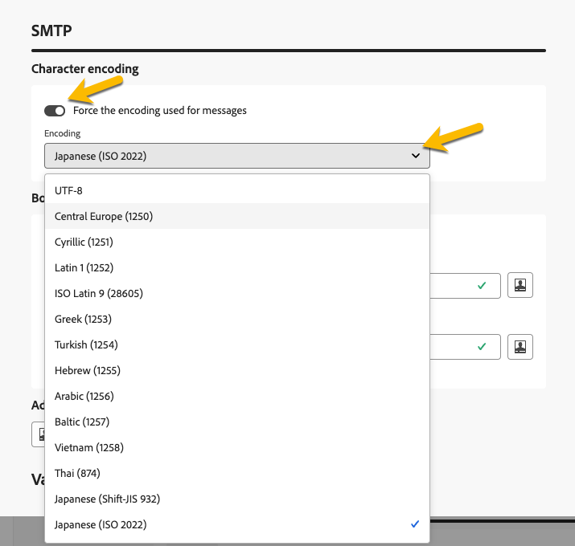

# Configure delivery settings {#del-settings}

Delivery settings are **technical delivery parameters** that are defined in the delivery template. They can be overloaded for each delivery. These settings are available from the **Settings** button available when editing a delivery or a delivery template.

>[!CAUTION]
>
>These settings are described for your information only. Some of them depend on your configuration and permissions. They must not be modified in this version of the product. 

## Typology settings {#typology}

>[!CONTEXTUALHELP]
>id="acw_email_settings_typology"
>title="Typology"
>abstract="Typologies allow you to standardize business practices, across all deliveries. A typology is a collection of typology rules which lets you control, filter, and prioritize the sending of deliveries. Profiles which match criteria within a typology rule are excluded from the delivery audiences at the preparation phase."

>[!CONTEXTUALHELP]
>id="acw_delivery_template_settings_typology"
>title="Typology settings for the delivery"
>abstract="Typology rules allow you to standardize business practices, across all deliveries. A typology is a collection of typology rules which lets you control, filter, and prioritize the sending of deliveries. Profiles which match criteria within a typology rule are excluded from the delivery audiences at the preparation phase."

Typologies are sets of **typology rules** that are executed during the preparation phase in order to easily apply multiple filtering rules to a delivery at once. They allow marketers to standardize business practices across all deliveries as they let them control, filter, and prioritize the sending of deliveries. [Learn how to create typologies and typology rules](../administration/typologies.md)

{zoomable="yes"}

### Pressure parameters {#pressure-parameters}

>[!CONTEXTUALHELP]
>id="acw_email_settings_pressure_parameters"
>title="Pressure parameters for the delivery"
>abstract="Delivery weights let you identify top-priority deliveries within the framework of fatigue management. Messages with the highest weight have priority."

>[!CONTEXTUALHELP]
>id="acw_delivery_template_settings_delivery_weight"
>title="Delivery weight"
>abstract="Delivery weights let you identify top-priority deliveries within the framework of pressure management. Messages with the highest weight have priority."

In this section, pressure parameters let you define a **threshold** to set up fatigue management rules, which is the maximum number of messages that can be sent to one profile over a given period.

Once this threshold has been reached, no more deliveries can take place until the end of the period considered. This process lets you automatically exclude a profile from a delivery if a message exceeds the set threshold, thus avoiding over-solicitation.

Threshold values can be either constant or variable. This means that for a given period, thresholds can vary from one profile to another, or even for the same profile.

In the **[!UICONTROL Weight type]** field, three options are available:

* **[!UICONTROL Constant]**
* **[!UICONTROL Depends on the recipient]**
* **[!UICONTROL Defined in each rule]**

Use the **[!UICONTROL Delivery weight]** field to define the delivery priority. Each delivery has a weight which represents its level of priority. By default, the weight of a delivery is set to 5. Pressure rules let you define the weight of the deliveries which they are applied to. Weights can be either set or calculated via a formula to suit recipients. For example, you can define the weight of a delivery based on recipient interests.

Use the **[!UICONTROL Delivery mode]** field to select the target evaluation mode. 

Three modes are available:

* **[!UICONTROL Target estimation and message personalization]**
* **[!UICONTROL Estimation and approval of the provisional target]**
* **[!UICONTROL Target evaluation]**

>[!NOTE]
>
>Fatigue management and pressure rules are configured in the Campaign client console. Learn more in [Campaign v8 (client console) documentation](https://experienceleague.adobe.com/docs/campaign/automation/campaign-optimization/pressure-rules.html){target="_blank"}.

### Capacity settings {#capacity-settings}

>[!CONTEXTUALHELP]
>id="acw_email_settings_capacity_settings"
>title="Capacity settings for the delivery"
>abstract="Before delivering messages, use capacity rules to make sure your organization can process the delivery, the inbound messages which the delivery may generate, and the number of calls to be made to contact subscribers for example. Capacity rules are defined in the Adobe Campaign v8 console. In this screen, select a rule associated to the channel."

>[!CONTEXTUALHELP]
>id="acw_delivery_template_settings_recipient_importance"
>title="Importance of the recipient"
>abstract="The importance of the recipient is a formula used to determine which profiles are kept when the capacity typology rules are exceeded."

In this section, you can select a capacity rule defined in the Adobe Campaign v8 console. This rule is associated to the channel.

The **[!UICONTROL Importance of the recipient]** field is a formula used to determine which profiles are kept when the capacity typology rules are exceeded.

>[!NOTE]
>
>Typology rules are configured in the Campaign Client console. Learn more in [Campaign v8 (client console) documentation](https://experienceleague.adobe.com/docs/campaign/automation/campaign-optimization/consistency-rules.html){target="_blank"}.

## Audience settings {#audience}

>[!CONTEXTUALHELP]
>id="acw_email_settings_audience"
>title="Audience settings for the delivery"
>abstract="Select a **target mapping** among those available. Target mappings are defined in the Adobe Campaign v8 console. You can also set the exclusion parameters for the delivery."

In this section, you can select a **target mapping** among those available. Target mappings are defined in the Adobe Campaign v8 console. The target mapping is the type of data that an operation is handling. It lets you define the targeted population: recipients, contract beneficiaries, operators, subscribers, etc. [Learn more about target mappings](../audience/targeting-dimensions.md).

In the **[!UICONTROL Exclusion]** field, you can select to exclude profiles who no longer want to be contacted or who are quarantined. [Learn more](https://experienceleague.adobe.com/docs/campaign/campaign-v8/send/failures/quarantines.html){target="_blank"}

## Delivery {#delivery}

>[!CONTEXTUALHELP]
>id="acw_email_settings_delivery"
>title="Global settings for the delivery"
>abstract="Delivery parameters are technical settings which apply to your delivery. You can change the delivery and routine modes, activate Email BCC, send using waves, and also choose the format of the email messages sent. These options are restricted to expert users only."

**[!UICONTROL Delivery]** parameters are technical settings which apply to your delivery.

{zoomable="yes"}

The integrated **[!UICONTROL Routing]** external account is provided by default. It contains the technical parameters that allow the application to send deliveries.

You can define the **[!UICONTROL Sending]** settings below.

* **[!UICONTROL Delivery priority]**: Use this option to change the sending order for your deliveries by setting their priority level: normal, high or low. 

* **[!UICONTROL Message batch quantity]**: Use this option to define the number of messages grouped within the same XML delivery package. If the parameter is set to 0, the messages are automatically grouped. The package size is defined by the calculation `<delivery size>/1024`, with a minimum of 8 and a maximum of 256 messages by package.

  >[!IMPORTANT]
  >
  >When the delivery is created by duplicating an existing one, this parameter is reset.

* **[!UICONTROL Test SMTP delivery]** (email channel): This option is used to test sending via SMTP. The email is processed up to connection to the SMTP server, but is not sent: for every recipient of the email, Campaign connects to the SMTP provider server, executes the SMTP RCPT TO command, and closes the connection before the SMTP DATA command.

* **[!UICONTROL Email BCC]** (email channel): This option is used to store emails on an external system through BCC by simply adding a BCC email address to your message target. Learn more in [Campaign v8 (client console) documentation](https://experienceleague.adobe.com/docs/campaign/campaign-v8/send/emails/email-bcc.html){target="_blank"}.

In the **[!UICONTROL Wave definition]** section, select the **[!UICONTROL Send using multiple waves]** option to progressively increase the volume sent using waves. This will avoid your messages being marked as spam or when you want to restrict the number of messages per day. Using waves you can divide deliveries into several batches instead of sending high volumes of messages at the same time. [Learn more](send-using-waves.md)

For emails, you can also change the **[!UICONTROL Mail formats]** of the messages sent as detailed below.

* **[!UICONTROL Use recipient preferences]** (default mode): The email format is defined according to the data stored in the recipient profile. If a recipient wishes to receive emails in a certain format, this is the format sent. If the field is not filled in, a multipart-alternative email is sent (see below).

* **[!UICONTROL Let recipient mail client choose the most appropriate format]**: The email contains both formats: text and HTML. The format displayed on reception depends on the configuration of the recipient's mail software (multipart-alternative).

  >[!IMPORTANT]
  >
  >This option includes both versions of the document. It therefore impacts the delivery rate, because the email size is greater.

* **[!UICONTROL Send all messages in text format]**: The email is sent in text format. HTML format will not be sent, but used for the mirror page only when the recipient clicks the email.

## Web Analytics {#web-analytics}

>[!CONTEXTUALHELP]
>id="acw_email_settings_webanalytics"
>title="Web analytics settings for the delivery"
>abstract="Select a web analytics account. This account is configured in the Campaign Client console. You can also define the tags shared with the analytics tool you are using."

In this section, you can select a web analytics account. This account is configured in the Campaign client console. 

You can also define the tags shared with the analytics tool you are using.

>[!NOTE]
>
>Web Analytics capabilities are configured in the Campaign Client console. Learn more in [Campaign v8 (client console) documentation](https://experienceleague.adobe.com/docs/campaign/campaign-v8/connect/ac-aa.html#external-account-ac){target="_blank"}.

## Retries {#retries}

>[!CONTEXTUALHELP]
>id="acw_delivery_template_settings_retries"
>title="Maximum number of retries"
>abstract="If a message fails due to a temporary error, retries are performed until the end of the delivery duration."

<!--Currently not visible in UI > ??-->

Temporarily undelivered messages due to a Soft or Ignored error are subject to an automatic retry. By default, five retries are scheduled for the first day of the delivery with a minimum interval of one hour spread out over the 24 hours of the day. 

## Approval (email channel) {#approval}

>[!CONTEXTUALHELP]
>id="acw_email_settings_approval"
>title="Approval mode for the delivery"
>abstract="Select the approval mode. If warnings are generated during the delivery preparation, you can configure the delivery to define whether or not it should still be executed."

>[!CONTEXTUALHELP]
>id="acw_delivery_template_settings_approval"
>title="Approval mode for the deliveries"
>abstract="Select the approval mode for deliveries based on this template. If warnings are generated during the delivery preparation, you can configure the delivery to define whether or not it should still be executed."

If warnings are generated during an email delivery preparation, you can configure the delivery to define whether or not it should still be executed. By default, the user must confirm the sending of emails at the end of the analysis phase: this is **manual** validation.

You can select another approval mode in the appropriate field. Available modes are: 

* **[!UICONTROL Manual]**: At the end of the analysis phase, the user must confirm delivery to start sending. 
* **[!UICONTROL Semi-Automatic]**: Sending begins automatically if the analysis phase generates no warning messages.
* **[!UICONTROL Automatic]**: Sending begins automatically at the end of the analysis phase, irrespective of its result.

## Validity {#validity}

>[!CONTEXTUALHELP]
>id="acw_email_settings_validity"
>title="Settings validity"
>abstract="The **Delivery duration** field lets you enter the limit for global delivery retries. This means that Adobe Campaign sends the messages beginning on the start date, and then, for messages returning an error only, regular, configurable retries are performed until the validity limit is reached. The **Resources validity limit** field is used for uploaded resources, such as mirror page or images. Once the limit is reached, resources are no longer available."

>[!CONTEXTUALHELP]
>id="acw_delivery_template_settings_resources_validity"
>title="Resources validity limit"
>abstract="The **Resources validity limit** field is used for uploaded resources, such as the mirror page or images. These resources are valid for a limited time: once the limit is reached, resources are no longer available."

>[!CONTEXTUALHELP]
>id="acw_delivery_template_settings_delivery_duration"
>title="Delivery duration"
>abstract="The **Delivery duration** field lets you enter the limit for global delivery retries. This means that Adobe Campaign sends the messages beginning on the start date, and then, for messages returning an error only, regular, configurable retries are performed until the validity limit is reached."

<!--
>[!CONTEXTUALHELP]
>id="acw_email_settings_resources_validity"
>title="Resources validity limit"
>abstract="The Validity limit field is used for uploaded resources, such as the mirror page or images. These resources are valid for a limited time: once the limit is reached, resources are no longer available."
-->

### Validity period {#validity-period}

The **[!UICONTROL Delivery duration]** field lets you enter the limit for global delivery retries. This means that Adobe Campaign sends the messages beginning on the start date, and then, for messages returning an error only, regular, configurable retries are performed until the validity limit is reached.

You can also choose to specify dates. To do this, select **[!UICONTROL Explicitly set validity dates]**. In this case, the delivery and validity limit dates also let you specify the time. The current time is used by default, but you can modify this directly in the input field.

**[!UICONTROL Resources validity limit]** is used for uploaded resources, mainly for the mirror page and images. The resources on this page are valid for a limited time (to save disk space). After this limit, these resources are no longer available.

{zoomable="yes"}

<!--Change screenshot to be consistent with prod > not sure which version is correct-->

Learn more about delivery validity period in [Campaign v8 (client console) documentation](https://experienceleague.adobe.com/docs/campaign/campaign-v8/campaigns/send/failures/delivery-failures.html#validity-period){target="_blank"}.

### Mirror page management (email channel) {#mirror}

The mirror page is an HTML page accessible online via a web browser. Its content is identical to the email. By default, the mirror page is generated if the link is inserted in the content of the email. 

In addition to the default mode, the following options are also available:

* **[!UICONTROL Force the generation of the mirror page]**: Use this mode to generate the mirror page even if no link to the mirror page is inserted in the email.
* **[!UICONTROL Do not generate the mirror page]**: Use this mode to avoid generating a mirror page, even if the link is present in the email.
* **[!UICONTROL Generates a mirror page accessible using only the message identifier]**: When the mirror page link is not present in the email content, use this option to enable access the content of the mirror page, in the delivery log window, from the client console. 

### Tracking {#tracking}

<!--
>[!CONTEXTUALHELP]
>id="acw_email_settings_tracking_validity"
>title="Validity period"
>abstract="This option defines the duration for which the tracking is activated on the URLs."
-->

>[!CONTEXTUALHELP]
>id="acw_delivery_template_settings_tracking_validity"
>title="Validity period"
>abstract="The validity period sets the duration for which the tracking is activated on the message URLs."

**[!UICONTROL Tracking]** parameters are defined in the related section. Possible options are:

* **[!UICONTROL Tracking validity limit]**: Use this option to change the duration for which the tracking is activated on the URLs.
* **[!UICONTROL Substitution URL for expired URLs]**: Use this option to enter a URL to a fallback web page: it is displayed once the tracking has expired.

## Proof settings {#test-setttings}

>[!CONTEXTUALHELP]
>id="acw_email_settings_testsettings"
>title="Define the proof settings for the delivery"
>abstract="Select the exclusion parameters and customize the label of the proofs."

<!--Test to be replaced with Proof everywhere - currently not consistent within UI > changed to Proof to reflect UI here but not consistent in documentation either-->

You can set the exclusion parameters in this section. Available options are:

* **[!UICONTROL Keep doubles]** lets you authorize multiple deliveries to profiles who satisfy several targeting criteria.
* **[!UICONTROL Keep denylisted addresses]** lets you keep from the target any profiles no longer being targeted by the delivery, such as after an unsubscription (opt-out).
* **[!UICONTROL Keep quarantined addresses]** lets you keep from the target any profiles with an address that does not respond. 

You can also customize the lable of the proofs:

* Use the **[!UICONTROL Keep the delivery code for the proof]** to associate to the proof the same delivery code as the one defined for the delivery to which it relates.
* By default, the subject of the proof is prefixed by 'PROOF #', where # is the number of the proof. You can change this prefix in the **[!UICONTROL Label prefix]** field.

## SMS settings (SMS channel) {#sms-tab}

>[!CONTEXTUALHELP]
>id="acw_sms_delivery_settings"
>title="SMS delivery settings"
>abstract="SMS delivery parameters are technical settings which apply to your SMS delivery. You can define the sender address, service parameters, transmission mode, and more. These options are restricted to expert users only."

SMS delivery parameters are technical settings which apply to your SMS delivery. You can define the sender address, service parameters, transmission mode, and more. These options are restricted to expert users only.

<!--

* **[!UICONTROL Sender address]**

  The field is limited to 21 characters by the SMPP specification, but some providers may allow longer values. Note also that very strict restrictions may be applied in some countries (length, content, allowed characters, …), so you may need to double-check that the content you place here is legal. Be especially careful when using personalized fields.

  This optional field allows you to override the sender address (oADC). Its content is placed in the *source_addr* field of the SUBMIT_SM PDU.

  Although the SMPP specification limits this field to 21 characters, some providers may support longer values. Be aware that certain countries impose strict regulations on sender addresses (regarding length, content, allowed characters, etc.), so always verify that your input complies with local requirements. Use extra caution when working with personalized fields.

  If this field is left empty, the value of the Source number field defined in the external account will be used instead. If both values are empty, the *source_addr* field will be left empty.

-->

* **[!UICONTROL Service type]**:

  This parameter is passed to the provider as is.

* **[!UICONTROL Service or program ID]**

  >[!NOTE]
  >
  >Use of this field is discouraged. Optional SMPP parameters, available in the Client Console, provide a much more flexible implementation.
  >
  >This field cannot be used simultaneously with optional SMPP parameters.

  In combination with the matching external account setting, allows sending one optional parameter with each MT. This field defines the value part of the TLV.

* **[!UICONTROL Transmission mode]**

  This field defines the type of SMS to send: whether it is a normal or flash message, and whether it should be stored on the mobile device or the SIM card. This setting is transmitted in the dest_addr_subunit optional field in the SUBMIT_SM PDU.
  
  * **Flash** sets the value to 1. Sends a flash SMS that appears immediately on the screen and is not stored.
  * **Normal** sets the value to 0. Sends a standard SMS.
  * **Saved on mobile** sets the value to 2. Instructs the device to store the SMS in internal memory.
  * **Saved on terminal** sets the value to 3. Instructs the device to store the SMS on the SIM card.

* **[!UICONTROL Priority, Communication type]**

  These fields are ignored by the extended SMPP connector.

* **[!UICONTROL Maximum number of SMS per message]**

  This setting is only effective if the Message payload option is disabled (see the external account settings for more details). If the message requires more SMS than this value, an error is triggered.

  While the SMS protocol allows messages to be split into up to 255 parts, some mobile devices may struggle to reassemble messages with more than 10 parts (the limit depends on the device model). For reliability, it's best to limit messages to 5 parts or fewer.

  Note that due to how personalized messages work in Adobe Campaign, message sizes can vary. A high number of long messages may result in increased sending costs, so using a sensible limit helps control expenses.

  Setting this value to 0 disables the limit.

## SMTP settings for email delivery {#smtp}

>[!CONTEXTUALHELP]
>id="acw_email_settings_smtp"
>title="SMTP parameters"
>abstract="You can add additional SMTP parameters to your email delivery."

You can add additional SMTP parameters to your email delivery. You can do it in the SMTP tab of the delivery settings.

{zoomable="yes"}

### Character encoding {#character-encoding}

The **[!UICONTROL Character encoding]** section allows you to set a specific encoding. The default encoding is UTF-8, which works for most characters. However, some email providers might not display special characters correctly if they do not support the UTF-8 standard encoding.

For example, if you want to send an email with Japanese characters, it is better to use an encoding that specifically supports those characters, so your audience in Japan can see everything correctly.

To do this,  activate the **[!UICONTROL Force the encoding used for messages]** toggle, and select the right encoding from the list that supports your special characters.

{zoomable="yes"}

### Bounce emails {#bounce-emails}

The **[!UICONTROL SMTP]** tab of the delivery settings lets you also configure the management of bounce mails.

* **[!UICONTROL Errors-to-address]**: If you activate the **[!UICONTROL Use the default error address defined for the platform]** toggle, bounced emails are received in the default error box of the platform. If you do not activate it, you can define a specific error address for your delivery.

* **[!UICONTROL Bounce address]**: You can also define another address to which the unprocessed bounced emails are forwarded. This address allows to investigate the reasons for bouncing when emails could not be automatically qualified by the application.

These two fields can be personalized as described in [this section](../personalization/gs-personalization.md). 

{zoomable="yes"}

### Additional SMTP headers {#smtp-headers}

You can add **[!UICONTROL SMTP headers]** to your email delivery, in the SMTP tab of the delivery settings.

The script entered in this window must reference one header per line in the following form: name:value.

Values are encoded automatically if necessary.

{zoomable="yes"}

>[!IMPORTANT]
>
>Adding a script for inserting additional SMTP headers is reserved for advanced users. The syntax of this script must comply with the requirements of this content type: no unused space, no empty line, etc.

## Adding variables {#variables-delivery}

>[!CONTEXTUALHELP]
>id="acw_delivery_settings_variable"
>title="Variables"
>abstract="You can add variables to your delivery, which can be useful for tracking and personalization. These variables are accessible from both your delivery content and your workflows."

You can add variables to your delivery, which can be useful for tracking and personalization. These variables are accessible from both your delivery content and your workflows. Stored variables are used to set values that remain constant across all messages within the delivery. They can also be configured in delivery templates.

To add a variable, browse to the **[!UICONTROL Variables]** tab as shown below. 

{zoomable="yes"}

Click the **[!UICONTROL Add Variables]** button to enter the details of your variable. You can add directly its value or use an expression for it by activating the checkbox **[!UICONTROL Value is the result of an expression]**. Then click **[!UICONTROL Confirm]** to save your changes.

{zoomable="yes"}

Learn more about [using variables for personalization](../personalization/personalize.md#variables-personalization) and [using variables for dynamic content](../personalization/conditions.md#variables-conditional).