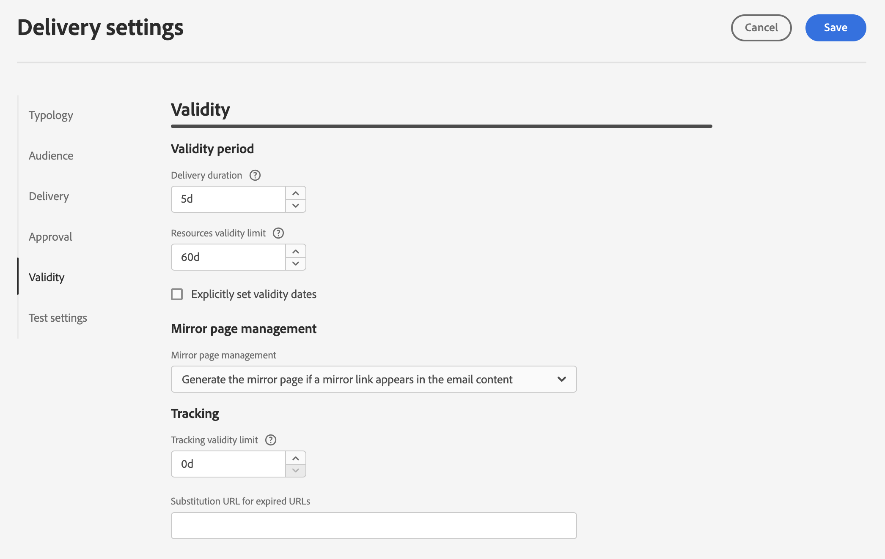

# Delivery settings {#email-del-settings}

Email delivery settings are **technical delivery parameters** that are defined in the email template. They can be overloaded for each delivery.

These settings are available from the **Configure delivery settings** icon available when editing an email delivery or an email delivery template.

## Email delivery settings {#email-delivery-settings}

>[!CAUTION]
>
>These settings are described for your information only. Some of them depend on your configuration and permissions. They must not be modified in this version of the product. 

## Typology settings {#typology}

>[!CONTEXTUALHELP]
>id="acw_email_settings_typology"
>title="Typology"
>abstract="Typology rules allow marketers to standardize business practices, across all deliveries. A typology is a collection of typology rules which lets you control, filter, and prioritize the sending of deliveries. Profiles which match criteria within a typology rule are excluded from the delivery audiences at the preparation phase."

>[!CONTEXTUALHELP]
>id="acw_delivery_template_settings_typology"
>title="Typology settings for the delivery"
>abstract="Typology rules allow marketers to standardize business practices, across all deliveries. A typology is a collection of typology rules which lets you control, filter, and prioritize the sending of deliveries. Profiles which match criteria within a typology rule are excluded from the delivery audiences at the preparation phase."

Typologies are sets of **typology rules**, that are executed during the preparation phase. Typology rules allow marketers to standardize business practices, across all deliveries. A typology is a collection of typology rules which lets you control, filter, and prioritize the sending of deliveries. Profiles which match criteria within a typology rule are excluded from the delivery audiences at the delivery preparation phase.  They allow you to make sure your emails always contain certain elements (such as an unsubscription link or a subject line) or filtering rules to exclude groups from your intended target (like unsubscribers, competitors, or non-loyalty customers).

Typology rules are grouped together within a typology in order to easily apply multiple filtering rules to a delivery at once.

When associating a typology with a message or message template, the typology rules included in the typology are executed to check the message validity during message preparation.

### Pressure parameters {#pressure-parameters}

>[!CONTEXTUALHELP]
>id="acw_email_settings_pressure_parameters"
>title="Pressure parameters for the delivery"
>abstract="Delivery weights let you identify top-priority deliveries within the framework of fatigue management. Messages with the highest weight have priority."

>[!CONTEXTUALHELP]
>id="acw_delivery_template_settings_delivery_weight"
>title="Delivery weight"
>abstract="Delivery weights let you identify top-priority deliveries within the framework of pressure management. Messages with the highest weight have priority."

In this section, pressure parameters let you define a **threshold** to set up fatigue management rules. This is the maximum number of messages that can be sent to one profile over a given period. Once this threshold has been reached, no more deliveries can take place until the end of the period considered. This process lets you automatically exclude a profile from a delivery if a message exceeds the set threshold, thus avoiding over-solicitation.

Threshold values can be either constant or variable. This means that for a given period, thresholds can vary from one profile to another, or even for the same profile.

In the **Weight type** field, three options are available:

* **Constant**
* **Depends on the recipient**
* **Defined in each rule**

Use the **Delivery weight** field to define the delivery priority. Each delivery has a weight which represents its level of priority. By default, the weight of a delivery is set to 5. Pressure rules let you define the weight of the deliveries which they are applied to. Weights can be either set or calculated via a formula to suit recipients. For example, you can define the weight of a delivery based on recipient interests.

Use the **Delivery mode** field to select the target evaluation mode. Three modes are available:

* **Target estimation and message personalization**
* **Estimation and approval of the provisional target**
* **Target evaluation**

Fatigue management comes with the **Campaign Optimization** add-on. Learn more about pressure rules and how to configure fatigue management in [Campaign v8 (client console) documentation](https://experienceleague.adobe.com/docs/campaign/automation/campaign-optimization/pressure-rules.html){target="_blank"}.

### Capacity settings {#capacity-settings}

>[!CONTEXTUALHELP]
>id="acw_email_settings_capacity_settings"
>title="Capacity settings for the delivery"
>abstract="Before delivering messages, use capacity rules to make sure your organization can process the delivery, the inbound messages which the delivery may generate, and the number of calls to be made to contact subscribers for example. Capacity rules are defined in the Adobe Campaign v8 Console. In this screen, select a rule associated to the email channel."

>[!CONTEXTUALHELP]
>id="acw_delivery_template_settings_recipient_importance"
>title="Importance of the recipient"
>abstract="The importance of the recipient is a formula used to determine which recipients are kept when the capacity typology rules are exceeded."

In this section, you can select a capacity rule defined in the Adobe Campaign v8 Console. This rule is associated to the email channel.

The **importance of the recipient** field is a formula used to determine which recipients are kept when the capacity typology rules are exceeded.

Learn more about consistency and capacity rules and how to configure them in [Campaign v8 (client console) documentation](https://experienceleague.adobe.com/docs/campaign/automation/campaign-optimization/consistency-rules.html){target="_blank"}.

## Audience settings {#audience}

>[!CONTEXTUALHELP]
>id="acw_email_settings_audience"
>title="Audience settings for the delivery"
>abstract="Select a **target mapping** among those available. Target mappings are defined in the Adobe Campaign v8 console. You can also set the exclusion parameters for the delivery. "

In this section, you can select a **target mapping** among those available. Target mappings are defined in the Adobe Campaign v8 console. The targeting dimension, or target mapping, is the type of data that an operation is handling. It lets you define the targeted population: recipients, contract beneficiaries, operators, subscribers, etc.

Learn more about target mappings in [this section](../audience/about-recipients.md#targeting-dimensions).

## Delivery {#delivery}

>[!CONTEXTUALHELP]
>id="acw_email_settings_delivery"
>title="Delivery settings for the delivery"
>abstract="Delivery parameters are technical settings which apply to your delivery. You can activate BCC for the delivery, and change the delivery and routine modes. These options are restricted to expert users only."

Delivery parameters are technical settings which apply to your delivery. 

* **Routing**: the integrated email routing external account is provided by default. It contains the technical parameters that allow the application to send emails.

* **Test SMTP delivery**: this option is used to test sending via SMTP. The delivery is processed up to connection to the SMTP server but is not sent: for every recipient of the delivery, Campaign connects to the SMTP provider server, executes the SMTP RCPT TO command, and closes the connection before the SMTP DATA command.

* **Email BCC**: this option is used to store emails on an external system through BCC by simply adding a BCC email address to your message target. Learn more about Email BCC in [Campaign v8 (client console) documentation](https://experienceleague.adobe.com/docs/campaign/campaign-v8/config/configuration/email-settings.html){target="_blank"}.

### Web Analytics {#web-analytics}

>[!CONTEXTUALHELP]
>id="acw_email_settings_webanalytics"
>title="Web analytics settings for the delivery"
>abstract="Select a web analytics account. This account is configured in the Campaign client console. You can also define the tags shared with the analytics tool you are using."

In this section, you can select a web analytics account. This account is configured in the Campaign client console. 

You can also define the tags shared with the analytics tool you are using.

Learn more about Web Analytics and Campaign in [Campaign v8 (client console) documentation](https://experienceleague.adobe.com/docs/campaign/campaign-v8/config/configuration/email-settings.html){target="_blank"}.

### Retries {#retries}

>[!CONTEXTUALHELP]
>id="acw_delivery_template_settings_retries"
>title="Maximum number of retries"
>abstract="If a message fails due to a temporary error, retries are performed until the end of the delivery duration."

Temporarily undelivered messages due to a Soft or Ignored error are subject to an automatic retry. By default, five retries are scheduled for the first day of the delivery with a minimum interval of one hour spread out over the 24 hours of the day. 

Learn more about retry management in [Campaign v8 (client console) documentation](https://experienceleague.adobe.com/docs/campaign/campaign-v8/config/configuration/email-settings.html){target="_blank"}.

## Approval {#approval}

>[!CONTEXTUALHELP]
>id="acw_email_settings_approval"
>title="Approval mode for the delivery"
>abstract="Select the approval mode. If warnings are generated during the delivery preparation, you can configure the delivery to define whether or not it should still be executed."

>[!CONTEXTUALHELP]
>id="acw_delivery_template_settings_approval"
>title="Approval mode for the deliveries"
>abstract="Select the approval mode for deliveries based on this template. If warnings are generated during the delivery preparation, you can configure the delivery to define whether or not it should still be executed."

If warnings are generated during the delivery preparation, you can configure the delivery to define whether or not it should still be executed. By default, the user must confirm the sending of messages at the end of the analysis phase: this is **manual** validation.

You can select another approval mode in the appropriate field. Available modes are: 

* **Manual**: At the end of the analysis phase, the user must confirm delivery to start sending. 

* **Semi-Automatic**: Sending begins automatically if the analysis phase generates no warning messages.

* **Automatic**: Sending begins automatically at the end of the analysis phase, irrespective of its result.

## Validity {#validity}

>[!CONTEXTUALHELP]
>id="acw_email_settings_validity"
>title="Settings validity"
>abstract="The Delivery duration field lets you enter the limit for global delivery retries. This means that Adobe Campaign sends the messages beginning on the start date, and then, for messages returning an error only, regular, configurable retries are performed until the validity limit is reached.The Validity limit field is used for uploaded resources, such as the mirror page or images. These resources are valid for a limited time: once the limit is reached, resources are no longer available."

>[!CONTEXTUALHELP]
>id="acw_delivery_template_settings_resources_validity"
>title="Resources validity limit"
>abstract="The Validity limit field is used for uploaded resources, such as the mirror page or images. These resources are valid for a limited time: once the limit is reached, resources are no longer available."

>[!CONTEXTUALHELP]
>id="acw_delivery_template_settings_delivery_duration"
>title="Delivery duration"
>abstract="The Delivery duration field lets you enter the limit for global delivery retries. This means that Adobe Campaign sends the messages beginning on the start date, and then, for messages returning an error only, regular, configurable retries are performed until the validity limit is reached."
<!--
>[!CONTEXTUALHELP]
>id="acw_email_settings_resources_validity"
>title="Resources validity limit"
>abstract="The Validity limit field is used for uploaded resources, such as the mirror page or images. These resources are valid for a limited time: once the limit is reached, resources are no longer available."
-->

The **Delivery duration** field lets you enter the limit for global delivery retries. This means that Adobe Campaign sends the messages beginning on the start date, and then, for messages returning an error only, regular, configurable retries are performed until the validity limit is reached.

You can also choose to specify dates. To do this, select **Explicitly set validity dates**. In this case, the delivery and validity limit dates also let you specify the time. The current time is used by default, but you can modify this directly in the input field.

**Resources Validity limit** is used for uploaded resources, mainly for the mirror page and images. The resources on this page are valid for a limited time (to save disk space). After this limit, these resources are no longer available.

Learn more about delivery validity period in [Campaign v8 (client console) documentation](https://experienceleague.adobe.com/docs/campaign/campaign-v8/campaigns/send/failures/delivery-failures.html#validity-period){target="_blank"}.

### Mirror page management {#mirror}

The mirror page is an HTML page accessible online via a web browser. Its content is identical to the email. By default, the mirror page is generated if the link is inserted in the content of the mail. 

In addition to the default mode, the following options are also available:

* **[!UICONTROL Force the generation of the mirror page]**: use this mode to generate the mirror page even if no link to the mirror page is inserted in the delivery.
* **[!UICONTROL Do not generate the mirror page]**: use this mode to avoid generating a mirror page, even if the link is present in the delivery.
* **[!UICONTROL Generates a mirror page accessible using only the message identifier]**: when the mirror page link is not present in the email content, use this option to enable access the content of the mirror page, in the delivery log window, from the client console. 

### Tracking {#tracking}

<!--
>[!CONTEXTUALHELP]
>id="acw_email_settings_tracking_validity"
>title="Validity period"
>abstract="This option defines the duration for which the tracking is activated on the URLs."
-->

>[!CONTEXTUALHELP]
>id="acw_delivery_template_settings_tracking_validity"
>title="Validity period"
>abstract="The validity period sets the duration for which the tracking is activated on the message URLs."

Tracking parameters are defined in the related section. Possible options are:

**Tracking validity limit**: use this option to change the duration for which the tracking is activated on the URLs.

**Substitution URL for expired URLs**: use this option to enter a URL to a fall-back web page: it is displayed once the tracking has expired.

## Test settings {#test-setttings}

>[!CONTEXTUALHELP]
>id="acw_email_settings_testsettings"
>title="Test settings for the delivery"
>abstract="Select the exclusion parameters and customize the label of the test emails."

You can set the exclusion parameters in this section. Available options are:

* **Keep double** lets you authorize multiple deliveries to recipients who satisfy several targeting criteria.

* **Keep denylisted addresses** lets you keep from the target any profiles no longer being targeted by the delivery, such as after an unsubscription (opt-out).

* **Keep quarantined addresses** lets you keep from the target any profiles with an address that does not respond. 

You can also customize the name of the test emails.

Use the **Keep the delivery code for the proof** to associate to the test email the same delivery code as the one defined for the delivery to which it relates.

By default, the subject of the test email is prefixed by 'PROOF #', where # is the number of the test email. You can change this prefix in the **Label prefix** field.