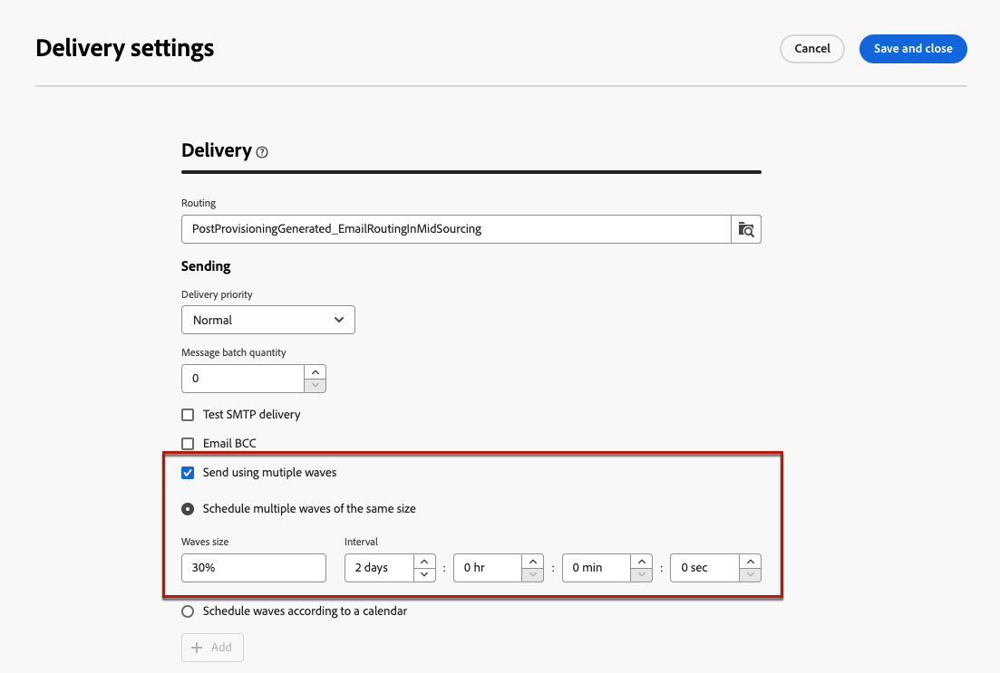

# Send using waves {#send-using-waves}

>[!CONTEXTUALHELP]
>id="acw_deliveries_waves_definition"
>title="Split deliveries into several batches"
>abstract="Instead of sending high volumes of messages at the same time, define waves to split deliveries into several batches. You can configure multiple waves of the same size, or set a calendar for the different waves to be sent."

>[!CONTEXTUALHELP]
>id="acw_deliveries_waves_size"
>title="Define the size of each wave"
>abstract="You must enter a size for all the waves you are adding. Enter either a numerical value (number of messages for each wave), or a percentage (0-100%)."

To balance the load, you can divide email deliveries into several batches. Configure the number of batches and their proportion with respect to the entire delivery, as well as the interval between two waves.

>[!NOTE]
>
>You can only define the size and the delay between two consecutive waves. The recipient selection criteria for each wave cannot be adjusted.

To send deliveries using waves, follow the steps below.

1. Open the [delivery settings](delivery-settings.md#retries).

1. Browse to the **[!UICONTROL Delivery]** section.

1. Select the **[!UICONTROL Send using multiple waves]** option.

1. To configure waves, you can either:

    * [Schedule multiple waves of the same size](#waves-same-size)
    * [Schedule waves according to a calendar](#waves-calendar)

1. Prepare and send your delivery as usual. [Learn more](../msg/gs-deliveries.md)

    >[!CAUTION]
    >
    >Make sure the last waves do not exceed the delivery deadline, defined in the [Validity](delivery-settings.md#validity) tab, otherwise some messages might not be sent. A specific typology control rule, **[!UICONTROL Wave scheduling check]**, ensures that the last wave is planned before the delivery validity limit. Learn more on control rules in the [Campaign v8 (client console) documentation](https://experienceleague.adobe.com/docs/campaign/automation/campaign-optimization/control-rules.html).
    >
    >You must also allow enough time for retries when configuring the last waves. [Learn more](delivery-settings.md#retries)

1. To monitor your sends, go to the [delivery logs](../monitor/delivery-logs.md). You can see the deliveries that were already sent in the processed waves (**[!UICONTROL Sent]** status) and the deliveries to be sent in the remaining waves (**[!UICONTROL Pending]** status).

## Schedule multiple waves of the same size {#waves-same-size}
    
If you select this option, all the waves have the same size (except the last one), and the delay between each wave is always the same.

* Specify the size for all the waves you are splitting the delivery into. You can enter a percentage or a numerical value. Only the last wave can vary in size as it must include the remaining number of messages. 

  For example, if you enter **[!UICONTROL 30%]** in the **[!UICONTROL Waves size]** field, the first three waves represent 30% of all the messages included in the delivery, and the fourth one stands for the remaining 10%.

* In the **[!UICONTROL Interval]** section, specify the delay between the start of two consecutive waves. For example, if you enter **[!UICONTROL 2 days]**, the first wave starts immediately, the second wave will start in two days, the third wave in four days, and so on.

One common use case for using several waves of the same size is with a call center involved. When managing a telephone loyalty campaign, your organization has a limited capacity to process the number of calls to contact subscribers.

Using waves, you can restrict the number of messages to 20 per day, which is the daily processing capacity of a call center.

To do this, select the **[!UICONTROL Schedule multiple waves of the same size]** option. Enter **[!UICONTROL 20]** as the waves size and **[!UICONTROL 1 day]** in the **[!UICONTROL Interval]** field.

## Schedule waves according to a calendar {#waves-calendar}

If you select this option, you need to define the start day/time for each wave you are sending, as well as the size of each wave.

* In the **[!UICONTROL Start]** fields, specify the delay between the start of two consecutive waves.

* In the **[!UICONTROL Size]** column, enter a fixed number or a percentage.

Add as many waves as needed.

In the example below, the first wave represents 25% of the total number of messages included in the delivery and starts immediately. The next two waves complete the delivery and are set to begin at six-hour intervals.

One common use case for using multiple waves according to a calendar is during ramp-up process.

When emails are sent using a new platform, Internet service providers (ISPs) are suspicious of IP addresses that are not recognized. If large volumes of emails are suddenly sent, the ISPs often mark them as spam.

To avoid being marked as spam, you can progressively increase the volume sent using waves. This should ensure smooth development of the start-up phase and enable you to reduce the overall rate of invalid addresses.

To do so, use the **[!UICONTROL Schedule waves according to a calendar]** option. For example, set the first wave to 10%, the second to 15%, the third to 20%, and so on.

  