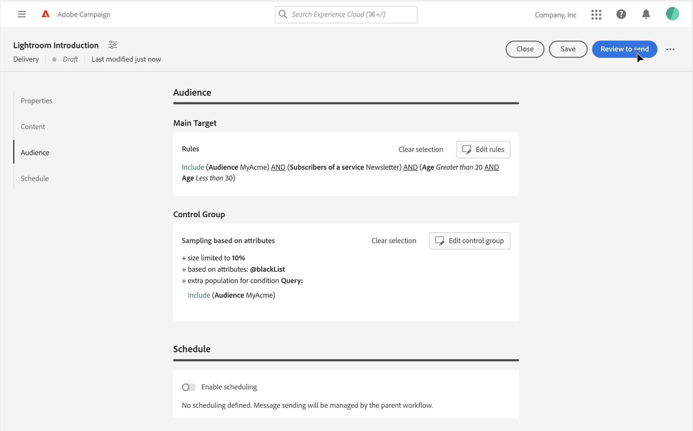

# Get started with audiences {#about-audiences}

<!--
Audience only created for the delivery, not available later-->

<!--
Three ways:
* existing audience

Campaign or AEP Audiences

* create new on the fly

query like AEP segment builder (same component with campaign data)

* import from file

show use case with a new audience creation (or import from file?)

control groups like acc: exract, random, based on attribute
-->

The audience is the main target of your delivery: the recipients who receive the messages. The type of audience depends on the target mapping defined in the delivery template. Learn what is a delivery template [in this section](../msg/delivery-template.md). 

To define the audience population, you can:

* Select an existing audience, created as a list in the Client Console. [Learn more](add-audience.md)
* Select an Adobe Experience Platform audience. [Learn more](aep-audience.md)
* Build a new audience with the rule builder by defining and combining filtering criteria. [Learn more](segment-builder.md)
* Use an audience from an external file: this option is only available for standalone email deliveries, and cannot be used in campaign deliveries. [Learn more](file-audience.md)

When sending messages in the context of a campaign workflow, the audience is defined in a specific **Read audience** workflow activity. In this context, you cannot load an audience from a file for an email delivery, and the audience is defined only in this dedicated activity. Learn how to define the audience of your delivery in a campaign workflow [in this section](../workflows/orchestrate-activities.md).

In addition, you can define control groups to avoid sending messages to a portion of your audience, and measure the impact of your campaigns. [Learn more](control-group.md)

