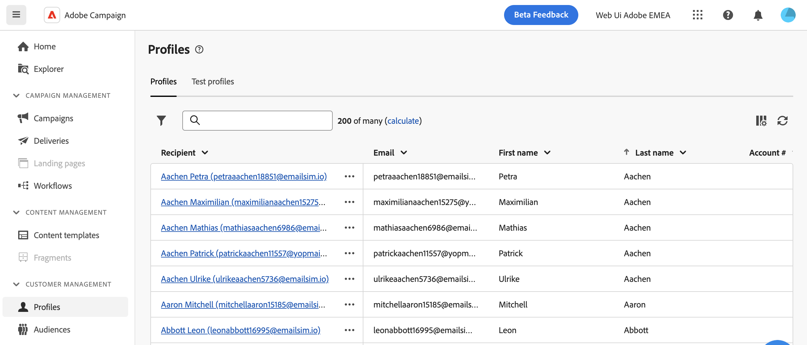
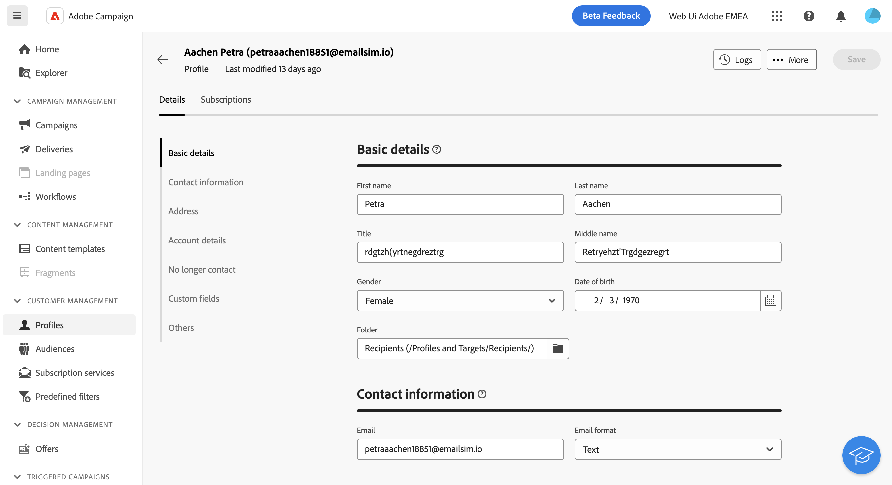

# Monitor & manage profiles {#profiles}

>[!CONTEXTUALHELP]
>id="acw_homepage_rn4"
>title="360 view of your profiles"
>abstract="Create new profiles, and monitor them through powerful reports and tools. Access your profiles' attributes, interactions and logs. Use the filtering options to browse the profiles list, edit and update their profile."
>additional-url="https://experienceleague.adobe.com/docs/campaign-web/v8/whats-new.html" text="See release notes"

>[!CONTEXTUALHELP]
>id="acw_recipients_list"
>title="Profiles"
>abstract="A profile is an individual which is targeted to receive messages sent by Adobe Campaign. From this list, you can view the profiles' details, based on your permissions. Use the filtering options to browse this list. You can edit and update a small set of your profiles' attributes."

## Get started with profiles {#gs}

A profile in Adobe Campaign Web is an individual stored in the database, serving as a key component to create audiences for deliveries and add personalization data to your content. Various types of profiles are stored in the database such as Test profiles, which are designed to test your deliveries before they are sent to the final audience. [Learn how to work with test profiles](test-profiles.md)

Profiles can be added from the Campaign client console only. However, they are accessible in Adobe Campaign Web from the **Profiles** entry in the left navigation rail. You can also access them from the **Explorer** view, where you can browse, create folders, subfolders, and check associated permissions.

You can filter the profiles list using the search field or filters available from the **Show filters** button.

>[!NOTE]
>
>Depending on your permissions, you might not have access to the full list of profiles stored in the database. Learn more about permissions in [this section](../get-started/permissions.md).

## Access & edit profiles' attributes {#access}

To access the details of a profile, click on its name in the profiles list. 

From this screen, you can access detailed information on the profile:

* The **[!UICONTROL Details]** tab allows you to browse through the profile's attributes. To edit an attribute, make changes in the desired field and click the **[!UICONTROL Save]** button.
* The **[!UICONTROL Subscriptions]** tab provides information on the services the profile is subscribed to. [Learn how to work with subscription services](manage-services.md)
* The **[!UICONTROL Logs]** button located in the upper-right corner of the screen allows you to view an history of the profile's interactions through sending, exclusion, and tracking logs as well as the propositions presented to the profile.
