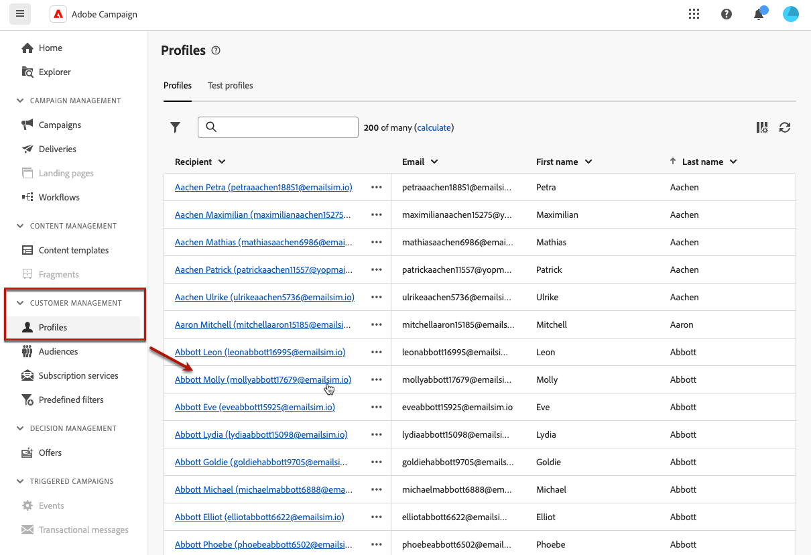
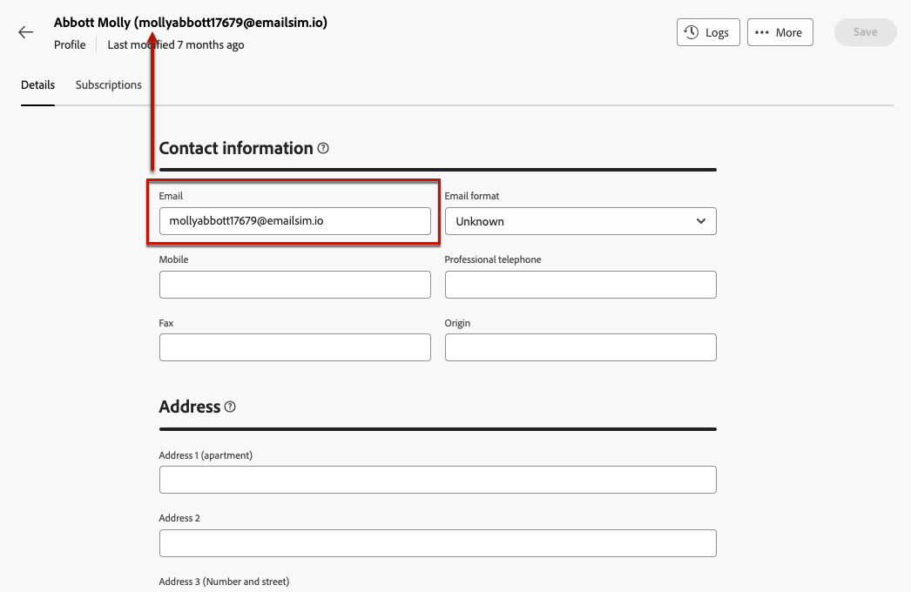

# Monitor and manage profiles {#profiles}

>[!CONTEXTUALHELP]
>id="acw_homepage_rn4"
>title="360 view of your profiles"
>abstract="Create new profiles, and monitor them through powerful reports and tools. Access your profiles' attributes, interactions and logs. Use the filtering options to browse the profiles list, edit and update their profile."
>additional-url="https://experienceleague.adobe.com/docs/campaign-web/v8/whats-new.html" text="See release notes"

>[!CONTEXTUALHELP]
>id="acw_recipients_list"
>title="Profiles"
>abstract="A profile is an individual which is targeted to receive messages sent by Adobe Campaign. From this list, you can view the profiles' details, based on your permissions. Use the filtering options to browse this list. You can edit and update a small set of your profiles' attributes."

## Get started with profiles {#gs}

A profile in Adobe Campaign Web is an individual stored in the database, serving as a key component to [create audiences](create-audience.md) for deliveries and [add personalization](../personalization/personalize.md) data to your content.

Other types of profiles are stored in the database such as **[!UICONTROL Test profiles]**, which are designed to test your deliveries before they are sent to the final audience. [Learn more](test-profiles.md)

Profiles can be created from the Adobe Campaign client console only - [learn how](https://experienceleague.adobe.com/docs/campaign/campaign-v8/audience/add-profiles/create-profiles.html){target="_blank"}. However, they are accessible and editable in Adobe Campaign Web from the **[!UICONTROL Customer management]** > **Profiles** entry in the left navigation rail.

>[!NOTE]
>
>Depending on your permissions, you might not have access to the full list of profiles stored in the database. [Learn more about permissions](../get-started/permissions.md).

* You can filter the **[!UICONTROL Profiles]** list using the search field or filters available from the **Show filters** button. You can restrict the results to a specific [folder](../get-started/permissions.md#folders) using the drop-down list, or add rules using the [query modeler](../query/query-modeler-overview.md).

    

* To delete a profile, select the corresponding option from the **[!UICONTROL More actions]** menu.

* To edit a profile, click the desired item from the list. [Learn more](#access)

You can also access profiles through the **[!UICONTROL Explorer]** view, from the **[!UICONTROL Profiles & Targets]** > **[!UICONTROL Recipients]** node.

From there you can browse, create and manage folders or subfolders, as well as check associated permissions. [Learn how to create folders](../get-started/permissions.md#folders)

From the **[!UICONTROL Explorer]** view you can also filter, delete and [edit](#access) profiles.

## Access and edit profiles' attributes {#access}

>[!CONTEXTUALHELP]
>id="acw_recipients_creation_details"
>title="Basic details"
>abstract="This section offers insights into the basic details of the profile. To modify any information, make your changes directly within the respective field and click the **Save** button located in the upper-right corner of the screen."

>[!CONTEXTUALHELP]
>id="acw_recipients_creation_contactinformation"
>title="Contact information"
>abstract="This section offers insights into the profile's contact information. To modify any information, make your changes directly within the respective field and click the **Save** button located in the upper-right corner of the screen."

>[!CONTEXTUALHELP]
>id="acw_recipients_creation_address"
>title="Address"
>abstract="This section offers insights into the profile's postal address and the address quality. To modify any information, make your changes directly within the respective field and click the **Save** button located in the upper-right corner of the screen."

>[!CONTEXTUALHELP]
>id="acw_recipients_creation_account"
>title="Account details"
>abstract="This section offers insights into the account details of the profile. To modify any information, make your changes directly within the respective field and click the **Save** button located in the upper-right corner of the screen."

>[!CONTEXTUALHELP]
>id="acw_recipients_creation_nolongercontact"
>title="Recipients No longer contact"
>abstract="This section offers insights into the contact preferences of the profile. To modify any information, make your changes directly within the respective field and click the **Save** button located in the upper-right corner of the screen."

>[!CONTEXTUALHELP]
>id="acw_recipients_creation_customfields"
>title="Custom fields"
>abstract="Custom fields are specific attributes tailored to your needs that have been configured for your instance. To modify any information, make your changes directly within the respective field and click the **Save** button located in the upper-right corner of the screen."

>[!CONTEXTUALHELP]
>id="acw_recipients_creation_othersfields"
>title="Others"
>abstract="This section provides additional built-in attributes. To modify any information, make your changes directly within the respective field and click the **Save** button located in the upper-right corner of the screen."

>[!CONTEXTUALHELP]
>id="acw_recipients_subscription_list"
>title="Recipients subscriptions list"
>abstract="This tab lists all the services the profile is subscribed to."

To access the details of a profile and edit them, follow the steps below.

1. Browse to **[!UICONTROL Customer management]** > **[!UICONTROL Profiles]** and click the desired item from the **[!UICONTROL Profiles]** list.

    

1. The detailed information on the profile is displayed.

    The **[!UICONTROL Details]** tab allows you to browse through the profile's built-in and custom attributes. To edit an attribute, make changes in the desired field and click the **[!UICONTROL Save]** button.

    

    1. By default, profiles are stored in the **[!UICONTROL Recipients]** folder. You can change it by browsing to the desired location. [Learn how to work with folders](../get-started/permissions.md#folders)

        

    1. In the **[!UICONTROL Contact information]** section, you can update the email address and other relevant data. The email address is displayed between brackets after the profile label.

        

    1. Check the **[!UICONTROL No longer contact]** options and update them if needed. When any of these options is selected, the profile is on denylist. For example, if the recipient clicked an unsubscription link in a newsletter, this information is added to the contact data. Such recipient is no longer targeted on the selected channel(s). [Learn more](https://experienceleague.adobe.com/docs/campaign/campaign-v8/send/failures/quarantines.html){target="_blank"}

        

    1. If there are **[!UICONTROL Custom fields]**, you can update their values as needed. Custom fields are additional attributes added to the **[!UICONTROL Profiles]** schema through the Adobe Campaign console. [Learn more](https://experienceleague.adobe.com/docs/campaign/campaign-v8/developer/shemas-forms/extend-schema.html){target="_blank"}

        

1. Click the **[!UICONTROL Subscriptions]** tab to access information on the services the profile is subscribed to. [Learn more on subscription services](manage-services.md)

    

1. Click the **[!UICONTROL Logs]** button located in the upper-right corner of the screen to view the history of the profile's interactions through sending, exclusion, and tracking logs. [Learn more on delivery logs](../monitor/delivery-logs.md)

    You can also review the offers presented to the profile in the **[!UICONTROL Propositions]** tab. [Learn more on offers](../msg/offers.md)

    
