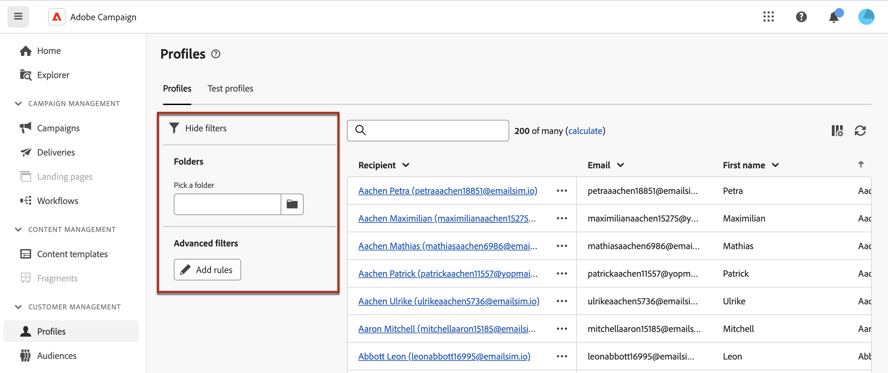

# Get started with profiles {#profiles}

>[!CONTEXTUALHELP]
>id="acw_homepage_welcome_rn4"
>title="360 view of your profiles"
>abstract="Create new profiles, and monitor them through powerful reports and tools. Access your profiles' attributes, interactions and logs. Use the filtering options to browse the profiles list, edit and update their profile."
>additional-url="https://experienceleague.adobe.com/docs/campaign-web/v8/whats-new.html" text="See release notes"

<!--TO REMOVE BELOW-->
>[!CONTEXTUALHELP]
>id="acw_homepage_rn4"
>title="360 view of your profiles"
>abstract="Create new profiles, and monitor them through powerful reports and tools. Access your profiles' attributes, interactions and logs. Use the filtering options to browse the profiles list, edit and update their profile."
>additional-url="https://experienceleague.adobe.com/docs/campaign-web/v8/whats-new.html" text="See release notes"
<!--TO REMOVE ABOVE-->

>[!CONTEXTUALHELP]
>id="acw_recipients_list"
>title="Profiles"
>abstract="A profile is an individual who is targeted to receive messages sent by Adobe Campaign. From this list, you can view the profiles' details, based on your permissions. Use the filtering options to browse this list. You can edit and update a small set of your profiles' attributes."

## What is a profile? {#what} 

A profile in Adobe Campaign Web is an individual stored in the database, serving as a key component to [create audiences](create-audience.md) for deliveries and [add personalization](../personalization/personalize.md) data to your content.

Adobe Campaign allows you to create and monitor your profiles directly from the interface. From there, you can create profiles, access a detailed view of your profiles, and edit them.

Other types of profiles are stored in the database such as **[!UICONTROL Test profiles]**, which are designed to test your deliveries before they are sent to the final audience. [Learn how to work with test profiles](test-profiles.md)

## Access the list of profiles {#access}

Profiles are accessible and editable in Adobe Campaign Web from the **[!UICONTROL Customer management]** > **Profiles** entry in the left navigation rail.

You can also access them through the **[!UICONTROL Explorer]** view, from the **[!UICONTROL Profiles & Targets]** > **[!UICONTROL Recipients]** node. From there you can browse, create and manage folders or subfolders, as well as check associated permissions. [Learn how to create folders](../get-started/permissions.md#folders)

>[!NOTE]
>
>Depending on your permissions, you might not have access to the full list of profiles stored in the database. [Learn more about permissions](../get-started/permissions.md).

You can filter the **[!UICONTROL Profiles]** list using the search field or filters available from the **Show filters** button. You can restrict the results to a specific [folder](../get-started/permissions.md#folders) using the drop-down list, or add rules using the [query modeler](../query/query-modeler-overview.md).

To access the details of a profiles, click on its name from the list. A detailed view of the profile opens, allowing you to explore its attributes and the services he subscribed to. [Learn how to explore profiles' details](create-profile.md)

To delete a profile, select the corresponding option from the **[!UICONTROL More actions]** menu.
