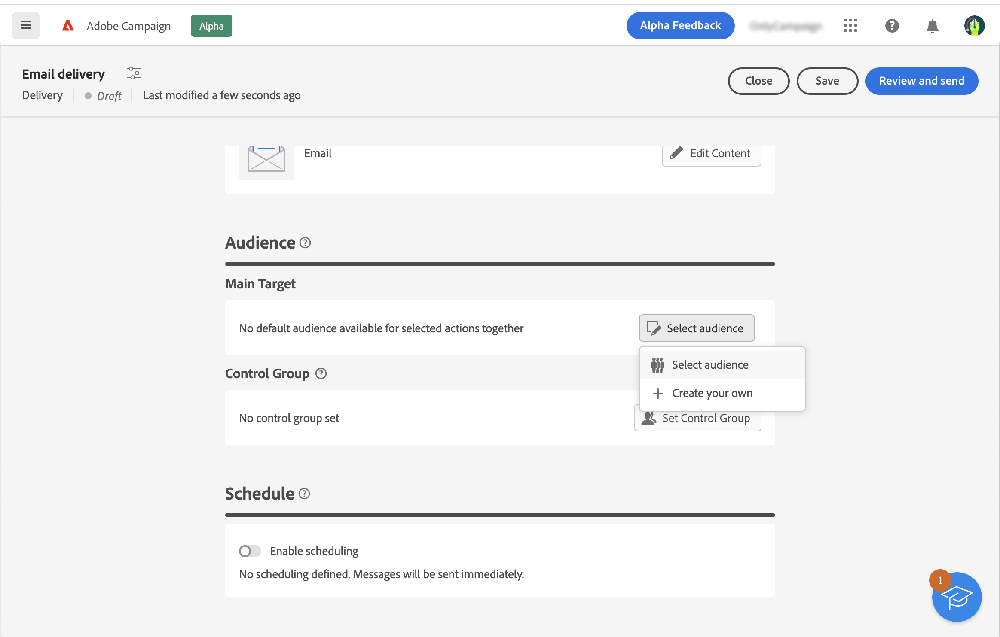

# Select an existing audience {#add-audience}
 
>[!CONTEXTUALHELP]
>id="acw_deliveries_email_audience_select"
>title="Select an existing audience"
>abstract="The audiences are defined in the Adobe Campaign v8 Console. If you have an Adobe Experience Platform integration available, you should be able to see Platform defined audiences too."

This section explains how to select an existing audience, when defining the target population of an email delivery.

You can also:

* Build a new audience. [Learn more](segment-builder.md)
* Load an audience from an external file. [Learn more](file-audience.md)
* Use an Adobe Experience Platform audience. [Learn more](aep-audience.md).

To select an existing audience for your message, follow the steps below:

1. From the **Audience** section of the delivery creation assistant, click the **[!UICONTROL Select audience]** button.

   

1. Choose **[!UICONTROL Select audience]** to use an existing audience. To create a new audience to be used in this email, choose **Create your own**. Refer to this [section](segment-builder.md).

    This screen displays all existing audiences defined in the Adobe Campaign client console, for the current folder.

    

    >[!NOTE]
    >
    >To leverage Adobe Experience Platform audiences, you need to configure the integration with Destinations. Refer to the [Destinations documentation](https://experienceleague.adobe.com/docs/experience-platform/destinations/home.html){target="_blank"}.

1. Choose an audience and click **Select**.

1. Click **Edit rules** if you want to refine your audience.

   

1. Using the rule builder, you can enrich your audience with additional filters or by combining different audiences. See this [section](segment-builder.md).

   

1. Click **Save**. 

You can also set a control group to measure the impact of your campaigns. The control group do not receive the message. This allows you to compare the behavior of the population which received the message with the behavior of contacts which did not. Learn more in [this section](control-group.md).