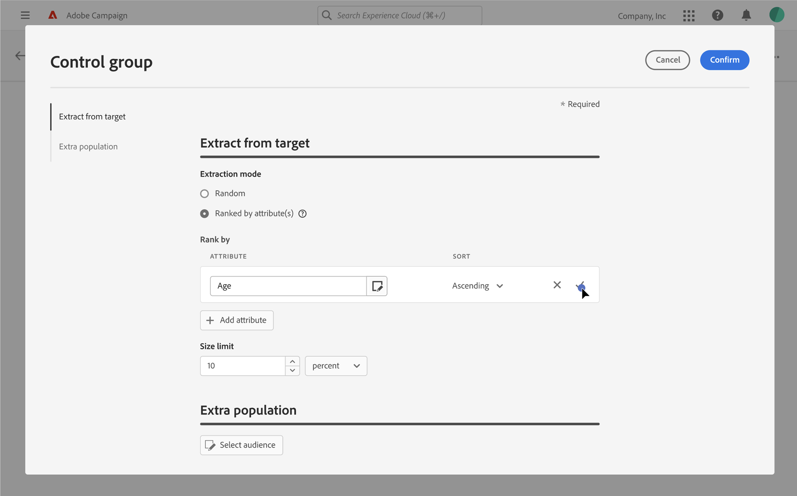

# Set a control group {#control-group}

>[!NOTE]
>
>This documentation is under construction and frequently updated. The final version of this content will be ready in January 2023.

You can use control groups to avoid sending messages to a portion of your audience in order to measure the impact of your campaigns.

To do this, create a control group when defining the audience of your delivery. Profiles are added to the control group randomly, filtered or not, or based on criteria. You will then be able to compare the behavior of the target population which did receive the message with the behavior of contacts which were not targeted. 

The control group can be extracted randomly from the main target and/or selected from a specific population. Consequently, there are two main ways you can define a control group:

* Extract a number of profiles from the main target.
* Exclude some profiles based on criteria defined in a query.

You can use both methods when defining a control group.

All profiles being part of the control group at the delivery preparation step will be removed from the main target. They will not receive the message once it is sent.

To create a control group, click the **[!UICONTROL Set Control Group]** button, from the **Audience** section of the delivery creation assistant.

## Extract from target {#extract-target}

>[!CONTEXTUALHELP]
>id="acw_deliveries_email_controlgroup_target"
>title="Extract from target"
>abstract="TBC"

To define a control group, you can choose to extract, randomly or based on a sorting, a percentage or a fixed number of profiles from the target population.

First, define the way the profiles will be extracted from the target: randomly or based on a sorting.

Under the **Extract from target** section, choose an **Exclusion type**:

* **Random**: when preparing the delivery, Adobe Campaign will randomly extract a number of profiles corresponding to the percentage or to the maximum number that you will set as the size limit.

    

* **Ranked by attribute(s)**: this option enables you to exclude a set of profiles based on specific attribute(s) in a specific sorting order(s).

    

Then define the **Size limit**: you must set how you are going to limit the number of profiles that you extract from the main target. 

## Extra population {#extra-population}

>[!CONTEXTUALHELP]
>id="acw_deliveries_email_controlgroup_extra"
>title="Extra population"
>abstract="TBC"

Another way to define a control group is to exclude a specific population from the target using an existing audience or by defining a query.

From the **Extra population** section of the **Control Group** definition screen, click the **[!UICONTROL Select Audience]** button.

* To use an existing audience, click **Select audience**. Refer to this [section](add-audience.md). 

* To define a new query, select **Create your own** and define the exclusion criteria using the segment builder. Refer to this [section](segment-builder.md). 

The profiles included in the audience or matching the result of the query will be excluded from the target.