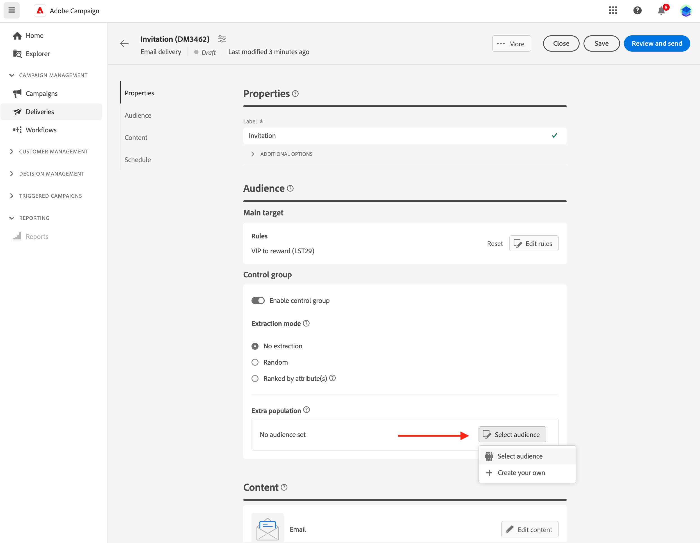

# Set a control group {#control-group}

A control group is a sub-population excluded from the delivery. You can define a control group to avoid sending messages to a portion of your audience, and compare post-delivery behavior with the main target. This option helps you measure the impact of your campaign.

## Enable control group{#add-a-control-group}

To add a control group, enable the option when defining the audience of your delivery. The control group can be extracted randomly from the main target and/or selected from a specific population. Consequently, there are two main ways you can define a control group:

* Extract a number of profiles from the main target.
* Exclude some profiles from a list, or based on criteria defined in a query.

You can combine both methods when defining a control group.

All profiles being part of the control group at the delivery preparation step are removed from the main target. They do not receive the message.

>[!CAUTION]
>
>You cannot use control groups when loading the target population [from an external file](file-audience.md).

To add a control group to a delivery, activate the **[!UICONTROL Enable control group]** toggle, from the **Audience** section of the delivery creation screen.

## Extract from target {#extract-target}

>[!CONTEXTUALHELP]
>id="acw_deliveries_email_controlgroup_target"
>title="Extraction mode"
>abstract="To define a control group, you can choose to extract, randomly or based on a sorting, a percentage or a fixed number of profiles from the target population."

### Build a control group {#build-extract-target}

To define a control group, you can choose to extract, randomly or based on a sorting, a percentage or a fixed number of profiles from the target population. If you prefer adding an extra-population, choose the **No extraction** option and select the extra population [as detailed here](#extra-population).

First, define the way the profiles are extracted from the target: randomly or based on a sorting.

Under the **Control group** section, choose an **Extraction mode**:

* **Random**: when preparing the delivery, Adobe Campaign  randomly extracts a number of profiles corresponding to the percentage or to the maximum number that is set as the size limit.

* **Ranked by attribute(s)**: this option enables you to exclude a set of profiles based on specific attribute(s) in a specific sorting order(s).

Then use the **Size limit** section to set the number of profiles that you need to extract from the main target. It can be a raw number (for example 50 profiles to exclude) or a percentage of your initial audience (for example 5% of the main target).

### Sample of control group{#control-group-sample}

For example, to create a control group with the 100 new youngest recipients, follow these steps:

1. Select the **Age** field as a sorting criterion. Leave the **Ascending** sort option. 
1. Add the **Creation Date** field. Change to the **Descending** sort option.
1. Define 100 as the threshold in the **Size limit** section.

    

These 100 new youngest recipients are then excluded from the main target. 

### Check your control group {#check-control-group}

You can view the logs to check and identify the exluded profiles. Let's take the example of a random exclusion on five profiles.

After the delivery preparation, you can review how the exclusions were applied:

* In delivery dashboard, before the sending, check the **To exclude** KPI.

    

* In the delivery logs, the Logs tab shows the exclusion step.

    

 * The **Exclusion logs** tab displays each profile and the related exclusion **Reason**.

    

* The **Exclusion causes** tab displays the number of excluded profile for each typology rule.

    

For more information on delivery logs, refer to this [section](../monitor/delivery-logs.md).

## Add an extra population {#extra-population}

>[!CONTEXTUALHELP]
>id="acw_deliveries_email_controlgroup_extra"
>title="Extra population"
>abstract="You can exclude a specific population from the target by selecting an existing audience, or by defining a query."

Another way to define a control group is to exclude a specific population from the target using an existing audience or by defining a query.

From the **Extra population** section of the **Control Group** definition screen, click the **[!UICONTROL Select Audience]** button.

* To use an existing audience, click **Select audience**. Refer to this [section](add-audience.md). 

* To define a new query, select **Create your own** and define the exclusion criteria using the rule builder. Refer to this [section](segment-builder.md). 

The profiles included in the audience or matching the result of the query are excluded from the target.

## Compare the results{#control-group-results}

Once the delivery is sent, you can extract the sending logs to compare behavior between the profiles which did not receive the communication and the effective target. You can also use the delivery logs to build a new targeting.

To see which profiles were removed from the target, check the **Delivery logs**. Learn more [in this section](#check-control-group).

