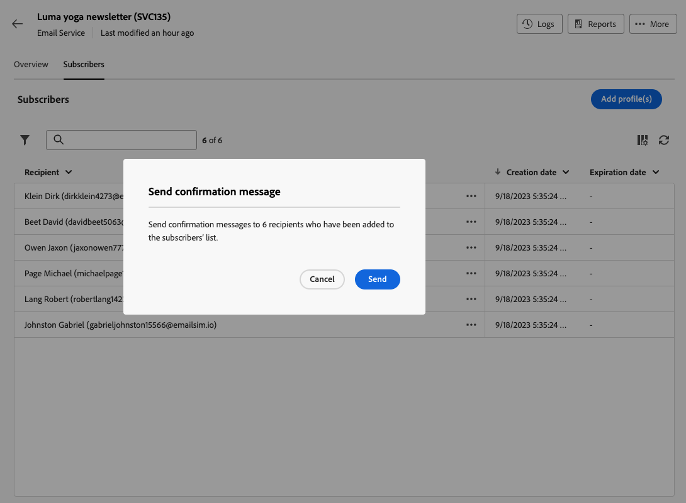

# Work with subscription services {#create-services}

>[!CONTEXTUALHELP]
>id="acw_subscriptions_list"
>title="Create and manage your services"
>abstract="Use Adobe Campaign to create and monitor your services such as newsletters, and to check the subscriptions or unsubscriptions to these services. Subscriptions only apply to email and SMS delivery."

Use Adobe Campaign web to manage and create your services such as newsletters, and to check the subscriptions or unsubscriptions to these services.

>[!NOTE]
>
>Subscriptions only apply to email and SMS delivery.

Several services can be defined in parallel, for example: newsletters for specific product categories, themes or areas of a web site, subscriptions to various types of alert messages, and real-time notifications.

To learn more on managing subscriptions and unsubscriptions, refer to the [Campaign v8 (client console) documentation](https://experienceleague.adobe.com/docs/campaign/campaign-v8/audience/subscriptions.html){target="_blank"}.

## Access susbscription services {#access-services}

To access subscription services available for your platform, follow the steps below.

1. Browse to the **[!UICONTROL Subscription services]** menu on the left navigation rail.

    

1. The list of all existing subscription services is displayed. You can search the services and filter on the channel, the folder or use advanced filters.

    

1. To edit an existing service, click its name.

1. You can delete or duplicate any service using the three dots icon next to this service name.

## Create your first subscription service {#create-service}

>[!CONTEXTUALHELP]
>id="acw_subscriptions_list_properties"
>title="Define your service properties"
>abstract="Enter the label of the subscription service, and define additional options, such as a validity period for your service."

>[!CONTEXTUALHELP]
>id="acw_subscriptions_list_confirm"
>title="Select a confirmation message"
>abstract="When a user subscribes to or unsubscribes from a service, you can send a confirmation message. Select the templates to use for that message."

To create a subscription service, follow the steps below.

1. Select the **[!UICONTROL Create subscription service]** button.

    

1. Select a channel: **[!UICONTROL Email]** or **[!UICONTROL SMS]**.

1. In the service properties, enter a label and define additional options as wanted.

    

1. By default, subscriptions are unlimited. You can disable the **[!UICONTROL  Unlimited validity period]** option to define a validity duration for the service. In the example below, after 20 days, no users will be able to subscribe to this service anymore.

    

1. When a user subscribes to or unsubscribes from a service, you can send a confirmation message. Select the templates to use for that message according to your use case. These templates must be configured with the **[!UICONTROL Subscriptions]** target mapping. [Learn more](#create-confirmation-message)

    

1. Click **[!UICONTROL Save and review]**. The new service is added to the **[!UICONTROL Subscription services]** list.

## Create a confirmation message {#create-confirmation-message}

To send confirmation message to the users who subscribe to or unsubscribe from your service, you must create a delivery template with the **[!UICONTROL Subscriptions]** target mapping, without a defined target. To do so, follow the steps below.

1. Create a delivery template for the susbscription confirmation. [Learn how](../msg/delivery-template.md)

1. Do not select an audience for this delivery. Instead, access the **[!UICONTROL Delivery settings]**, go to the [Audience](../advanced-settings/delivery-settings.md#audience) tab and select the **[!UICONTROL Subscriptions]** target mapping from the list.

    

    >[!NOTE]
    >
    >If you do not select the  **[!UICONTROL Subscriptions]** target mapping, your susbscribers will not receive the confirmation message. Target mappings are defined in the Campaign v8 console. Learn more the [Adobe Campaign v8 documentation](https://experienceleague.adobe.com/docs/campaign/campaign-v8/audience/add-profiles/target-mappings.html){target="_blank"}.

1. Edit the content of your delivery template, save and close it.

    

    >[!NOTE]
    >
    >Learn more about delivery channels and how to define a delivery content in the [Email channel](../email/create-email.md) and [SMS channel](../sms/create-sms.md) sections.

1. Repeat the steps above to create a delivery template for the unsusbscription confirmation.

You can now select these messages when [creating a subscription service](#create-service). Users who subscribe to or unsubscribe from that service receive the selected confirmation message.

## Add subscribers to your service {#add-subscribers}

Once you created a service, you can manually add subscribers. Follow the steps below.

1. Select an existing service from the **[!UICONTROL Subscription services]** list.

1. Select the **[!UICONTROL Subscribers]** tab and click **[!UICONTROL Add profiles]**.

    

1. Select the profiles you want to add from the list and click **[!UICONTROL Confirm]**.

    

1. Click **[!UICONTROL Send]**. The selected recipients will receive the subscription [confirmation message](#create-confirmation-message) that you selected when [creating the service](#create-service).

    

The profiles added are displayed in the **[!UICONTROL Subscribers]** list. They are now subscribed to your service.

## Remove subscribers from your service {#remove-subscribers}

Once you added subscribers to your service, you can remove them. Follow the steps below.

1. Select an existing service from the **[!UICONTROL Subscription services]** list.

1. Click the three dots icon next to the desired recipient name and select **[!UICONTROL Delete]**.

    

1. Confirm deletion and click **[!UICONTROL Send]**. The selected recipients will receive the unsubscription [confirmation message](#create-confirmation-message) that you selected when [creating the service](#create-service).

    

The recipient is removed from the **[!UICONTROL Subscribers]** list and is no longer subscribed to your service.

## Subscription service logs and reports {#logs-and-reports}

To measure the effectiveness of your subscription services for SMS and email channels, you can access the logs and reports for a given service.

1. Select an existing service from the **[!UICONTROL Subscription services]** list. Click **[!UICONTROL Calculate]** the get the number of total subscribers.

    

1. From the service dashboard, select **[!UICONTROL Logs]** to view the the list of subscribers to this service. You can check the total number of subscribers, the name an address of each recipient and when they susbscribed or unsubscribed. You can also filter on them.

    

1. From the service dashboard, select **[!UICONTROL Reports]**. Check the following indicators:

    * The **[!UICONTROL Total numbers of subscribers]** is displayed.

    * You can view the number of subscriptions and unsubscriptions over a selected period. Use the drop-down list to change the time range.

        

    * The **[!UICONTROL Overall evolution of subscriptions]** graph shows the breakdown by period, including subscriptions, unsubcriptions, the evolution in numbers and the loyalty percentage.<!--what is Registered?-->

    * Use the **[!UICONTROL Reload]** button to retrieve the last values from the execution and schedule of the tracking workflow.

## Deliver to the subscribers of a service

Once you [created a subscription service](#create-service), your can target its subscribers in a delivery. Follow the steps below.

1. [Create an audience](../audience/create-audience.md) including the subscribers to the service you created:

    * In the **[!UICONTROL Build audience]** activity, display the advanced attributes and select **[!UICONTROL Recipient]** > **[!UICONTROL Subscriptions]** > **[!UICONTROL Service]**.

    * In this example, select the users who are subscribed to the service that has the **Luma Newsletter** label.

    

1. [Create a delivery](../msg/gs-messages.md) and select the audience that you created above.

    

1. Edit your message content as wanted and send the delivery.

    

Your delivery is sent to the subscribers to that service only.

