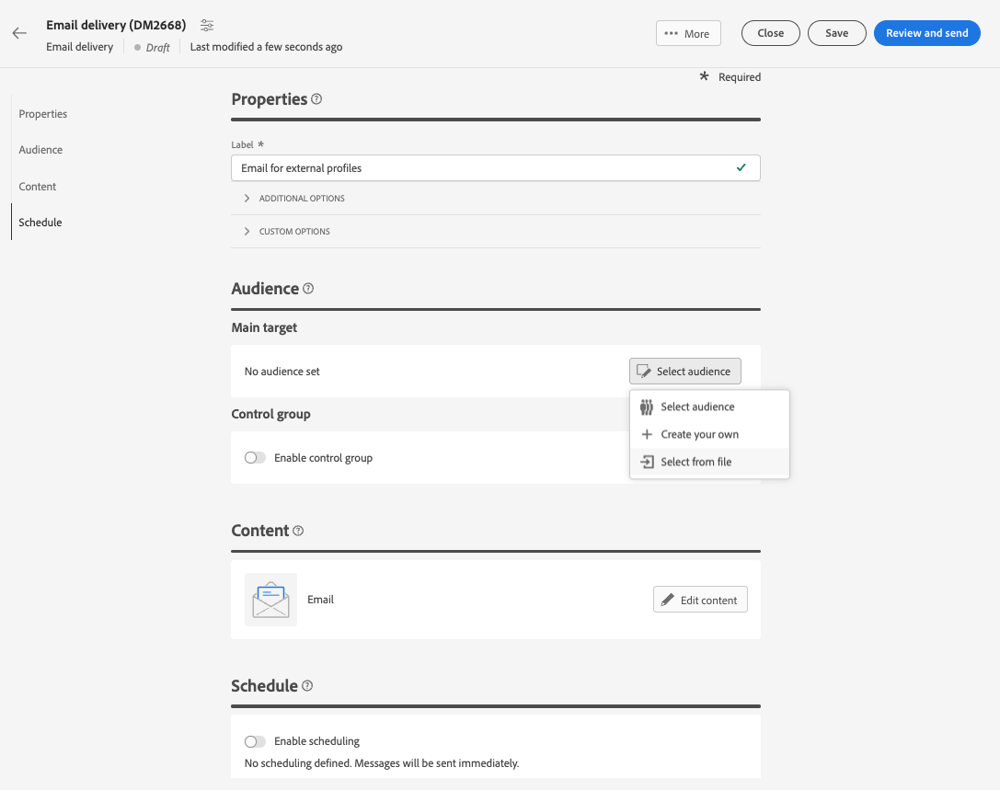

# Load an email audience from a file {#audience-from-file}

>[!CONTEXTUALHELP]
>id="acw_audience_fromfile_select"
>title="File selection"
>abstract="Select the local file to upload. Supported formats are TXT and CSV. Align your file format with the sample file linked below."

>[!CONTEXTUALHELP]
>id="acw_audience_fromfile_columns"
>title="Columns definition"
>abstract="Check the format of the columns in the external file."

>[!CONTEXTUALHELP]
>id="acw_audience_fromfile_formatting"
>title="Formatting parameters"
>abstract="Specify how the external file is formatted to ensure that data is correctly imported."

>[!CONTEXTUALHELP]
>id="acw_audience_fromfile_preview"
>title="Preview your file"
>abstract="Check the preview of the columns of the external file. This screen only shows up to 30 records."

Adobe Campaign Web User Interface allows you to target profiles stored in an external file. Once the profiles have been loaded, all fields from the input file are available for use to personalize your delivery [Learn how to personalize your content](../personalization/personalize.md).  

Profiles from the input file are not added to the database. They are loaded and available for this specific standalone email delivery only.

>[!NOTE]
>
>This page describes how to load external profiles from a file when creating a standalone email delivery. To load data from a file in the context of a workflow, refer to [this page](../workflows/activities/load-file.md).
 
## Must-read {#must-read}

* This capability is available for **email deliveries** only.
* Supported file formats are: text (TXT) and comma-separated value (CSV).
* You cannot use [control groups](control-group.md) when loading the target population from an external file.

## Select and configure the input file {#upload}

To target profiles from a file in your emails, follow these steps:

1. Open an existing email delivery, or [create a new email delivery](../email/create-email.md).
1. In the **Audience** section, click the **Select audience** button then choose **Select from file**.

    {zoomable="yes"}

1. Select the local file to load. The file format must align with the [sample file](#sample-file). 
1. Preview and check how data is mapped in the central section of the screen.

    

1. Specify the column which contains the email address from the **Address Field** drop-down list. You can also select the denylist colum if you have such information in the input file.
1. Adjust the column settings, and how to format the data from the available options.
1. Click **Confirm** once settings are correct.

When creating the message content, you can add personalization by leveraging fields from the input file. [Learn how to personalize content](../personalization/personalize.md)

{zoomable="yes"}

## Sample file {#sample-file}

>[!CONTEXTUALHELP]
>id="acw_audience_fromfile_samplefile"
>title="Load an audience from a file"
>abstract="Supported file formats are TXT and CSV. Use first line as column header. Align your file format with the sample file provided in the link below."

When loading an external file to target profiles in your deliveries, make sure the input file matches the recommendations below:

* Supported formats are TXT and CSV.
* The first line in the file is your column header.
* Align your file format with the sample file below:

    ```javascript
    {
    lastname,firstname,city,birthdate,email,denylist
    Smith,Hayden,Paris,23/05/1985,hayden.smith@example.com,0
    Mars,Daniel,London,17/11/1999,danny.mars@example.com,0
    Smith,Clara,Roma,08/02/1979,clara.smith@example.com,0
    Durance,Allison,San Francisco,15/12/2000,allison.durance@example.com,1
    }
    ```

## Preview and test your email {#test}

Campaign Web allows you to preview and send proofs when using an audience uploaded from a file. To do this, follow these steps:

1. Click the **[!UICONTROL Simulate content button]** from your delivery content editing screen and click the **[!UICONTROL Add test profile(s)]** button. 

1. The profiles contained in the uploaded file display. Select the profile(s) that you want to use for previewing your content and click **[!UICONTROL Select]**.

1. A preview of the delivery content displays in the right pane of the screen. Personalized elements are replaced with the data from the profile selected in the left pane. [Learn more on delivery content preview](../preview-test/preview-content.md) 

    {zoomable="yes"}

1. To send proofs, click the **[!UICONTROL Send proof]** button.

1. Click the **[!UICONTROL Upload proof profiles]** button and select the .txt or .csv file that contains your proof recipients.

    >[!CAUTION]
    >
    >Ensure that the file format matches the one used for uploading your audience. Any format errors will display an alert.

1. When the proof profiles are added and you are ready to send the proofs, click the **[!UICONTROL Send proof]** button and confirm the sending.

    {zoomable="yes"}

1. You can monitor the sending of the proof using the **[!UICONTROL View proofs]** button at any time. [Learn more on proofs monitoring](../preview-test/test-deliveries.md#access-test-deliveries)
