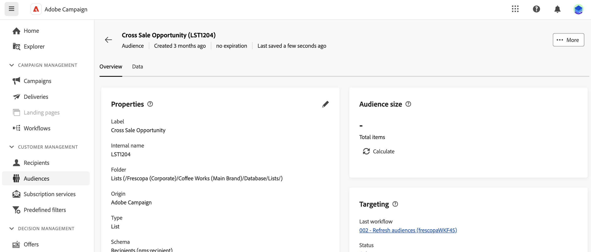

# Get started with audiences {#monitor-manage}

>[!CONTEXTUALHELP]
>id="acw_audiences_properties"
>title="Properties"
>abstract="Here you can find a summary of the audience properties, such as its origin or its storage folder. Click the link in the **Last workflow** section to open the workflow that has been used to create the audience."

>[!CONTEXTUALHELP]
>id="acw_audiences_count"
>title="Audience size"
>abstract="Here you can find the total number of profiles within the audience. Click the **Calculate** button to update and recalculate the audience results."

>[!CONTEXTUALHELP]
>id="acw_audiences_targeting"
>title="Targeting"
>abstract="Targeting"

>[!CONTEXTUALHELP]
>id="acw_audiences_workflow_error_data_execution"
>title="Audience error"
>abstract="Audience data is not available. Please wait for the end of the workflow execution."

The audience is the main target of your delivery: the profiles who receive the messages. The list of audiences available for use in Campaign Web is accessible from the **[!UICONTROL Audiences]** menu.

{zoomable="yes"}

Audiences can originate from multiple sources. The **[!UICONTROL Origin]** column indicates where a given audience has been created:

* **[!UICONTROL Adobe Campaign]**: These audiences have been created in [Adobe Campaign Web User Interface](create-audience.md) or in the [Adobe Campaign v8 client console](https://experienceleague.adobe.com/docs/campaign/campaign-v8/audience/create-audiences/create-audiences.html){target="_blank"}.

* **[!UICONTROL Adobe Experience Platform:]** These audiences have been created within Adobe Experience Platform and are integrated into Campaign Web using the Adobe Sources and Destinations integration. Learn how to set up this integration in [Campaign v8 (client console) documentation](https://experienceleague.adobe.com/docs/campaign/campaign-v8/connect/ac-aep/ac-aep.html){target="_blank"}.

    ➡️ [Discover this feature in video](#video) 

To get additional information on an audience, open it from the list. The audience properties display, along with the number of profiles included in the audience. Refresh the audience count at any time using the **[!UICONTROL Calculate]** button.

To preview the temporary Schema of an audience, click the **[!UICONTROL Schema preview]** button under the Propreties section. 

The **[!UICONTROL Data]** tab allows you to visualize the profiles that are part of the audience. Customize this view by adding additional columns or use advanced filters to refine the displayed data.

{zoomable="yes"}

To duplicate or delete an audience, click the **[!UICONTROL More action]** button available in the audiences list next to the audience name or inside an audience details screen.

## How-to video {#video}

Learn how to create a destination to use an Experience Platform audience in Adobe Campaign Web user interface.

>[!VIDEO](https://video.tv.adobe.com/v/3427635?quality=12)

Detailed information on how to set up the Adobe Sources and Destinations integration is available in [Campaign v8 (client console) documentation](https://experienceleague.adobe.com/docs/campaign/campaign-v8/connect/ac-aep/ac-aep.html){target="_blank"}.