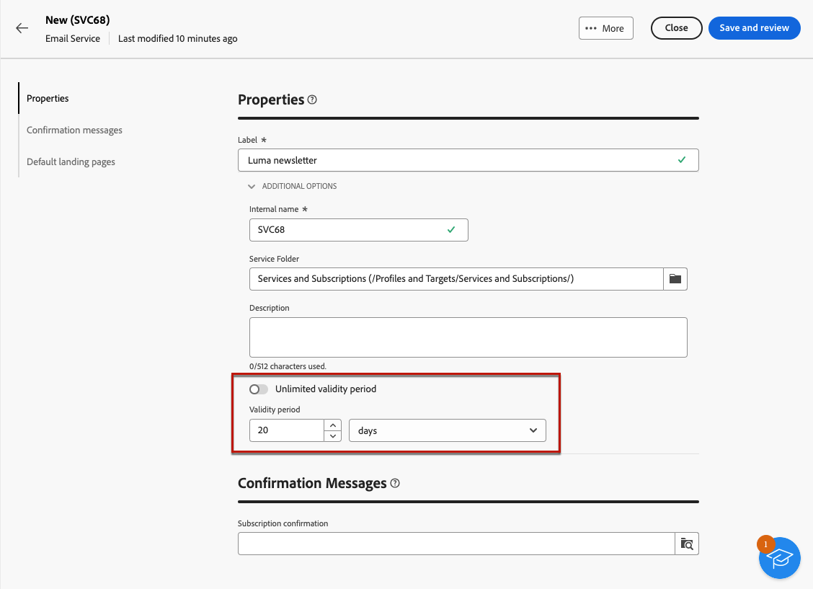
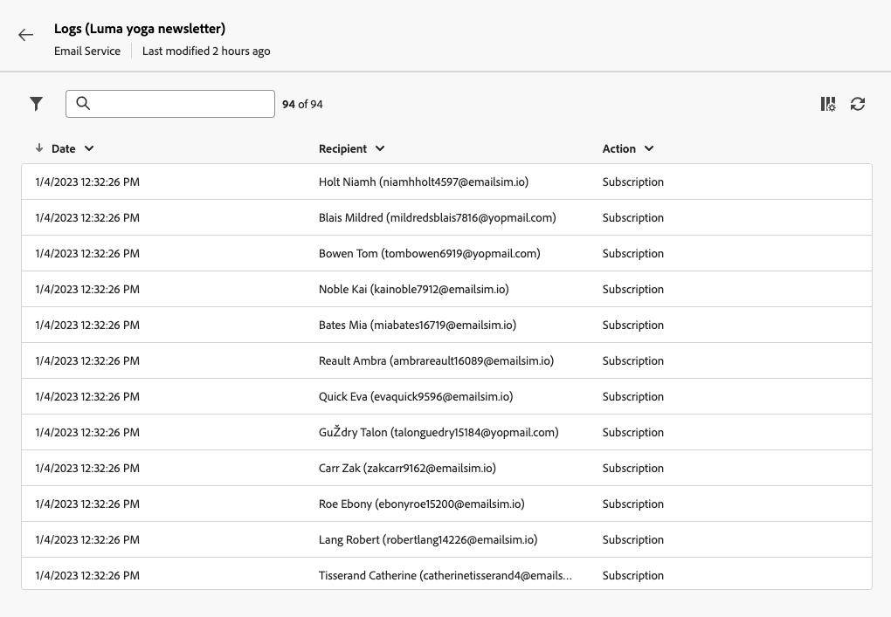

# Create and manage subscription services {#manage-services}

>[!CONTEXTUALHELP]
>id="acw_subscriptions_list"
>title="Create and manage services"
>abstract="Use Adobe Campaign to create and monitor your services such as newsletters, and to check the subscriptions or unsubscriptions to these services. Subscriptions only apply to email and SMS delivery."

Use Adobe Campaign Web to manage and create your services such as newsletters, and to check the subscriptions or unsubscriptions to these services.

>[!NOTE]
>
>Subscriptions only apply to email and SMS delivery.

Several services can be defined in parallel, for example: newsletters for specific product categories, themes or areas of a web site, subscriptions to various types of alert messages, and real-time notifications.

To learn more on managing subscriptions and unsubscriptions, refer to the [Campaign v8 (client console) documentation](https://experienceleague.adobe.com/docs/campaign/campaign-v8/audience/subscriptions.html){target="_blank"}.

## Access subscription services {#access-services}

To access subscription services available for your platform, follow the steps below.

1. Browse to the **[!UICONTROL Subscription services]** menu on the left navigation rail.

    

1. The list of all existing subscription services is displayed. You can search the services and filter on the channel, the folder or add rules using the [query modeler](../query/query-modeler-overview.md).

    

1. To edit an existing service, click its name.

1. You can delete or duplicate any service using the three dots icon next to the service name.<!--so all subscribers are unsubscribed - need to mention?-->

## Create your first subscription service {#create-service}

>[!CONTEXTUALHELP]
>id="acw_subscriptions_list_properties"
>title="Define the service properties"
>abstract="Enter the label of the subscription service, and define additional options, such as a validity period for your service."

>[!CONTEXTUALHELP]
>id="acw_subscriptions_list_confirm"
>title="Select a confirmation message"
>abstract="When a user subscribes to or unsubscribes from a service, you can send a confirmation message. Select the templates to use for that message."

To create a subscription service, follow the steps below.

1. Select the **[!UICONTROL Create subscription service]** button.

    

1. Select a channel: **[!UICONTROL Email]** or **[!UICONTROL SMS]**.

1. In the service properties, enter a label and define **[!UICONTROL Additional options]** as wanted.

    

1. By default, services are stored in the **[!UICONTROL Services and Subscriptions]** folder. You can change it by browsing to the desired location. [Learn how to work with folders](../get-started/permissions.md#folders)

1. By default, subscriptions are unlimited. 

    You can disable the **[!UICONTROL Unlimited validity period]** option to define a validity duration for the service. Once the validity period ends:
    * No recipients can subscribe to this service anymore
    * All subscribers to this service are automatically unsubscribed

    

1. When a user subscribes to or unsubscribes from a service, you can send a confirmation message. Select the templates to use for that message according to your use case. These templates must be configured with the **[!UICONTROL Subscriptions]** target mapping. [Learn more](#create-confirmation-message)

    

1. Click **[!UICONTROL Save and review]**. The new service is added to the **[!UICONTROL Subscription services]** list.

You can now:

* Add subscribers to this service, and unsubscribe recipients. [Learn more](../msg/send-to-subscribers.md)

* Send messages to the subscribers of this service. [Learn how](../msg/send-to-subscribers.md)

## Create a confirmation message {#create-confirmation-message}

>[!CONTEXTUALHELP]
>id="acw_subscriptions_delivery_template"
>title="Select the subscriptions delivery template"
>abstract="To send confirmation messages to the users who subscribe to your service, you must select a specific delivery template based on the **[!UICONTROL Subscriptions]** target mapping, without a defined target."

>[!CONTEXTUALHELP]
>id="acw_unsubscriptions_delivery_template"
>title="Select the unsubscriptions delivery template"
>abstract="To send confirmation messages to the users who unsubscribe from your service, you must select a specific delivery template based on the **[!UICONTROL Subscriptions]** target mapping, without a defined target."

To send confirmation messages to the users who subscribe to or unsubscribe from your service, you must create a delivery template with the **[!UICONTROL Subscriptions]** target mapping, without a defined target. To do so, follow the steps below.

1. Create a delivery template for the susbscription confirmation. [Learn how to create a template](../msg/delivery-template.md)

1. Do not select an audience for this delivery. Instead, access the delivery **[!UICONTROL Settings]**, go to the [Audience](../advanced-settings/delivery-settings.md#audience) tab and select the **[!UICONTROL Subscriptions]** target mapping from the list.

    

    >[!NOTE]
    >
    >If you do not select the  **[!UICONTROL Subscriptions]** target mapping, your susbscribers will not receive the confirmation message. Target mappings are defined in the Campaign v8 console. Learn more in the [Adobe Campaign v8 documentation](https://experienceleague.adobe.com/docs/campaign/campaign-v8/audience/add-profiles/target-mappings.html){target="_blank"}.

1. Edit the content of your delivery template, save and close it.

    

    >[!NOTE]
    >
    >Learn more about delivery channels and how to define a delivery content in the [Email channel](../email/create-email.md) and [SMS channel](../sms/create-sms.md) sections.

1. Repeat the steps above to create a delivery template for the unsusbscription confirmation.

You can now select these messages when [creating a subscription service](#create-service). Users who subscribe to or unsubscribe from that service will receive the selected confirmation messages.

## Monitor your subscription services {#logs-and-reports}

>[!CONTEXTUALHELP]
>id="acw_subscriptions_totalnumber_subscribers"
>title="Total number of subscribers"
>abstract="Click **Calculate** the get the total number of subscribers for this service."

>[!CONTEXTUALHELP]
>id="acw_subscriptions_overtheperiod_subscribers"
>title="Number of subscriptions for the period"
>abstract="Use the drop-down list to change the time range and view the number of subscriptions and unsubscriptions over the selected period."

>[!CONTEXTUALHELP]
>id="acw_subscriptions_overallevolution_subscribers"
>title="Subscriptions overall evolution"
>abstract="This graph shows the breakdown by period, including subscriptions, unsubcriptions, the evolution in numbers and the loyalty percentage."

To measure the effectiveness of your subscription services for SMS and email channels, you can access the logs and reports for a given service.

1. Select an existing service from the **[!UICONTROL Subscription services]** list. Click **[!UICONTROL Calculate]** the get the total number of subscribers.

    

1. From the service dashboard, select **[!UICONTROL Logs]** to view the the list of subscribers to this service.

    You can check the total number of subscribers, the name and address of each recipient, and when they susbscribed or unsubscribed. You can also filter on them.

    

1. From the service dashboard, select **[!UICONTROL Reports]**. Check the following indicators:

    * The **[!UICONTROL Total numbers of subscribers]** is displayed.

    * You can view the number of subscriptions and unsubscriptions over a selected period. Use the drop-down list to change the time range.

        

    * The **[!UICONTROL Overall evolution of subscriptions]** graph shows the breakdown by period, including subscriptions, unsubcriptions, the evolution in numbers and the loyalty percentage.<!--what is Registered?-->

1. Use the **[!UICONTROL Reload]** button to retrieve the last values from the execution and schedule of the tracking workflow.
