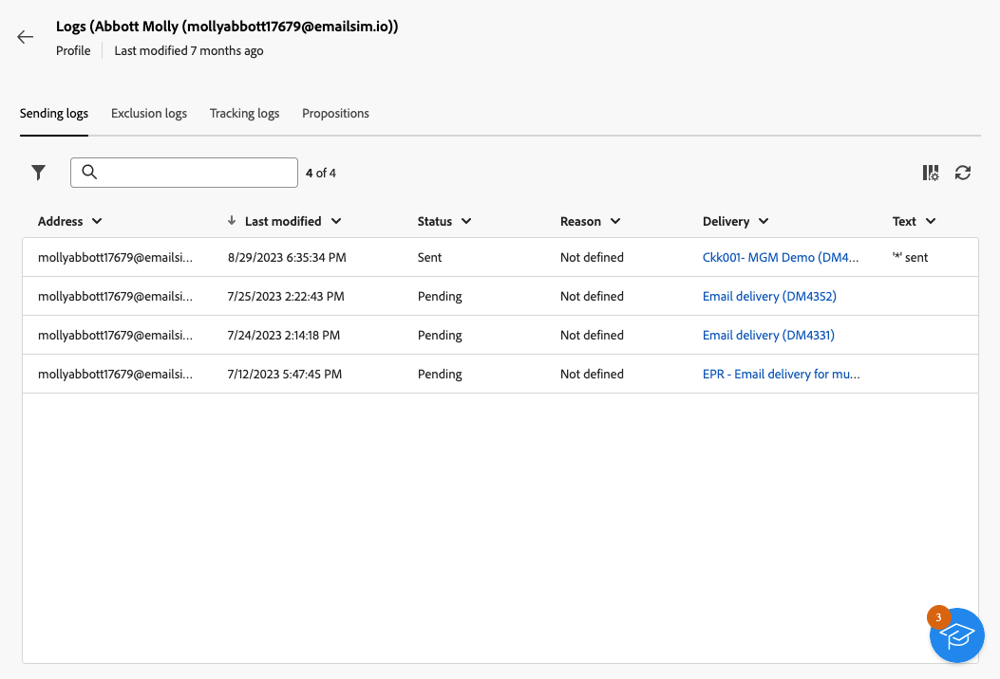

# Explore profiles' details {#profile-view}

>[!CONTEXTUALHELP]
>id="acw_recipients_subscription_list"
>title="Subscriptions list"
>abstract="This tab lists all the services the profile is subscribed to."

To access the details of a profile, browse to **[!UICONTROL Customer management]** > **[!UICONTROL Profiles]**, then click on the profile you want to access.

Information on the profile is organized as follows:

* The **[!UICONTROL Details]** tab allows you to browse through the profile's built-in and custom attributes. To edit an attribute, make changes in the desired field, and click the **[!UICONTROL Save]** button. Detailed information on profiles' attributes is available in the [Create a profile](create-profile.md) section.

    {zoomable="yes"}

* The **[!UICONTROL Subscriptions]** tab provides insight into the services the profile is subscribed to. [Learn more about subscription services](manage-services.md)

    {zoomable="yes"}

* You can display custom tabs, such as purchases, by defining collection links in the screen definition of the Recipients schema. [Learn more about collection links](../administration/schemas-collection-lists.md)

    {zoomable="yes"}

* In addition, the **[!UICONTROL Logs]** button, located in the upper-right corner of the screen, allows you to view the history of the profile's interactions through sending, exclusion, and tracking logs. [Learn more about delivery logs](../monitor/delivery-logs.md)

    From these logs, you can also review the offers presented to the selected profile in the **[!UICONTROL Propositions]** tab. [Learn more about offers](../msg/offers.md)

    {zoomable="yes"}