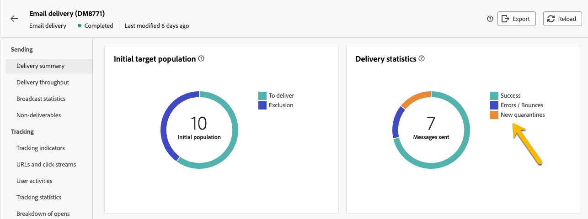

# Quarantine 

Adobe Campaign manages quarantine addresses (email, SMS, push notification).

Quarantine applies only to an **email address**, a **phone number**, or a **device token**, but not to the profile itself. For example, a profile whose email address is quarantined can update their profile and enter a new address, and could then be targeted by delivery actions again. Likewise, if two profiles happen to have the same phone number, they will both be affected if the number is quarantined. 

>[!CAUTION]
>
>Quarantine in Adobe Campaign is case sensitive.

## What is quarantine ?

Quarantine is the way to **manage the invalid addresses in deliveries**.

If a delivery has a high rate of invalid addresses, it may be considered as spam. Managing those addresses with quarantine will avoid you to be denylisted by internet providers. This is important for your reputation.

When an address is quarantined in Adobe Campaign, the profile will be excluded automatically from the target during delivery analysis. 

Quarantine will help you to reduce SMS sending cost by excluding erroneous phone numbers from deliveries.

## Why an address is sent to quarantine

Many reasons may send an address to quarantine : 

- For SMS, erroneous phone numbers
- For SMS, when the profile reply to an SMS message with a keyword such as "STOP"
- For email, when your message is reported as spam. The message is automatically redirected towards a technical mailbox managed by Adobe. The user's email address is then automatically sent to quarantine with the Denylisted status.
- An email address can be quarantined, for example, when the mailbox is full, if the address does not exist, or if the email server is unavailable.

[Learn more about delivery failures](https://experienceleague.adobe.com/en/docs/campaign-classic/using/sending-messages/monitoring-deliveries/understanding-delivery-failures)

## Where to find the quarantine addresses

You can view all the quarantine addresses of your instance in **[!UICONTROL Explorer]** > **[!UICONTROL Administration]** > **[!UICONTROL Campaign Management]** > **[!UICONTROL Non deliverables Management]** > **[!UICONTROL Non deliverables and addresses]**. This section lists quarantined elements for email, SMS and Push notification channels.

{zoomable="yes"}

You can also have the report about the quarantine in your instance :

{zoomable="yes"}

For each delivery, you can also check the Delivery summary report: it shows the number of addresses in quarantine in the delivery target :

{zoomable="yes"}

You can have more possibilities to manage the quarantine addresses in Adobe Campaign console. [Learn more](https://experienceleague.adobe.com/en/docs/campaign/campaign-v8/send/failures/quarantines#access-quarantined-addresses)
