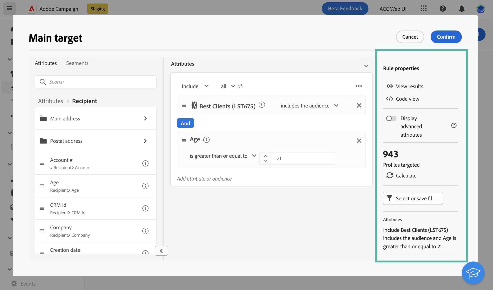
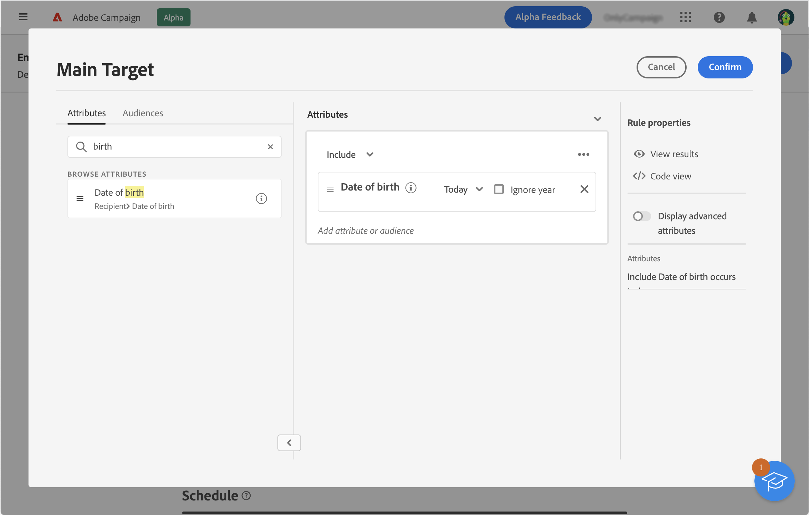

# Work with the rule builder {#segment-builder}

The rule builder allows you to define the population targeted by your delivery by filtering data contained in the database. You can use it to build an audience either from a workflow using a **[!UICONTROL Build audience]** activity, or directly when creating a delivery to create a one-time audience.

* [Learn how to create an audience](create-audience.md)
* [Learn how to create a one-time audience for a delivery](one-time-audience.md)

## The palette

The palette, located on the left side contains all the elements that you can filter on to create your audience. You can use the search bar to find elements quickly. The tiles contained in the palette must be moved into the center canvas in order to be configured and taken into account.

{width="70%" align="left"}
    
The palette is divided into two tabs:

* **Attributes**: this tab allows you to access all available fields from the schema. The list of fields depends on the targeting schema defined in the email template.

* **Audiences**: this tab allows you to filter using one of the existing audiences defined in the Campaign Classic console or from Adobe Experience Platform. Learn how to monitor and manage audiences in [this section](manage-audience.md)

    >[!NOTE]
    >
    >To leverage Adobe Experience Platform audiences, you need to configure the integration with Destinations. Refer to the [Adobe Experience Platform Destinations documentation](https://experienceleague.adobe.com/docs/experience-platform/destinations/home.html){target="_blank"}.

## The canvas

The canvas is the central zone in which you can configure and combine rules based on the elements added from the palette. To add a new rule, drag a tile from the palette and drop it onto the canvas. You can then be presented with context-specific options according to the type of data being added. 

{width="70%" align="left"}

## The rule properties pane

On the right side, the **Rule properties** pane allows you to perform the  actions listed below.

{width="70%" align="left"}

* **View results:** displays the list of recipients targeted by the audience.
* **Code view**: displays a code-based version of the audience in SQL.
* **Display advanced attributes**: check this option if you want to view the complete list of attributes in the left palette: nodes, groupings, 1-1 links, 1-N links.
* **Calculate**: updates and displays the number of profiles targeted by your query.
* **Select or save filter**: use a predefined filter to filter your query, or save your query as a new filter for future reuse. [Learn how to work with predefined filters](../get-started/predefined-filters.md)

    >[!IMPORTANT]
    >
    >In that version of the product, some predefined filters are not available in the user interface. You can still use them. [Learn more](../get-started/guardrails.md#predefined-filters-filters-guardrails-limitations)

* **Attributes**: displays a description of the created audience.

## Example

In this example, we build an audience to target all customers living in Atlanta or Seattle and born after 1980. 

1. In the **Attributes** tab of the palette, search for the **Date of birth** field. Drag the tile and drop it onto the canvas. 

    

1. In the canvas, choose the **After** operator and enter the desired date.

    

1. In the palette, search for the **City** field and add it to the canvas below the first rule. 

    

1. In the text field, enter the first city name, then press enter. 

    

1. Repeat this action for the second city name.

    

1. Click **View results** to display the list and number of recipients matching the query. You can also add columns to visualize and check the data. In our example, add the **City** column and should see Atlanta and Seattle.

    

1. Click **Confirm**.