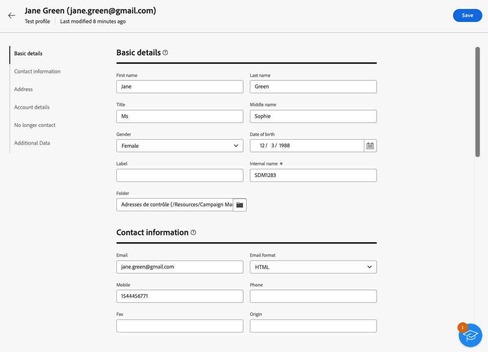
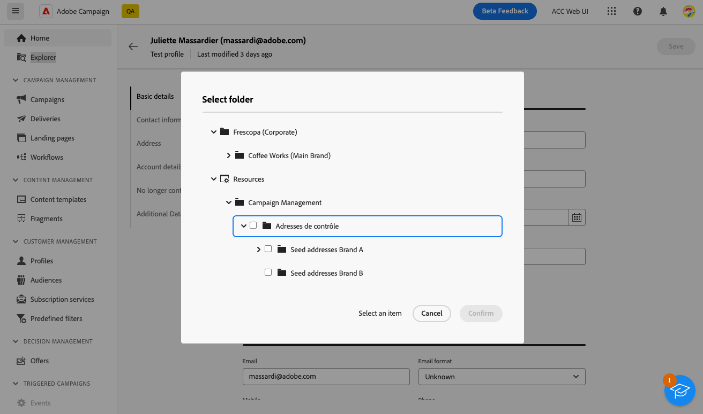

# Create and manage test profiles {#create-test-profiles}

>[!CONTEXTUALHELP]
>id="acw_recipients_testprofiles_menu"
>title="Create test profiles"
>abstract="Test profiles are additional recipients which let you preview and test the personalization and rendering before sending your messages. You can select a test profile when previewing a message content, and send proofs to the test profiles to control and validate your message content and settings."

Test profiles are used to send proofs and validate your message content and settings. These profiles are additional recipients that let you preview and test the personalization and rendering before sending your messages. You can select a test profile when previewing a message content and send proofs to the test profiles to control and validate your message content and settings.

➡️ [Discover this feature in video](#video) 

<!--Learn more about test profiles in the [Campaign v8 (client console) documentation](https://experienceleague.adobe.com/docs/campaign/campaign-v8/audience/add-profiles/test-profiles.html){target="_blank"}.-->

The steps to send proofs to test profiles are detailed in [this section](../preview-test/test-deliveries.md#test-profiles).

>[!NOTE]
>
>* Test profiles are created as seed addresses in the Client console. 
>
>* Test profiles are automatically excluded from reports on the following delivery statistics: **[!UICONTROL Clicks]**, **[!UICONTROL Opens]**, **[!UICONTROL Unsubscriptions]**.

## Access and manage test profiles {#access-test-profiles}

To access the test profile list, select **[!UICONTROL Customer management]** > **[!UICONTROL Profiles]** from the left menu, and click the **[!UICONTROL Test profiles]** tab.

{zoomable="yes"}

* You can filter on a specific [folder](../get-started/permissions.md#folders) using the drop-down list or add rules using the [query modeler](../query/query-modeler-overview.md).

    {zoomable="yes"}

* You can duplicate any test profile and update it as needed. The steps to edit a test profile are the same as when [creating a test profile](#create-test-profile).

* To delete a test profile, select the corresponding option from the **[!UICONTROL More actions]** menu.

    {zoomable="yes"}

* To edit a test profile, click the desired item from the list. The steps to edit a test profile are the same as when [creating a test profile](#create-test-profile).

You can also access test profiles through the **[!UICONTROL Explorer]** view, from the **[!UICONTROL Resources]** > **[!UICONTROL Campaign Management]** > **[!UICONTROL Seed addresses]** node.

From there, you can browse, create, and manage folders or subfolders, as well as check associated permissions. [Learn how to create folders](../get-started/permissions.md#folders)

{zoomable="yes"}

From the **[!UICONTROL Explorer]** view, you can also filter, delete, edit, and [create](#create-test-profile) test profiles.

## Create a test profile {#create-test-profile}

>[!CONTEXTUALHELP]
>id="acw_recipients_testprofiles_additionaldata"
>title="Test profiles Additional Data"
>abstract="Enter the personalization data used for the deliveries created in the Data management workflows and which you want to assign a specific value to."

To create a test profile, follow the steps below:

1. Browse to **[!UICONTROL Customer management]** > **[!UICONTROL Profiles]**, and select the **[!UICONTROL Test profiles]** tab.

1. Click the **[!UICONTROL Create test profile]** button.

    {zoomable="yes"}

1. Fill in the test profile details as needed. <!--Most of the fields are the same as when creating profiles. [Learn more]-->

    {zoomable="yes"}

    >[!NOTE]
    >
    >The **[!UICONTROL Label]** field is automatically filled in with the first name and last name you defined.

1. By default, test profiles are stored in the **[!UICONTROL Seed addresses]** folder. You can change it by browsing to the desired location. [Learn how to work with folders](../get-started/permissions.md#folders)

    <!--{zoomable="yes"}-->

<!--
You do not need to enter all fields of each tab when creating a seed address. Missing personalization elements are entered randomly during delivery analysis. (Not valid?)
-->

1. In the **[!UICONTROL Contact information]** section, enter the email address and other relevant data. The email address is displayed between brackets after the test profile label.

    {zoomable="yes"}

1. If you select the **[!UICONTROL No longer contact (by any channel)]** checkbox, the test profile is on denylist. Such recipient is no longer targeted on any channel (email, SMS, etc.).

1. In the **[!UICONTROL Additional data]** tab, enter the personalization data used for the deliveries created in the Data management workflows and which you want to assign a specific value to. [Learn more about workflows](../workflows/gs-workflows.md)

    {zoomable="yes"}
    
   Make sure that additional target data has been defined with an alias starting with '@' in the **[!UICONTROL Enrichment]** workflow activity. Otherwise, you cannot use it properly with your seed addresses in the delivery activity. [Learn more about the Enrichment activity](../workflows/activities/enrichment.md)

1. Click the **[!UICONTROL Save]** button.

The test profile you just created is now ready to be used to send a proof. [Learn more](../preview-test/test-deliveries.md#test-profiles)

<!--Use test profiles in Direct mail? cf v7/v8-->

## How-to video {#video}

Learn how to create and manage test profiles using the Campaign Web user interface.

>[!VIDEO](https://video.tv.adobe.com/v/3442844?quality=12)