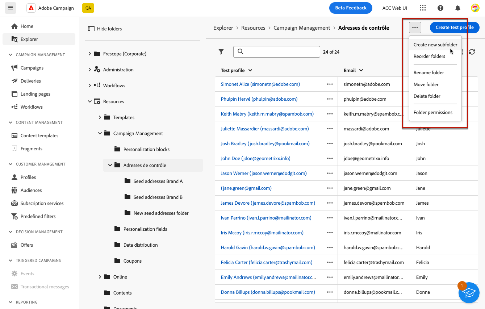

# Create and manage test profiles {#create-test-profiles}

>[!CONTEXTUALHELP]
>id="acw_recipients_testprofiles_menu"
>title="Create test profiles"
>abstract="Test profiles are created as seed addresses. They are additional recipients in the database used to target fictitious profiles who do not match the defined target criteria."

Test profiles are created as seed addresses. They are additional recipients in the database used to target fictitious profiles who do not match the defined target criteria. They let you preview and test the personalization and rendering before sending your delivery, by sending them proofs.

<!--Learn more on test profiles in the [Campaign v8 (client console) documentation](https://experienceleague.adobe.com/docs/campaign/campaign-v8/audience/add-profiles/test-profiles.html){target="_blank"}.-->

The steps to send test messages to seed addresses are detailed in [this section](../preview-test/test-deliveries.md#test-profiles).

>[!NOTE]
>
>Test profiles are automatically excluded from reports on the following delivery statistics: **[!UICONTROL Clicks]**, **[!UICONTROL Opens]**, **[!UICONTROL Unsubscriptions]**.

## Create a test profile {#create-test-profile}

>[!CONTEXTUALHELP]
>id="acw_recipients_testprofiles_additionaldata"
>title="Test profiles Additional Data"
>abstract="Enter the personalization data used for the deliveries created in the Data management workflows and which you want to assign a specific value to."

To create a test profile, follow the steps below.

1. Browse to **[!UICONTROL Customer management]** > **[!UICONTROL Profiles]**.

1. Select the **[!UICONTROL Test profiles]** tab.

    

1. Click the **[!UICONTROL Create test profile]** button.

1. Fill in the test profile details. <!--Most of the fields are the same as when creating profiles. [Learn more]-->

    

1. In the **[!UICONTROL Basic details]** section, enter a label for easy retrieving in the user interface.

1. By default, the test profiles are stored in the **[!UICONTROL Seed addresses]** folder. You can change it by browsing to the desired location. [Learn more](#seed-addresses-folders)

    

<!--
The label of the address is automatically filled in with the last name and first name you defined. (Not available yet in UI)

You do not need to enter all fields of each tab when creating a seed address. Missing personalization elements are entered randomly during delivery analysis. (Not valid?)
-->

1. In the **[!UICONTROL Contact information]** section, enter the email address and other relevant data. The email address is displayed in the user interface with the test profile label.

1. If you select the **[!UICONTROL No longer contact (by any channel)]** checkbox, the profile is on denylist. Such recipient is no longer targeted on any channel (email, SMS, etc.).

1. In the **[!UICONTROL Additional data]** tab, enter the personalization data used for the deliveries created in the Data management workflows and which you want to assign a specific value to. 
    
   Make sure that additional target data has been defined with an alias starting with '@' in the **[!UICONTROL Enrichment]** workflow activity. Otherwise, you will not be able to use them properly with your seed addresses in your delivery activity.<!--Is this visible in UI for GA?-->

1. Click the **[!UICONTROL Save]** button.

The test profile you just created is now ready to be used to send a test. [Learn more](../preview-test/test-deliveries.md#test-profiles)

<!--Use test profiles in Direct mail? cf v7/v8-->

<!--Where can you see touchpoints? seen in mocks-->

## Seed addresses folders {#seed-addresses-folders}

Seed addresses are not managed via standard profiles and targets, but in a dedicated node of the Adobe Campaign hierarchy **[!UICONTROL Resources]** > **[!UICONTROL Campaign management]** > **[!UICONTROL Seed addresses]**.

You can create sub-folders in order to organize the seed addresses. To do this, right-click the Seed addresses node and select Create new sub-folder. Name the sub-folder and then click **[!UICONTROL Create]** to validate. You can now create or copy seed addresses to this sub-folder.

You can also create a test profile from here. [Learn how to create folders](../get-started/permissions.md#folders)
