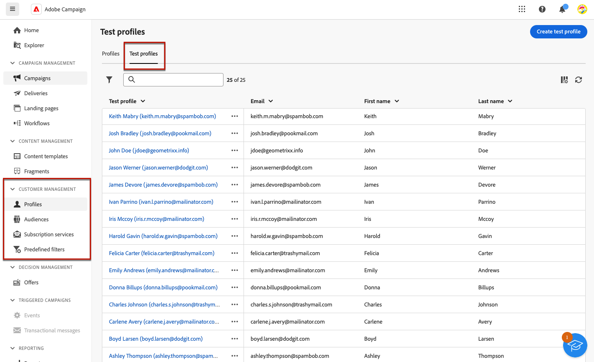

# Create and manage test profiles {#create-test-profiles}

>[!CONTEXTUALHELP]
>id="acw_recipients_testprofiles_menu"
>title="Create test profiles"
>abstract="Test profiles are created as seed addresses. They are additional recipients in the database used to target fictitious profiles who do not match the defined target criteria."

Test profiles are created as seed addresses. They are additional recipients in the database used to target fictitious profiles who do not match the defined target criteria. They let you preview and test the personalization and rendering before sending your delivery, by sending them proofs.

<!--Learn more on test profiles in the [Campaign v8 (client console) documentation](https://experienceleague.adobe.com/docs/campaign/campaign-v8/audience/add-profiles/test-profiles.html){target="_blank"}.-->

The steps to send test messages to seed addresses are detailed in [this section](../preview-test/test-deliveries.md#test-profiles).

>[!NOTE]
>
>Test profiles are automatically excluded from reports on the following delivery statistics: **[!UICONTROL Clicks]**, **[!UICONTROL Opens]**, **[!UICONTROL Unsubscriptions]**.

## Access and manage test profiles {#access-test-profiles}

## Create a test profile {#create-test-profile}

>[!CONTEXTUALHELP]
>id="acw_recipients_testprofiles_additionaldata"
>title="Test profiles Additional Data"
>abstract="Enter the personalization data used for the deliveries created in the Data management workflows and which you want to assign a specific value to."

To create a test profile, follow the steps below.

1. Browse to **[!UICONTROL Customer management]** > **[!UICONTROL Profiles]**.

1. Select the **[!UICONTROL Test profiles]** tab.

    

1. Click the **[!UICONTROL Create test profile]** button.

1. Fill in the test profile details. <!--Most of the fields are the same as when creating profiles. [Learn more]-->

    

    >[!NOTE]
    >
    >The label of the address is automatically filled in with the first name and last name you defined.

1. By default, test profiles are stored in the **[!UICONTROL Seed addresses]** folder. You can change it by browsing to the desired location. [Learn more](#seed-addresses-folders)

    

<!--
You do not need to enter all fields of each tab when creating a seed address. Missing personalization elements are entered randomly during delivery analysis. (Not valid?)
-->

1. In the **[!UICONTROL Contact information]** section, enter the email address and other relevant data. The email address is displayed between brackets after the test profile label.

    

1. If you select the **[!UICONTROL No longer contact (by any channel)]** checkbox, the profile is on denylist. Such recipient is no longer targeted on any channel (email, SMS, etc.).

1. In the **[!UICONTROL Additional data]** tab, enter the personalization data used for the deliveries created in the Data management workflows and which you want to assign a specific value to. [Learn more on workflows](../workflows/gs-workflows.md)

    
    
   Make sure that additional target data has been defined with an alias starting with '@' in the **[!UICONTROL Enrichment]** workflow activity. Otherwise, you cannot use it properly with your seed addresses in the delivery activity. [Learn more on the Enrichment activity](v8/workflows/activities/enrichment.md)

1. Click the **[!UICONTROL Save]** button.

The test profile you just created is now ready to be used to send a test. [Learn more](../preview-test/test-deliveries.md#test-profiles)

<!--Use test profiles in Direct mail? cf v7/v8-->

## Manage seed addresses folders {#seed-addresses-folders}

Seed addresses are stored in a dedicated node of the Adobe Campaign hierarchy: **[!UICONTROL Explorer]** > **[!UICONTROL Resources]** > **[!UICONTROL Campaign Management]** > **[!UICONTROL Seed addresses]**.

To organize test profiles, you can create subfolders from the More actions drop-down list. [Learn how to create folders](../get-started/permissions.md#folders)

You can also create a test profile from any **[!UICONTROL Seed addresses]** folder or subfolder. Fill in all the details the same way you would do it from the **[!UICONTROL Customer Management]** > **[!UICONTROL Profiles]** menu. [Learn more](#create-test-profile)

To edit a test profiles, click its label either from the **[!UICONTROL Test profiles]** tab or from the folder where it is stored.

