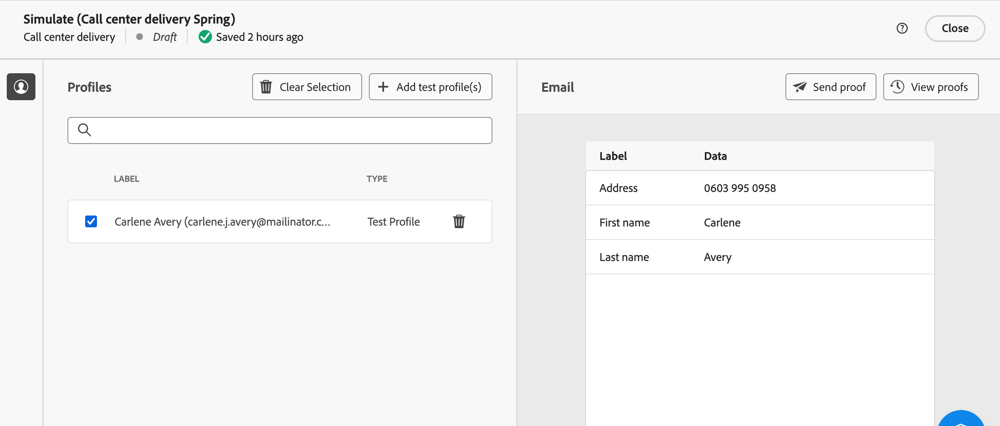

# Create a Call center mail delivery {#create-call-center}

You can create a standalone call center delivery, or create one in the context of a campaign workflow. The steps below detail the procedure for a standalone (one-shot) delivery. If you are working in the context of a campaign workflow, creation steps are detailed in [this section](../workflows/activities/channels.md#create-a-delivery-in-a-campaign-workflow).

To create and send a new standalone call center delivery, follow these main steps:

1. Create the delivery, [read more](#create-delivery)
1. Select the audience, [read more](#select-audience)
1. Edit the content, [read more](#edit-content)
1. Preview and send the delivery, [read more](#preview-send)

## Create the delivery{#create-delivery}

Follow these steps to create the delivery and configure its properties:

1. Select the **[!UICONTROL Deliveries]** menu and click the **[!UICONTROL Create delivery]** button.

1. Choose **[!UICONTROL Call center]** as the channel and click **[!UICONTROL Create delivery]** to confirm.

    {zoomable="yes"}

    >[!NOTE]
    >
    >If you wish to select a different template, refer to this [page](../msg/delivery-template.md)

1. Under **[!UICONTROL Properties]**, enter a **[!UICONTROL Label]** for the delivery. Additional options are detailed in this [section](../email/create-email.md#create-email).

    {zoomable="yes"}

>[!NOTE]
>
>You can schedule your delivery to a specific date. For more on this, refer to this [section](../msg/gs-deliveries.md#gs-schedule).

## Select the audience{#select-audience}

Now, you need to define the audience that will be targeted for the extraction file.

1. In the **[!UICONTROL Audience]** section, click **[!UICONTROL Select audience]**

1. Choose an existing audience or create your own.

    * [Learn how to select an existing audience](../audience/add-audience.md)
    * [Learn how to create a new audience](../audience/one-time-audience.md)

    {zoomable="yes"}

    >[!NOTE]
    >
    >Call center recipients must contain at least their names and telephone number. Any recipients with incomplete information will be excluded from call center deliveries.
    >
    >To learn how to configure control groups, refer to this [page](../audience/control-group.md)

## Edit the content{#edit-content}

Now, let's design the content of the extraction file that will be generated by your call center mail delivery. 

1. Click the **[!UICONTROL Edit content]** button.

    {zoomable="yes"}

1. Specify the **[!UICONTROL File name]** field. To learn how to personalize the file name, refer to this [page](../personalization/personalize.md)

1. Select a **[!UICONTROL File format]**: **Text**, **Text using fixed-width columns**, **CSV (Excel)**, or **XML**.

    >[!NOTE]
    >
    >Extraction format options are detailed in this [page](../direct-mail/content-direct-mail.md).

1. Toggle on the **[!UICONTROL Requested quantity]** option to restrict the number of recipients for your delivery.

1. In the **[!UICONTROL Content]** section, click the **[!UICONTROL Add Attribute]** button to create a new column to display in the extraction file.

1. Choose the attribute to display in the column, then confirm. To learn more on how to select attributes and add them to favorites, refer to this [page](../get-started/attributes.md)

    

1. Repeat these steps to add as many columns as needed for your extraction file.

    You can then edit the attributes, sort the extraction file, or change the position of the columns. For more on this, refer to this [page](../direct-mail/content-direct-mail.md).

    

## Preview and send the delivery{#preview-send}

When the delivery content is ready, you can preview it using test profiles and send proofs. You can then send the direct mail delivery to generate the extraction file.

The main steps to preview and send your extraction file are as follows. More details are available in [this page](./direct-mail/send-direct-mail.md).

1. From your delivery content page, use **[!UICONTROL Simulate content]** to preview your personalized content and send proofs. [Read more](./direct-mail/send-direct-mail.md#preview-dm)

    {zoomable="yes"}

1. From the delivery page, click **[!UICONTROL Review & send]**.

  {zoomable="yes"}

1. Click **[!UICONTROL Prepare]** and monitor the progress and statistics provided. Confirm.

    {zoomable="yes"}

1. Click **[!UICONTROL Send]** to proceed with the final sending process. Confirm.

Once your delivery is sent, the extraction file is automatically generated and exported to the location specified in the **[!UICONTROL Routing]** external account selected in the delivery template's [advanced settings](../advanced-settings/delivery-settings.md).

Track your KPIs (Key Performance Indicator) data from your delivery page and data from the **[!UICONTROL Logs]** menu.

Start measuring the impact of your message with built-in reports. [Learn more](../reporting/direct-mail.md)

