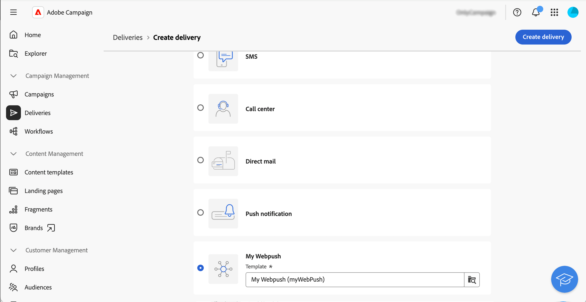
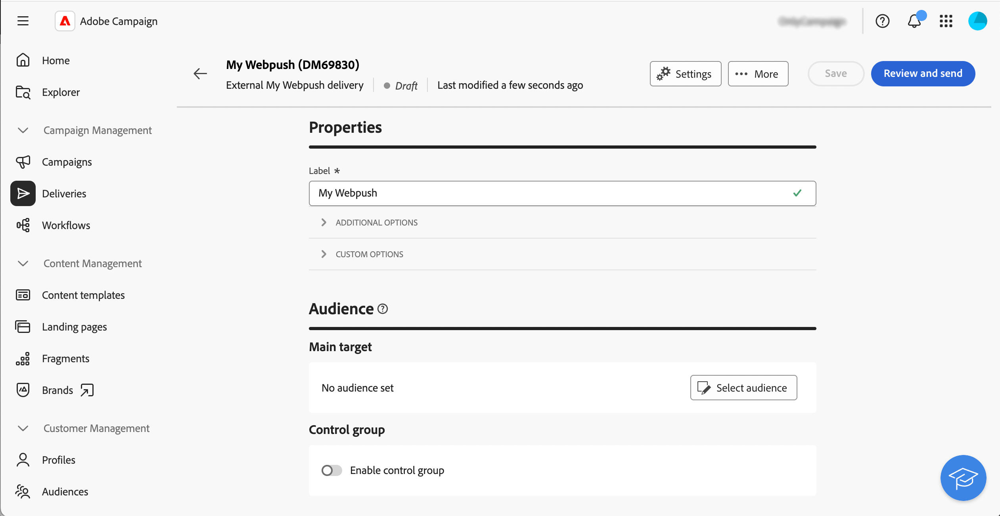
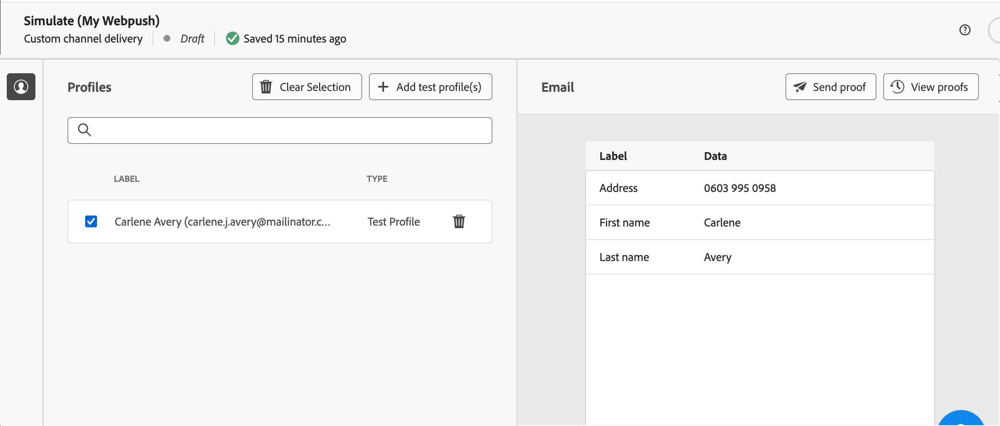
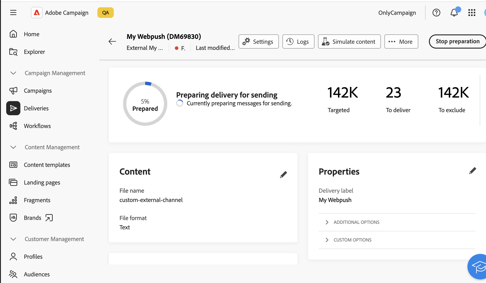

# Get started with custom channels {#gs-custom-channel}

You can, directly from Adobe Campaign Web UI, orchestrate and execute deliveries based on custom channels integrated with third-parties. The configuration of the custom channel is performed in the Client Console.

Two types of custom channels are supported, external and API. With external channels, Campaign generates customizable export files with all necessary contact and personalization data. With API channels, messages are sent to the target profiles via the API configured.

You can add custom channel deliveries in workflows or just use them as standalone deliveries.

The steps below detail the procedure for a standalone (one-shot) delivery. Most steps are similar to call center deliveries. For more details, refer to this [page](../call-center/create-call-center.md).

To send a new standalone custom delivery, follow these main steps:

1. Configure the custom channel, [read more](#create-channel)
1. Create the delivery, [read more](#create-delivery)
1. Define the audience, [read more](#select-audience)
1. Edit the content, [read more](#edit-content)
1. Preview and send the delivery, [read more](#preview-send)

## Configure the custom channel{#create-channel}

First, you need to configure the custom channel. Here are the main steps to perform in the Client Console. These steps are common to custom external and API channels:

1. Configure the schema to add the new channel to the list of available channels. [Read more](https://experienceleague.adobe.com/docs/campaign/campaign-v8/send/other-channels/custom-channel.html#configure-schema){target="_blank"}
1. Create a new routing external account. [Read more](https://experienceleague.adobe.com/docs/campaign/campaign-v8/send/other-channels/custom-channel.html#create-ext-account){target="_blank"}
1. Create a new delivery template associated to the new channel. [Read more](https://experienceleague.adobe.com/docs/campaign/campaign-v8/send/other-channels/custom-channel.html#create-template){target="_blank"}

Custom API channels require additional configuration. [Read more](https://experienceleague.adobe.com/docs/campaign/campaign-v8/send/other-channels/custom-channel.html#api-additional){target="_blank"}

## Create the delivery{#create-delivery}

Follow these steps to create the delivery and configure its properties:

1. Select the **[!UICONTROL Deliveries]** menu and click the **[!UICONTROL Create delivery]** button.

1. Choose the desired custom channel, select the associated template and click **[!UICONTROL Create delivery]** to confirm.

    {zoomable="yes"}

1. Under **[!UICONTROL Properties]**, enter a **[!UICONTROL Label]** for the delivery.

    {zoomable="yes"}

For more details on delivery creation, refer to the call center [documentation](../call-center/create-call-center.md#create-delivery).

## Define the audience{#select-audience}

Now, you need to define the audience that will be targeted.

1. From the **[!UICONTROL Audience]** section of the delivery dashboard, click **[!UICONTROL Select audience]**.

1. Choose an existing audience or create your own.

    {zoomable="yes"}

For more details on audience definition, refer to the call center [documentation](../call-center/create-call-center.md#select-audience).

## Edit the content{#edit-content}

Now, let's edit the content of the delivery.

>[!BEGINTABS]

>[!TAB Custom external channel]

1. From the delivery dashboard, click the **[!UICONTROL Edit content]** button.

1. Specify a **[!UICONTROL File name]**, select a **[!UICONTROL File format]** and add as many columns as needed for your extraction file.

    

>[!TAB Custom API channel]

1. From the delivery dashboard, click the **[!UICONTROL Edit content]** button.

1. Fill in the fields as needed. To learn how to set up this screen, refer to this [page](https://experienceleague.adobe.com/docs/campaign/campaign-v8/send/other-channels/custom-channel.html#api-additional-screen){target="_blank"}.

    

>[!ENDTABS]

For more details on content edition, refer to the call center [documentation](../call-center/create-call-center.md#edit-content).

## Preview and send the delivery{#preview-send}

When the delivery content is ready, you can preview it using test profiles. You can then send the delivery to generate the extraction file or send the message via API.

>[!BEGINTABS]

>[!TAB Custom external channel]

1. From the delivery dashboard, click the **[!UICONTROL Edit content]** button.

1. From the delivery content page, click the **[!UICONTROL Simulate content]** button and select test profiles.

    {zoomable="yes"}

>[!TAB Custom API channel]

1. From the delivery dashboard, click the **[!UICONTROL Edit content]** button.

1. From the delivery content page, click the **[!UICONTROL Simulate content]** button and select test profiles.

1. On the right side, click **Open preview**. This capability needs to be configured using JSSP. Refer to this [page](https://experienceleague.adobe.com/docs/campaign/campaign-v8/send/other-channels/custom-channel.html#api-additional-preview){target="_blank"}.

    {zoomable="yes"}

>[!ENDTABS]

From the delivery dashboard, click **[!UICONTROL Review & send]** and click **[!UICONTROL Prepare]**. Then, confirm. Click **[!UICONTROL Send]** to proceed with the final sending process, then confirm.

{zoomable="yes"}

For more details on preview and send, refer to the call center [documentation](../call-center/create-call-center.md#preview-send).
