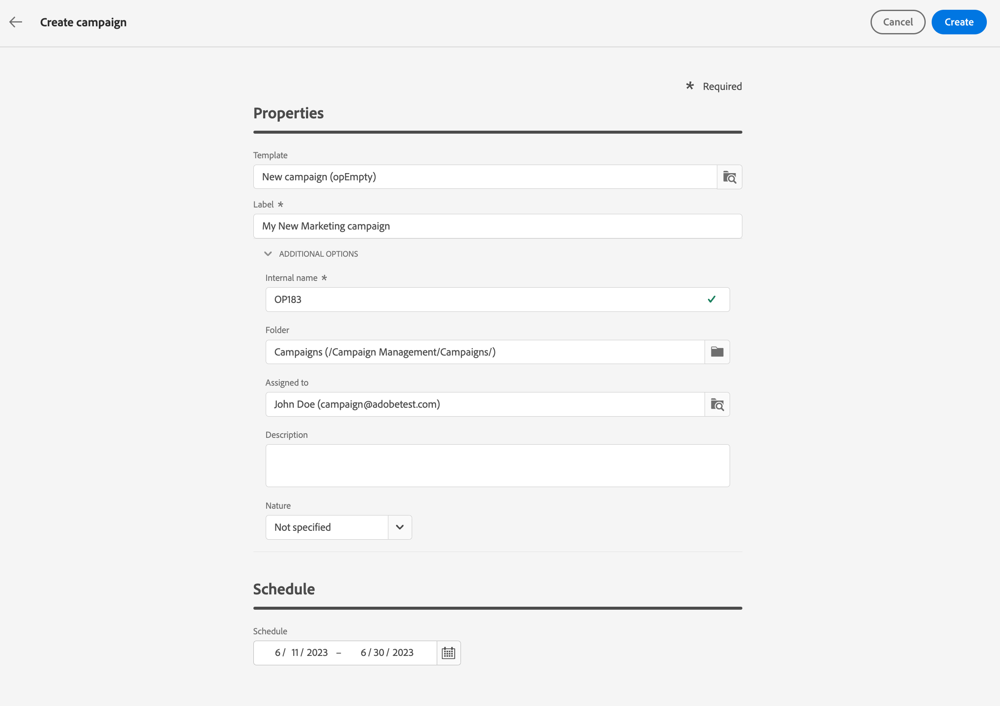

# Create your first campaign {#create-campaigns}

>[!CONTEXTUALHELP]
>id="acw_campaign_creation_properties"
>title="Campaign creation properties"
>abstract="Define properties and metadata for the campaign."

>[!CONTEXTUALHELP]
>id="acw_campaign_properties"
>title="Campaign properties"
>abstract="Define your campaign settings and metadata."

Campaigns can include workflows and standalone deliveries. Properties, schedule, work, deliv plus rien a faire schedule

## Create the campaign

To create a new campaign, follow these steps:

1. Click the **[!UICONTROL Campaigns]** menu, and click the **[!UICONTROL Create campaign]** button.
1. Select the **Template** to use and provide a label for the campaign. Campaign templates are pre-configured so that they can be reused for creating new campaigns. They are created from the client console.
[Read more](https://experienceleague.adobe.com/docs/campaign/automation/campaign-orchestration/marketing-campaign-templates.html).
1. If needed, you can change the following **Additional options**: internal name, folder, assignee, description and nature.
1. Define the **Schedule** of your campaign. The campaign starts when the start date is reached. Start and end dates are displayed in the campaign list, and can be used as a filter. See this [section](manage-campaigns.md#access-campaigns).

    

    >[!NOTE]
    >
    >You can always modify these properties later, from the **Configure campaign settings** icon, next to the campaign label. See this [section](gs-campaigns.md#campaign-dashboard)

1. Click **Create**.
1. Add workflows and deliveries to your campaign:

     * From the **Workflows** tab, click **Create workflow**. A default workflow is automatically added when you create your campaign. Lean more on how to [create a workflow](../workflows/create-workflow.md)
     * From the **Deliveries** tab, click **Create delivery**. [Learn more](../msg/gs-messages.md)

1. Use the **Logs** and **Reporting** buttons to analyze your campaign's performance.

## Monitor and track your campaign{#campaign-monitoring}

Campaign monitoring is a key step to analyze your campaigns. Open your campaign, and click the **Logs** button.

You can also view the dedicated reports by clicking the **Reports** button. See this [section](../reporting/campaign-reports.md).

+++WORKF
++screen

<!--
## Create a cross-channel campaign {#cross-channel-campaign}

>[!CONTEXTUALHELP]
>id="acw_campaign_creation_workflow"
>title="Workflow list"
>abstract="List of workflows available for your campaign. Use the 'Create workflow' button to add a workflow in your campaign."

In a cross-channel campaign, a single marketing communication uses different channels. Data is passed between the channels. The customer receives communication through multiple channels based on, for example, their interaction with the previous communication.

-->
<!--
existing campaign: settings button -> properties like when creation
schedule in header

About plans, programs and campaigns
Adobe Campaign allows you to plan marketing campaigns in which you can create and manage different types of activities: emails, SMS messages, push notifications, workflows, landing pages. These campaigns and their contents can be gathered into programs.

The programs and campaigns allow you to regroup and view the different marketing activities that are linked to them.

A program may contain other programs as well as campaigns, workflows, and landing pages. It appears in the timeline and help you organize your marketing activities: you can separate them by country, by brand, by unit, etc.
A campaign enables you to gather all the marketing activities of your choice under a single entity. A campaign may contain emails, SMS, push notifications, direct mails, workflows, and landing pages.
To better organize your marketing plans, Adobe recommends the following hierarchy: Program > Sub-programs > Campaigns > Workflows > Deliveries.

Reports on programs and campaigns allow you to analyze their impact. For example, you can build reports at the campaign level to aggregate data on all deliveries contained in that campaign.

Related topics:

Timeline
About dynamic reports
Creating a campaign
In programs and sub-programs, you can add campaigns. Campaigns can contain marketing activities such as emails, SMS, push notifications, workflows, and landing pages.

From the Adobe Campaign home page, select the Programs & Campaigns card and access a program or sub-program.

Click on the Create button and select Campaign.

In the Creation mode screen, select a campaign type.

The campaign types available are based on templates defined in Resources > Templates > Campaign templates. For more on this, refer to the Managing templates section.

In the Properties screen, enter the name and ID of the campaign.

Select a start and end date to your campaign. These dates only apply to the campaign itself.

Click on Create to confirm the creation of the campaign.

The campaign is created and displayed. Use the Create button to add marketing activities to your campaign.

NOTE
Depending on your license agreement, you may access only some of these activities.

You can also create a campaign from the marketing activity list. You can choose to link the marketing activity to a parent program or sub-program via the properties window of the campaign.

Programs and campaigns icons and statuses
Each program and each campaign in the list has a visual symbol and an icon whose color indicates the execution status. This status depends on the validity period of the program or the campaign.

Gray: the program/campaign has not yet started - Editing status.
Blue: the program/campaign is in progress - In progress status.
Green: the program/campaign has finished - Finished status. By default, the current date is automatically shown as the validity start date and the end date is calculated according to the start date (D+186 days). You can change these dates in the program or campaign properties.

Business.Adobe.com resources
-->
