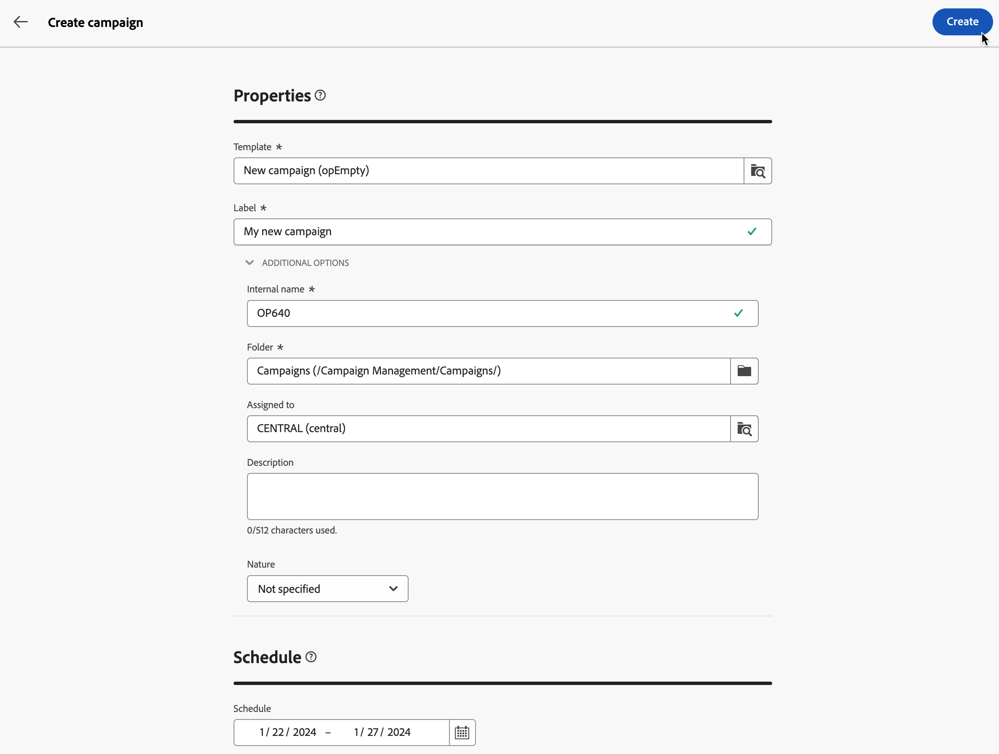

# Create your first campaign {#create-first-campaigns}

>[!CONTEXTUALHELP]
>id="acw_campaign_creation_properties"
>title="Campaign creation properties"
>abstract="In this screen, define your campaign settings: select a template, and enter a label for your campaign. Browse to the additional settings to change the default internal name, folder, add a description, and select the assignee."

>[!CONTEXTUALHELP]
>id="acw_campaign_properties"
>title="Campaign properties"
>abstract="In this screen, you can check and update your campaign settings: its label, internal name, folder, and description. You can also view which user it is assigned to."

To create a new campaign, define its settings, schedule, and include workflows and deliveries.

## Create the campaign {#campaign-create}

To create a new campaign, follow these steps:

1. Click the **[!UICONTROL Campaigns]** menu, and click the **[!UICONTROL Create campaign]** button.

     [Screenshot showing the "Create campaign" button in the Campaigns menu.]

1. Select the **Template** to use, and provide a label for the campaign. [Read more](manage-campaigns.md#manage-campaign-templates).
1. If needed, change the following **Additional options**: internal name, folder, assignee, description, and nature.
1. Define the **Schedule** of your campaign. Learn how to set your campaign schedule in [this section](#campaign-schedule).
1. Click **Create**.

     [Screenshot showing the campaign properties screen, including fields for internal name, folder, assignee, description, and nature.]

1. Add workflows and deliveries to your campaign:

    * From the **Workflows** tab, click **Create workflow**. A default workflow is automatically added when you create your campaign. Learn more about how to [create a workflow](../workflows/create-workflow.md).

    * From the **Deliveries** tab, click **Create delivery**. [Learn more](../msg/gs-messages.md).

## Monitor and track your campaign {#campaign-monitoring}

Campaign monitoring is a key step to analyze your campaign's effectiveness. Open your campaign, and click the **Logs** button.

You can also view the dedicated reports by clicking the **Reports** button. See this [section](../reporting/campaign-reports.md).

## Define the campaign schedule {#campaign-schedule}

>[!CONTEXTUALHELP]
>id="acw_campaign_creation_schedule"
>title="Campaign schedule"
>abstract="Select the campaign schedule. You can create the campaign, and it starts when the start date is reached. By default, the campaign start date is the creation date, and it lasts for 5 days. Start and end dates are displayed in the campaign list, and can be used as a filter."

The campaign starts when the start date is reached. As long as the start date is not reached, the campaign has the **[!UICONTROL Draft]** status. When the start date is reached, it turns to **[!UICONTROL In progress]**. Once the end date is reached, the campaign is set to **[!UICONTROL Completed]**.

Start and end dates are displayed in the campaign list, and can be used as a filter. See this [section](manage-campaigns.md#access-campaigns).

>[!NOTE]
>
>You can modify these properties later, from the **Configure campaign settings** icon next to the campaign label. See this [section](gs-campaigns.md#campaign-dashboard).

Once the date is reached, deliveries created in that campaign in the context of a workflow, which are ready to be sent, are actually sent. For this, the workflow must have been started.

<!--
    +++WORKF
++screen
## Create a cross-channel campaign {#cross-channel-campaign}

In a cross-channel campaign, a single marketing communication uses different channels. Data is passed between the channels. The customer receives communication through multiple channels based on, for example, their interaction with the previous communication.
-->
<!--
existing campaign: settings button -> properties like when creation
schedule in header

About plans, programs and campaigns
Adobe Campaign allows you to plan marketing campaigns in which you can create and manage different types of activities: emails, SMS messages, push notifications, workflows, landing pages. These campaigns and their contents can be gathered into programs.

The programs and campaigns allow you to regroup and view the different marketing activities that are linked to them.

A program may contain other programs as well as campaigns, workflows, and landing pages. It appears in the timeline and helps you organize your marketing activities: you can separate them by country, by brand, by unit, and similar criteria.

A campaign enables you to gather all the marketing activities of your choice under a single entity. A campaign may contain emails, SMS, push notifications, direct mails, workflows, and landing pages.

To better organize your marketing plans, Adobe recommends the following hierarchy: Program > Sub-programs > Campaigns > Workflows > Deliveries.

Reports on programs and campaigns allow you to analyze their impact. For example, you can build reports at the campaign level to aggregate data on all deliveries contained in that campaign.

Related topics:

* Timeline
* About dynamic reports
* Creating a campaign

In programs and sub-programs, you can add campaigns. Campaigns can contain marketing activities such as emails, SMS, push notifications, workflows, and landing pages.

From the Adobe Campaign home page, select the Programs & Campaigns card, and access a program or sub-program.

Click on the Create button, and select Campaign.

In the Creation mode screen, select a campaign type.

The campaign types available are based on templates defined in Resources > Templates > Campaign templates. For more on this, refer to the Managing templates section.

In the Properties screen, enter the name and ID of the campaign.

Select a start and end date for your campaign. These dates only apply to the campaign itself.

Click on Create to confirm the creation of the campaign.

The campaign is created and displayed. Use the Create button to add marketing activities to your campaign.

>[!NOTE]
>
>Depending on your license agreement, you may access only some of these activities.

You can also create a campaign from the marketing activity list. You can choose to link the marketing activity to a parent program or sub-program via the properties window of the campaign.

Programs and campaigns icons and statuses:

Each program and each campaign in the list has a visual symbol and an icon whose color indicates the execution status. This status depends on the validity period of the program or the campaign.

* Gray: the program/campaign has not yet started - Editing status.
* Blue: the program/campaign is in progress - In progress status.
* Green: the program/campaign has finished - Finished status.

By default, the current date is automatically shown as the validity start date, and the end date is calculated according to the start date (D+186 days). You can change these dates in the program or campaign properties.

Business.Adobe.com resources
-->