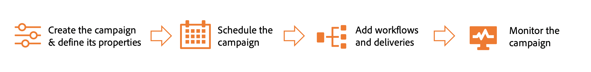

# Get started with campaigns {#campaigns}

>[!CONTEXTUALHELP]
>id="acw_campaigns_list"
>title="Campaigns"
>abstract="Browse the list of campaigns. Select a campaign to view its content, deliveries, and details. You can filter by status, start/end dates, or with custom rules. You can also view reports for finished campaigns. Click the **Create campaign** button to add a new campaign. Browse to the **Templates** tab to view and create templates."

Adobe Campaign enables you to orchestrate targeted marketing initiatives using the built-in campaign management capability. With the ability to define a schedule, you plan the duration and timing of campaigns to align with strategic objectives and maximize audience engagement.

By adding multiple workflows and deliveries specific to the campaign, you create personalized experiences across various channels, ensuring that each touchpoint resonates with the intended audience.

Campaigns provide dedicated reporting metrics to gain comprehensive insights into the performance of the entire campaign. These metrics help assess effectiveness, identify trends, and make data-driven decisions to optimize future efforts. Discover how to access and understand campaign reports in [this section](../reporting/campaign-reports.md).

Learn how to create, manage, and monitor campaigns in the following sections:

* [Access and manage your campaigns](manage-campaigns.md)
* [Create your first campaign](create-campaigns.md)
* [Set up and manage the approval process](campaign-approvals.md)
* [Browse your campaign reports](../reporting/campaign-reports.md).