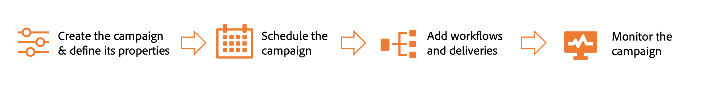

# Get started with campaigns {#campaigns}

>[!CONTEXTUALHELP]
>id="acw_campaigns_list"
>title="Campaigns"
>abstract="Browse the list of campaigns. Select a campaign to view its content, deliveries, and details. You can filter by status, start/end dates, or with custom rules. You can also view reports for finished campaigns. Click the **Create campaign** button to add a new campaign. Browse to the **Templates** tab to view and create templates."

Adobe Campaign allows you to easily orchestrate your targeted marketing initiatives, using the built-in campaign management capability. With the ability to define a schedule, you can plan the duration and timing of your campaigns to align with strategic objectives and maximize audience engagement.

By adding multiple workflows and deliveries specific to the campaign, you can create personalized experiences across various channels, ensuring that each touchpoint resonates with the intended audience.

Campaigns offer dedicated reporting metrics to gain comprehensive insights into the performance of your entire campaign, enabling you to assess its effectiveness, identify trends, and make data-driven decisions to optimize future efforts. Discover how to access and understand campaign reports in [this section](../reporting/campaign-reports.md).

Learn how to create and manage campaigns in the following sections:

* [Access and manage your campaigns](manage-campaigns.md)
* [Create your first campaign](create-campaigns.md)

<!--
Use Adobe Campaign to create cross-channel campaigns. With its marketing campaign orchestration capabilities, you can manage and centralize customer data, design customer communications and campaigns, and create personalized experiences across different channels. In this version, email, push and SMS channels are available.

Design and execute high-volume email campaigns to deliver personalized messages, for all platforms and screen sizes. 
Measure the effectiveness of your deliveries with detailed reports including the counts of opens, clicks, forwards, and more. With Adobe Campaign segmentation capabilities, you can run queries against a high-volume database, and easily define dynamic marketing segments which perfectly target your campaigns.
-->

<!--
Get Started with campaigns
Adobe Campaign offers a set of solutions that help you personalize and deliver campaigns across all of your online and offline channels. You can create, configure, execute and analyze marketing campaigns. All marketing campaigns can be managed from a unified control center. Discover how to browse and create marketing campaigns in this section.

Campaigns include actions (deliveries) and processes (importing or extracting files), as well as resources (marketing documents, delivery outlines). They are used in marketing campaigns. Campaigns are part of a program, and programs are included in a campaign plan.
-->
