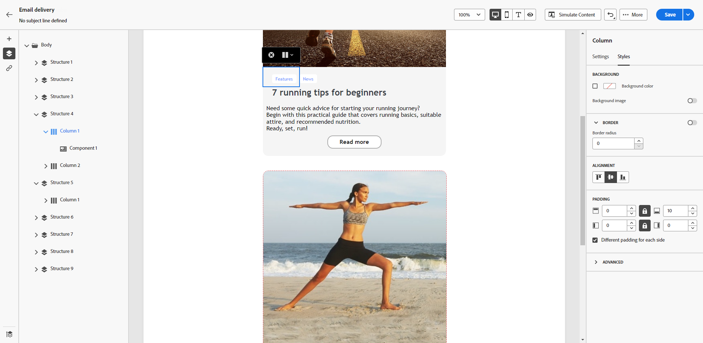

# Adjust vertical alignment and padding {#adjusting-vertical-alignment-and-padding}

In this example, we will adjust padding and vertical alignment inside a structure component composed of three columns.

1. Select the structure component directly in the email or using the **[!UICONTROL Navigation tree]** available in the left-hand menu.

   

1. From the toolbar, click **[!UICONTROL Select a column]** and choose the one that you want to edit. You can also select it from the structure tree.

   The editable parameters for that column are displayed in the **[!UICONTROL Column settings]** menu.

   

1. Under **[!UICONTROL Vertical alignment]**, select **[!UICONTROL Bottom]**.

   The content component moves to the bottom of the column.

   

1. Under **[!UICONTROL Padding]**, define the top padding inside the column. Click the lock icon to break synchronization with the bottom padding.

   Define the left and right padding for that column.

   

1. Proceed similarly to adjust the other columns' alignment and padding.

1. Save your changes.
