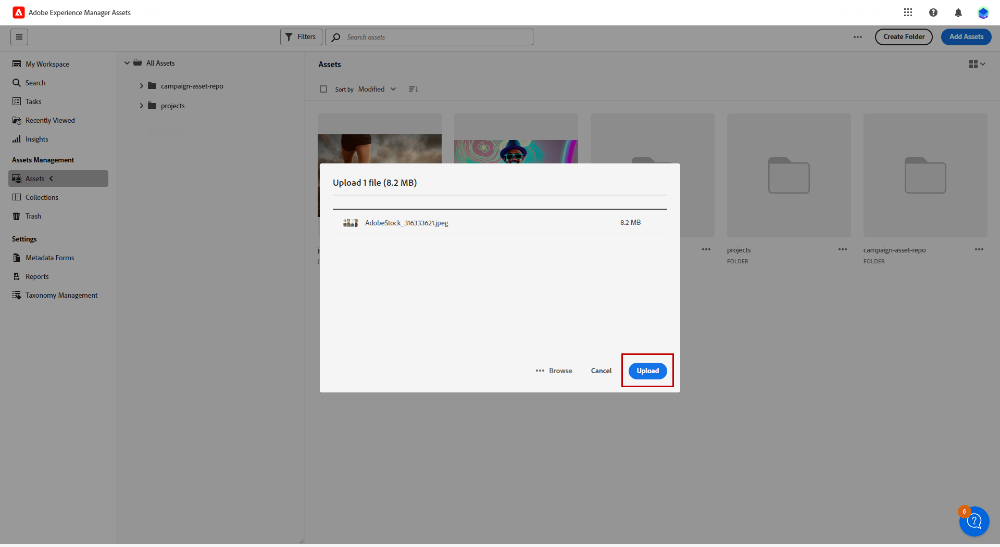

# Manage assets with [!DNL Adobe Experience Manager Assets as a Cloud Service]{#aem-assets}

## Get started with [!DNL Adobe Experience Manager Assets as a Cloud Service] {#get-started-assets-essentials}

[!DNL Adobe Experience Manager Assets as a Cloud Service] is an integrated, collaborative platform designed to streamline your creative workflow and centralize digital assets for seamless experience delivery. It simplifies the organization, tagging, and retrieval of approved production assets, ensuring brand consistency across teams. With its user-friendly interface, [!DNL Assets as Cloud Service] allows you to instantly access and share assets within your Adobe Creative and Experience Cloud applications.

Learn more in [Adobe Experience Manager Assets as a Cloud Service documentation](https://experienceleague.adobe.com/docs/experience-manager-cloud-service/content/assets/home.html){target="_blank"}.

## Upload and insert assets{#add-asset}

To import files to [!DNL Assets as Cloud Service], you first need to browse or create the folder it will be stored into. You will then be able to insert them to your email content.

For more information on how to upload assets, refer to [Adobe Experience Manager Assets as a Cloud Service documentation](https://experienceleague.adobe.com/docs/experience-manager-cloud-service/content/assets/assets-view/add-delete-assets-view.html){target="_blank"}.

1. From your homepage, access the advanced menu and select [!DNL Experience Manager Assets].

    

1. Under **Assets Management**, click **Assets** and choose the repository for your Assets in Adobe Campaign.

1. Click a folder from the central section or from the tree view to open it.

    You can also click **[!UICONTROL Create folder]** to create a new folder.

1. Once in the selected or created folder, click **[!UICONTROL Add Assets]** to upload new asset to your folder.

    

1. From the **[!UICONTROL Upload files]**, click **[!UICONTROL Browse]** and choose if you want to **[!UICONTROL Browse files]** or **[!UICONTROL Browse folders]**.

1. Select the file you want to upload. When done, click **[!UICONTROL Upload]**. 

    

1. To access the advanced asset management menu, select the asset you just uploaded.

    To learn more on how to manage your assets, refer to this [page](https://experienceleague.adobe.com/docs/experience-manager-cloud-service/content/assets/assets-view/manage-organize-assets-view.html).

    

1. To further edit your assets with Adobe Photoshop Express, double-click the assets. Then, from the right-hand menu, select the **[!UICONTROL Edit mode]** icon. [Learn more](https://experienceleague.adobe.com/docs/experience-manager-cloud-service/content/assets/assets-view/edit-images-assets-view.html#edit-using-express){target="_blank"}.

1. From [!DNL Adobe Campaign], select the **[!UICONTROL Asset picker]** menu from the left pane of the email designer.

    

1. Select your previously created **[!UICONTROL Assets]** folder. You can also search for your asset or your folder in the search bar.

    If needed, click  **[!UICONTROL Manage assets]** to directly access your [!DNL Adobe Experience Manager Assets] workspace.

1. Drag and drop your asset in your email content.

    

1. You can further customize your assets such as adding an external link or a text using the **[!UICONTROL Settings]** and **[!UICONTROL Styles]** tabs. [Learn more about components settings](../content/content-components.md)

    
