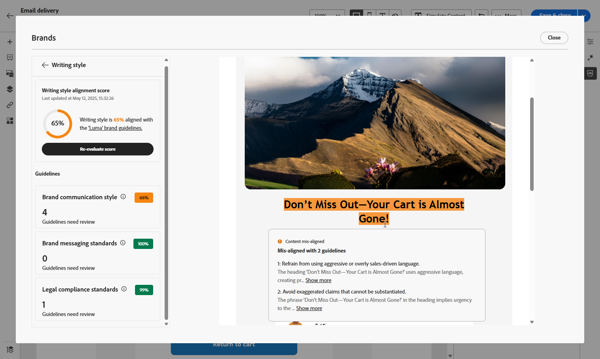

# Brand alignment (Beta){#brands-score}

>[!AVAILABILITY]
>
>This capability is released as a private beta. It will be progressively available to all customers in future releases.
>You must agree to the [user agreement](https://www.adobe.com/legal/licenses-terms/adobe-dx-gen-ai-user-guidelines.html){target="_blank"} before you can use the AI Assistant. For more information, contact your Adobe representative.

The Brand Alignment feature is built to help you create, review, and manage content that stays true to your brand guidelines. It ensures consistency in tone, messaging, and visual identity across your email campaigns, while also serving as a quality check before your content goes live.

## Validate your content with brand alignment {#validate-content}

Once [your brand is set up and published](brands.md), assess your brand alignment score directly within your email campaign to ensure your content aligns with your brand guidelines:

1. Create your [email campaign](../email/create-email.md).

1. Open the **[!UICONTROL Brand Alignment]** menu in the email designer.
    
    Your content will automatically be evaluated against your default brand. [Learn how to assign a default brand](brands.md).

    

1. To evaluate using a different brand, select it from the **[!UICONTROL Brand]** drop-down menu and click **[!UICONTROL Re-evaluate score]**.

    

1. Browse through the **Brand Alignment Score** (High, Medium, Low) and review detailed feedback.

1. Click the  icon to see more insights into your score.

    

1. Select any flagged guideline to view specific feedback and suggestions.

    

1. Edit your content based on the recommendations to improve brand alignment.

1. Manually re-evaluate the content after making changes to refresh your alignment score.
