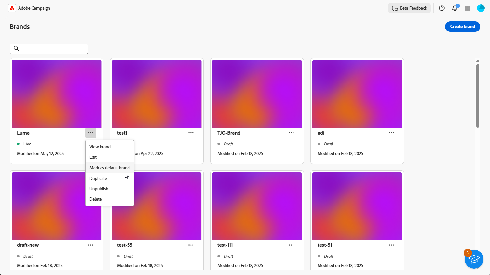

# Create & manage your brands {#brands}

Brand guidelines are a comprehensive set of rules and standards that define a brand's visual and verbal identity. They serve as a reference to ensure consistent brand representation across all marketing and communication channels.

In [!DNL Adobe Campaign Web], users can manually enter and organize brand information or upload brand guideline documents for automatic data extraction.

## Access brands {#generative-access}

To access the **[!UICONTROL Brands]** menu in [!DNL Adobe Campaign Web], users must be assigned the **[!UICONTROL Administrator (admin)]** and **[!UICONTROL Brand kit]** product profiles to create and manage brands. For read-only access, users need the [!UICONTROL AI assistant] product profile. [Learn more](https://experienceleague.adobe.com/en/docs/campaign/campaign-v8/admin/permissions/manage-permissions)

+++ Learn how to assign brand-related permissions

1. In the [Admin Console](https://adminconsole.adobe.com/enterprise) home page, access your Campaign product.

    

1. Select the **[!DNL Product profile]** based on the level of permissions you want to grant your user.

    

1. Click **[!DNL Add users]** to assign the selected product profile.

    

1. Type your user's name, user group, or email address.

1. Click **Save** to apply changes.

Users already assigned to this role have their permissions automatically updated.

+++

## Create your brand {#create-brand-kit}

To create and manage your brand guidelines, follow the steps below.

Users can either enter the details manually or upload a brand guidelines document to extract the information automatically:

1. In the **[!UICONTROL Brands]** menu, click **[!UICONTROL Create brand]**.

    

1. Enter a **[!UICONTROL Name]** for your brand.

1. Drag and drop or select your file to upload your brand guidelines and extract automatically relevant brand information. Click **[!UICONTROL Create brand]**.

    The information extraction process now begins. Note that it may take several minutes to complete.

    

1. Your Content and visual creation standards are now automatically populated. Browse through the different tabs to adapt the information as needed. [Learn more](#personalize)

1. From the advanced menu of each section or category, you can add references to extract relevant brand information automatically.

    To remove existing content, use the **[!UICONTROL Clear section]** or **[!UICONTROL Clear category]** options.

    

1. Once configured, click **[!UICONTROL Save]**, then **[!UICONTROL Publish]** to make your brand guideline available in AI Assistant.

1. To make modifications to your published brand, click **[!UICONTROL Edit brand]**. 

    >[!NOTE]
    >
    >This creates a temporary copy in edit mode, replacing the live version once published.

    

1. From your **[!UICONTROL Brands]** dashboard, open the advanced menu by clicking the  icon to: 

    * View brand
    * Edit
    * Mark as default brand
    * Duplicate
    * Publish
    * Unpublish
    * Delete

    

Your brand guidelines are now accessible from the **[!UICONTROL Brand]** drop-down in AI Assistant menu. This enables AI Assistant to generate content and assets aligned with your specifications. [Learn more about AI Assistant](../content/generative-gs.md)

You can also use your brand guidelines to evaluate your content quality and brand alignment. [Learn more about content quality validation](brands-score.md#validate-quality)

### Set a default brand {#default-brand}

You can designate a default brand to be automatically applied when generating content and calculating alignment scores during campaign creation.

To set a default brand, go to your **[!UICONTROL Brands]** dashboard. Open the advanced menu by clicking the by clicking the  icon and select **[!UICONTROL Mark as default brand]**.

